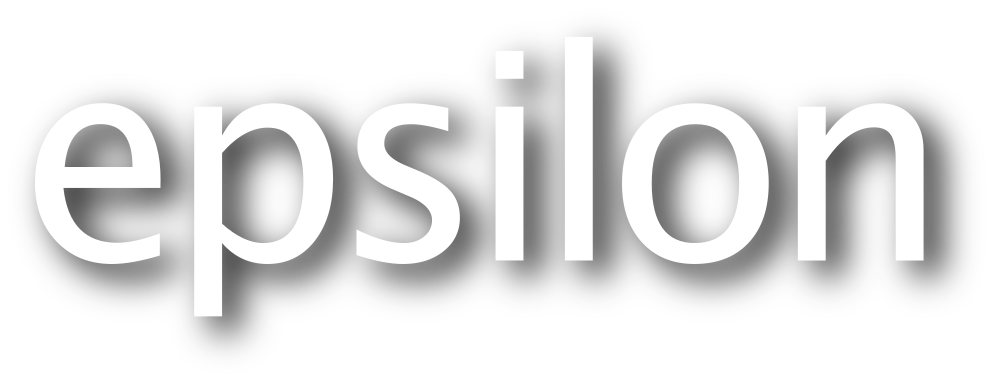

# Branding

Below are different versions of the Epsilon logo to use in posters, presentations, demos etc. To download a copy of a logo, right-click on it and select `Save Image As...` in your browser. The SVG version is infinitely scalable and the PNG images are much larger than their thumbnails on this page. The font of the text in the logo is [Lucida Grande](https://en.wikipedia.org/wiki/Lucida_Grande).

| Description | SVG | PNG |
|---|---|---|
| Sphere and text |  |  |
| Sphere only |  |  |
| Text only |  |  |

## What do the name and the logo mean?

Epsilon (pronounced [ɛpsɪlɒn](https://youtu.be/Z2MJ_oBcfYE?t=10)) stands for **E**xtensible **P**latform for **S**pecification of I**n**teroperable **L**anguages for M**o**del Ma**n**agement. The dark blue jigsaw pieces in the logo represent the [different languages in Epsilon](../doc/#languages), while the purple pieces represent the [different modelling technologies](../doc/emc/#emc-drivers) that Epsilon programs can operate on.

## License

As with everything else in Epsilon, the logos are licensed under the [Eclipse Public License 2.0](https://www.eclipse.org/legal/epl-2.0/).
