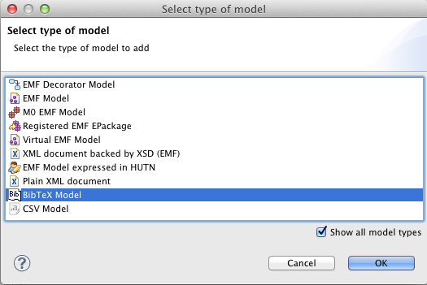

# Scripting BibTeX files using Epsilon

In this article we demonstrate how you can query list of references stored in BibTeX files in Epsilon programs using the BibTeX EMC driver. All the examples in this article demonstrate using EOL to script BibTeX files. However, it's worth stressing that BibTeX files are supported throughout Epsilon. Therefore, you can use Epsilon to (cross-)validate, transform (to other models - XML or EMF-based -, or to text), compare and merge your BibTeX files.

## Querying a BibTeX file


We use the following `eclipse.bib` as a base for demonstrating the EOL
syntax for querying BibTeX files.

```bibtex
@book{steinberg09emf,
  author    = {Steinberg, D. and Budinsky, F. and Paternostro, M. and Merks, E.},
  title     = {{EMF}: {E}clipse {M}odeling {F}ramework},
  year      = {2008},
  publisher = {Addison-Wesley Professional},
  address   = {Boston, Massachusetts}
}

@inproceedings{gronback06gmf,
  author    = {Gronback, R.},
  title     = {Introduction to the {Eclipse Graphical Modeling Framework}},
  booktitle = {Proc. EclipseCon},
  year      = {2006},
  address   = {Santa Clara, California}
}

@article{brooks86nosilverbullet,
  author    = {Brooks Jr., F.P.},
  title     = {No Silver Bullet - Essence and Accidents of Software Engineering},
  journal   = {IEEE Computer},
  volume    = {20},
  number    = {4},
  year      = {1987},
  pages     = {10-19},
}
```

## How can I access all publications?

Presuming that we have specified the name `MyPubs` when loading the BibTeX file as a model, the `allContents` method can be used to access all of the entries in the BibTeX file:

```eol
// Get all publications
var publications = MyPubs.allContents();
```

## How can I access a publication?

Publications (entries) in a BibTeX file can be accessed by type:

```eol
// Get all @book elements
var books = Book.all;

// Get a random book
var b = Book.all.random();
```

Note that the BibTeX driver recognises only those types defined in your BibTeX file. For example, attempting to call `Phdthesis.all` will result in an error for the BibTeX file shown above, as that BibTeX file contains no `@phdthesis` entries.

## How can I access and change the properties of a particular publication?

Properties are accessed via the dot notation:

```eol
// Get a random book
var b = Book.all.random();

// Get the title of the random book
var t = b.title;

// Get the Amazon rating of the random book
var a = b.amazonRating;
```

Note that the empty string is returned when accessing a property that does not exist (such as the amazonRating property in the example above).

Properties can be changed using an assignment statement:

```eol
// Get a random book
var b = Book.all.random();

// Get the title of the random book
b.title = "On the Criteria To Be Used in Decomposing Systems into Modules"
```

Note that the current version of the BibTeX driver does not support saving changes to disk. Any changes made to properties are volatile (and persist only during the duration of the Epsilon program's execution).

## Adding a BibTeX file to your launch configuration

To add a BibTeX file to your Epsilon launch configuration, you need to select "Show all model types" and then choose "BibTeX model" from the list of available model types.



Then you can configure the details of your BibTeX (name, file etc.) in the screen that pops up.


## Unsupported features

The current version of the BibTeX driver for Epsilon is not yet a complete implementation. In particular, the following features are not yet supported:

- Storing changes to BibTeX models to disk.
- Deleting entries from a BibTeX file.

Please file an [enhancement request](https://github.com/eclipse/epsilon/issues)
if you require -- or can provide a patch for -- these features.
