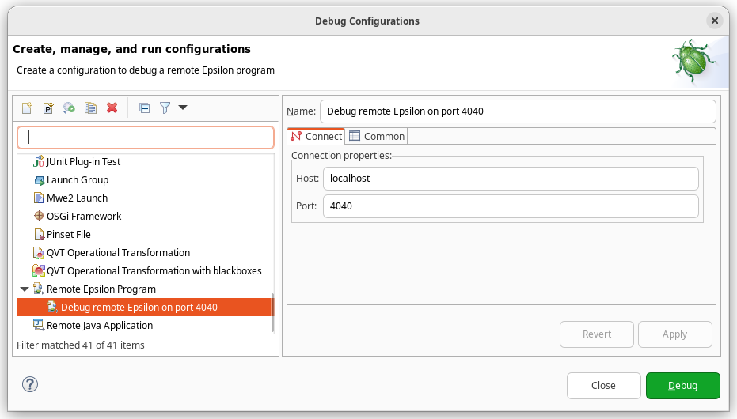
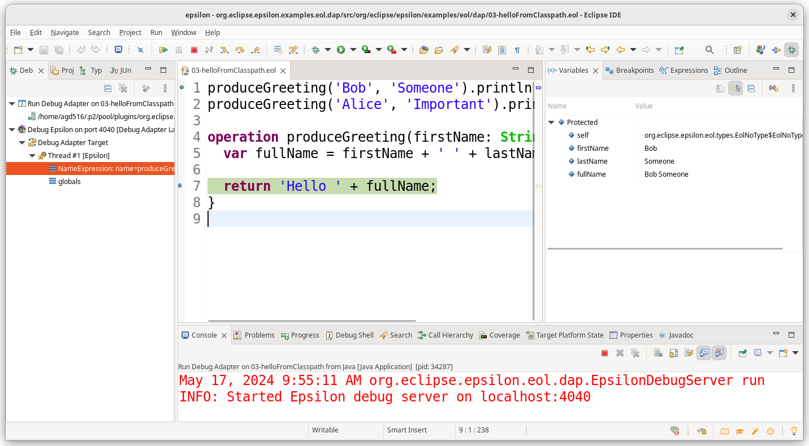
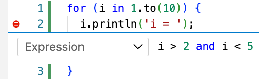
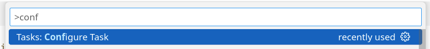

# Epsilon Debugger

All Epsilon languages include interactive Eclipse-based debuggers.
The debugger for the Epsilon Object Language is demonstrated in the screencast below.

<iframe width="90%" height="494" src="https://www.youtube.com/embed/gZPHoW-DaiU" frameborder="0" allow="accelerometer; autoplay; encrypted-media; gyroscope; picture-in-picture" allowfullscreen></iframe>

Since 2.6.0, you can debug Epsilon scripts which run from outside an Eclipse launch configuration (e.g. [embedded in a Java program](./run-epsilon-from-java.md) or [executed from the command line](./running-epsilon-ant-tasks-from-command-line/index.md)), using the Epsilon [Debug Adapter Protocol](https://microsoft.github.io/debug-adapter-protocol/) server and a [DAP client](#debug-adapter-protocol-clients-tested-with-epsilon).

The [`examples.eol.dap`](https://github.com/eclipse/epsilon/tree/main/examples/org.eclipse.epsilon.examples.eol.dap) project on GitHub shows several examples of how to do this, and further information on various use cases is listed below.

## Debugging Epsilon scripts embedded in Java programs

If you are running your Epsilon script from a Java program, you can wrap your module in an `EpsilonDebugServer` class provided by Epsilon and debug it through a DAP client of your choice.
The video below gives an overview of the Debug Adapter Protocol, and explains the design and general use of the debug adapter for Epsilon.

<iframe width="90%" height="494" src="https://www.youtube.com/embed/QWtVbm1rVfY?si=BWcpvmA6Ryi6uQnk" title="YouTube video player" frameborder="0" allow="accelerometer; autoplay; clipboard-write; encrypted-media; gyroscope; picture-in-picture; web-share" referrerpolicy="strict-origin-when-cross-origin" allowfullscreen></iframe>

### Importing the EpsilonDebugServer into your program

If you are developing a regular Java program, you will need to add a dependency to the `org.eclipse.epsilon.eol.dap` Maven artifact of your chosen Epsilon release.
More information on the stable and interim Epsilon Maven artifacts is available from our [download page](https://eclipse.dev/epsilon/download/#maven).

If you are developing an Eclipse plug-in, you will need to declare a dependency on the `org.eclipse.epsilon.eol.dap` plugin.

### Wrapping your module with the EpsilonDebugServer

The next step is to replace your regular `module.execute()` call with code that uses the debug server.
For instance, if you have this code:

```java
Object result = module.execute();
```

You can replace it with:

```java
EpsilonDebugServer server = new EpsilonDebugServer(module, port);
server.run();
Object result = server.getResult().get();
```

* The first line wraps the module with Epsilon's DAP server and indicates that it will listen on a certain port (it can be a port of your choosing, or 0 to pick any available port).
* The second line starts the server and blocks until the script has completed its execution: the server will automatically shut down once the script has completed its execution.
* The third line retrieves the result of `module.execute()`: it will also rethrow any exceptions produced by `module.execute()`.

The script will not start its execution until a DAP client connects to it, to allow you to set any necessary breakpoints.

The next step is to connect to the DAP server with your DAP client of choice.
Several options are discussed in the [DAP client](#debug-adapter-protocol-clients-tested-with-epsilon) section.

### Mapping module URIs to your IDE files

If your Epsilon scripts are being loaded from URIs rather than regular files, you will need to tell the `EpsilonDebugServer` how to map those module URIs to the files with your breakpoints.
Here is a simplified excerpt from the `DebugClasspathBasedEOL` example, which shows how to do this:

```java
EolModule module = new EolModule();
URI classpathUri = DebugClasspathBasedEOL.class.getResource("your.eol").toURI();
module.parse(classpathUri);

EpsilonDebugServer server = new EpsilonDebugServer(module, 4040);
server.getDebugAdapter().getUriToPathMappings().put(
    classpathUri,
    Paths.get("src/path/to/your.eol"));

server.run();
```

A debugging session would work like this:

* From your DAP client, you would set some breakpoints in `your.eol`.
* Run the above code, leaving the script waiting for a DAP connection.
* Connect with your DAP client, which will send the breakpoints in `src/path/to/your.eol` file.
* The DAP server will map the `src/path/to/your.eol` breakpoints to your parsed module.
* The DAP server will start the execution of your script.
* The script will reach one of the breakpoints and stop execution.
* The server will map the location that we stopped in to `src/path/to/your.eol` file and report it to your DAP client.
* Your DAP client will then highlight the relevant line and allow you to inspect variables and control execution.

## Debugging Epsilon scripts running from Ant workflows

If you need to debug your Epsilon script that you are [running from the command line](./running-epsilon-ant-tasks-from-command-line/index.md) (e.g. Ant or Gradle), you will need to use the Debug Adapter Protocol support available from Epsilon 2.6.0.
To do so, set the `debug` and `debugPort` attributes in your Ant task, like this:

```xml
<epsilon.eol ... debug="true" debugPort="4040"/>
```

When executed, this task will start a DAP server listening on TCP port 4040.
It wait for a connection from a [DAP client](#debug-adapter-protocol-clients-tested-with-epsilon), and then start the script.

Epsilon includes an [example](https://github.com/eclipse/epsilon/blob/main/examples/org.eclipse.epsilon.examples.eol.dap/build.xml) of an Ant buildfile that uses DAP for debugging.
There is also an [example of a Gradle script](https://github.com/eclipse/epsilon/blob/main/examples/org.eclipse.epsilon.examples.eol.dap/epsilon/build.gradle).

## Debug Adapter Protocol clients tested with Epsilon

After the `EpsilonDebugServer` has started and is waiting for a DAP connection, you should be able to connect to it with a DAP client of your choice.
This section details two DAP clients that have been tested with the Epsilon DAP server.

### Eclipse LSP4E

To use this client, install it from its [official repository](https://github.com/eclipse/lsp4e).
You will need the "Debug Adapter client for Eclipse IDE" feature.

Set your breakpoints as usual. Once the DAP server is running and waiting for connections (as shown in the terminal with the "Started Epsilon debug server" text), start a "Remote Epsilon Program" debug configuration that attaches to the relevant port in `localhost`:



Once LSP4E connects to the DAP server, the script will start running.
After hitting a breakpoint, you will be prompted to switch to the Debug perspective, as usual:



### Microsoft Visual Studio Code

Recent versions of the [VS Code](./vscode/index.md) support in Epsilon include support for the Epsilon DAP server.
Epsilon includes an [example Gradle project](https://github.com/eclipse/epsilon/tree/main/examples/org.eclipse.epsilon.examples.eol.dap/epsilon) with VS Code configuration files that you can use as a starting point.
The rest of the section breaks down some of these details.

#### Starting the DAP server

First, you will need to add the `debug` and `debugPort` attributes to the Ant tasks being executed from your Gradle script:

```groovy
task runHello {
  dependsOn tasks.setupEpsilonTasks
  doLast {
    ant.'epsilon.eol'(src: '01-hello.eol', debug: true, debugPort: 4040)
  }
}
```

Note how the Epsilon task is wrapped in a `doLast` block, to ensure it only runs when we explicitly run the task, and not on Gradle's configure phase.
When the task is run, execution will suspend until a DAP client (VS Code in this case) connects to the DAP server.

#### Creating and launching a debug configuration

You will then need to add a launch configuration to your `launch.json` file.
Based on the above example, you would need something like:

```json
{
    "type": "epsilon",
    "request": "attach",
    "name": "Debug 01-hello",
    "port": 4040
}
```

Set breakpoints as usual.
Launch the above configuration, and you should be able to hit breakpoints, control execution, and inspect variables as usual:


#### Conditional breakpoints

The Epsilon debug adapter supports conditional breakpoints.

To set a condition on a breakpoint, right-click on its red circle in the editor, and select "Edit Breakpoint".
Select the "Expression" option as shown below, write a Boolean expression in EOL, and press Enter:



Note that the debug adapter will automatically wrap the expresssion with a `return` statement, casting the result to a Boolean.
If the expression fails to run, the adapter will allow execution to continue, and will disable the breakpoint.

The condition is evaluated from within the debugged module, so you can access user-defined operations as usual, as well as operations imported from other modules.

#### Inline breakpoints

When setting a regular line breakpoint, the debugger will only stop at the first valid location at that line.
If you would like to stop at a later location, you can use [inline breakpoints](https://code.visualstudio.com/docs/editor/debugging#_inline-breakpoints) from VS Code.
This is normally done by placing your editing cursor at the location you would like to stop, and pressing `Shift + F9`.

For instance, in this EGL example, execution will stop from inside the dynamic region at the middle of the line, instead of the static region at the beginning of the line:


#### Single-click launching and debugging

The above approach requires separately launching your Gradle task, and your debug configuration.
You can configure VS Code to launch the Gradle task for you, by using a `preLaunchTask`.

First, open the Command Palette as usual (Ctrl+Shift+P in Windows/Linux, or "View - Command Palette..." from the menus), and select "Tasks: Configure Task":



Select the "Gradle: ..." task corresponding to the Gradle task to be executed:


This add a rather verbose block to your [`tasks.json`](https://code.visualstudio.com/Docs/editor/tasks) file:

```json
{
    "type": "gradle",
    "id": "...",
    "script": "runHello",
    "description": "",
    "group": "other",
    "project": "org.eclipse.epsilon.examples.eol.dap",
    "buildFile": ".../org.eclipse.epsilon/examples/org.eclipse.epsilon.examples.eol.dap/epsilon/build.gradle",
    "rootProject": "org.eclipse.epsilon.examples.eol.dap",
    "projectFolder": ".../org.eclipse.epsilon/examples/org.eclipse.epsilon.examples.eol.dap/epsilon",
    "workspaceFolder": ".../org.eclipse.epsilon/examples/org.eclipse.epsilon.examples.eol.dap/epsilon",
    "args": "",
    "javaDebug": false,
    "problemMatcher": [
        "$gradle"
    ],
    "label": "gradle: runHello"
}
```

This JSON block needs a number of changes before it can be used:

* Remove the unnecessary `id`, `description`, `project`, and `rootProject` fields.
* Use `${workspaceFolder}` to shorten the values of `buildFile`, `projectFolder`, and `workspaceFolder`.
* Change `args` to `"--info"`: we need the INFO log messages to detect when the DAP server has started.
* Add the `"$epsilon-debug"` problem matcher, which will detect when the DAP server has started.
* Optionally, change the label to `"epsilonDebug: runHello"`, to distinguish it from a normal Gradle task execution.
* Add an `"isBackground": true` setting, to mark it as a background task. Otherwise, debugging will never start as VS Code will indefinitely wait for this task to complete, rather than read the INFO messages to detect when the DAP server has started.

You should end up with something like the following:

```json
{
    "type": "gradle",
    "script": "runHello",
    "group": "other",
    "buildFile": "${workspaceFolder}/build.gradle",
    "workspaceFolder": "${workspaceFolder}",
    "projectFolder": "${workspaceFolder}",
    "args": "--info",
    "problemMatcher": [
        "$gradle",
        "$epsilon-debug"
    ],
    "label": "epsilonDebug: hello",
    "isBackground": true
}
```

Now that the task has been set up, you can return to your `launch.json` file, and use the task as your `preLaunchTask`:

```json
{
    "type": "epsilon",
    "request": "attach",
    "name": "Debug 01-hello",
    "port": 4040,
    "preLaunchTask": "epsilonDebug: hello"
}
```

After these steps, launching `Debug 01-hello` should run the Gradle task, wait until the DAP server is started, and then start the debugging session as usual.
