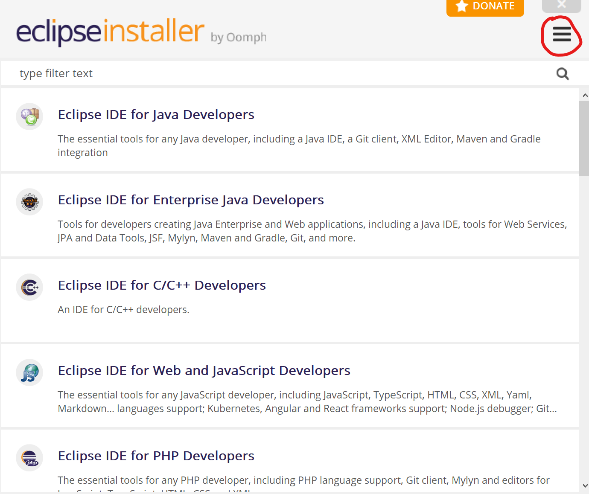
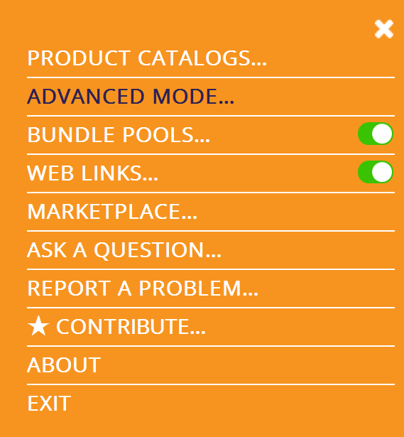
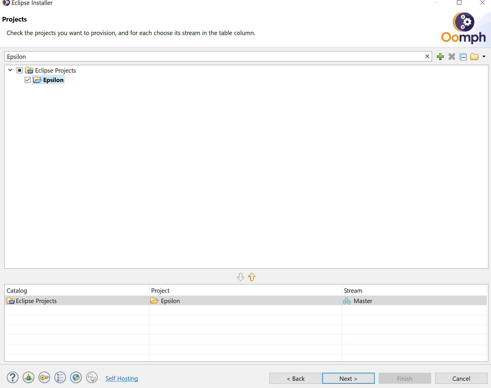

# Eclipse Setup for Epsilon Developers

If you are a contributor to Epsilon (or you want to build on top of it), and don't already have Eclipse installed or the repository cloned, you can easily set this up automatically in a few clicks.

Head to the [Downloads page](../../../download), download the installer for your platform and launch it.

Then switch to Advanced Mode.

Select "Eclipse IDE for Java Developers" in the *Product* page and then Next.

On the *Projects* page, look for Epsilon and select it, then Next.

You can customise variables to suit, such as where Eclipse will be installed and the protocol for cloning the repositories. The defaults should be fine.

Keep going with Next and then Finish. If all went to plan, then you should have a local copy of the [main Epsilon repository](https://git.eclipse.org/c/epsilon/org.eclipse.epsilon.git/) and [the website](https://git.eclipse.org/c/www.eclipse.org/epsilon.git/), with projects imported into Eclipse. You may need to wait for setup tasks to finish when first launching Eclipse. This can also be manually triggered from the *Help -> Perform Setup Tasks* menu in Eclipse.

If you encounter any issues, please let us know via the [mailing list](https://accounts.eclipse.org/mailing-list/epsilon-dev) or [forum](https://www.eclipse.org/forums/index.php/f/22/).
