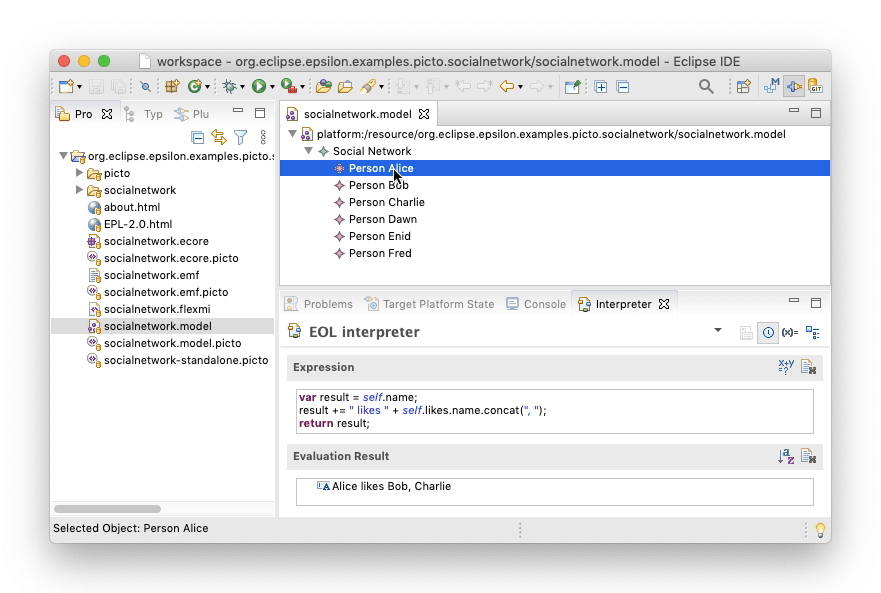

# EOL Interpreter View

Acceleo provides an [extensible interpreter view](https://wiki.eclipse.org/Acceleo/Interpreter) that can be used to evaluate queries on selections of model elements in EMF-based editors. Epsilon extends this view with support for writing and running [Epsilon Object Language](../../eol) scripts. To show the view, click on `Window` --> `Show View` --> `Other` --> `Interpreter`, and to switch to EOL, click on the respective button at the top-right of the view. More detailed instructions on using the different facilities offered by the interpreter view (e.g. variables, live evaluation) are provided [here](https://wiki.eclipse.org/Acceleo/Interpreter).



!!! info
    The EOL interpreter view is available in versions of Epsilon >= 2.3.0

## Accessing Selected Model Elements and Variables

Selected model elements in EMF-based editors can be accessed from the EOL script through the `self` variable. If multiple model elements are selected, then `self` will be a list containing all these elements, and if no model elements are selected, `self` will be `null`. Variables are accessible by name.

## Importing External Operations

You can import operations defined in EOL files in your workspace using an `import` statement with a `platform:/resource` URI, as shown below.

```eol
// bar() is defined in bar.eol under the bar project
import "platform:/resource/bar/bar.eol";

return foo() + bar();

operation foo() {
    return "foo";
}
```
