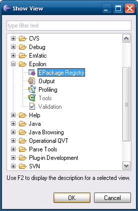

# The EMF EPackage Registry View
 
The EPackage registry (`EPackage.Registry.INSTANCE`) contains references to all registered Ecore EPackages in EMF. To visualise the contents of the registry, we have implemented the following EPackage Registry view. Using this view, one can browse through the EClasses contained in each registered EPackage, discover the super/sub types of each EClass, and navigate through its features and operations. The view provides options to show/hide derived features, operations, inherited features and opposite references, supports quick navigation from a feature to its type (double-click), and integrates with the Properties view.

To make this view visible go to Window --> Show view --> Other... and select EPackage Registry under the Epsilon category.

The view is populated and refreshed on demand. As such, when it first appears it is empty. To populate it with the registered EPackages, you need to click the `Refresh` button on the top right.