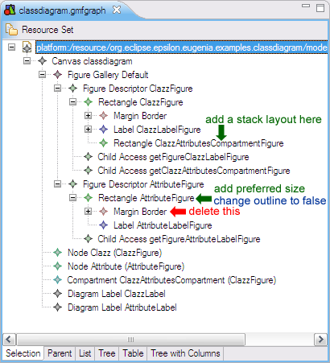

# Customizing a GMF editor generated by Eugenia

So now you have created the first version of your GMF editor with Eugenia and it looks *almost* like what you want - just a few tweaks and you are there. As Eugenia doesn't support all the features of GMF (otherwise it would be just as complex) you are finding that the tweaks you want to do are not supported by the annotations provided by Eugenia and therefore you need to go change one or more of the generated .gmfgraph, .gmfmap and .gmftool models manually. If you decide to do this, you won't be able to use Eugenia any more for your editor because it will overwrite your changes.

We've come across this situation many times and decided to do something about it. Since merging such complex models sensibly is virtually impossible, we've implemented support for user-defined transformations that complement the built-in transformations provided by Eugenia. Let's go straight to an example. We have the following `classdiagram` metamodel:

```emf
@namespace(uri="classdiagram", prefix="classdiagram")
package classdiagram;

@gmf.diagram
class Model {
   val Clazz[*] classes;
}

@gmf.node(label="name", figure="rectangle")
class Clazz {
   attr String name;
   @gmf.compartment(layout="list", collapsible="false")
   val Attribute[*] attributes;
}

@gmf.node(label="name,type", figure="rectangle",
    label.icon="false", label.pattern="{0}:{1}")
class Attribute {
   attr String name;
   attr String type;
}
```

and we follow the [standard Eugenia procedure](../eugenia-gmf-tutorial/) to generate a GMF editor from it. The editor looks like this:


which is **almost** what we want. What we **really** want is something like this:


To get this, we need to customize the `classdiagram.gmfgraph` model like this



so that we can get this:


To perform these changes automatically every time Eugenia is executed on `classdiagram.ecore`, we can create a new EOL transformation called `ECore2GMF.eol` and place it in the same folder with `classdiagram.ecore`. Eugenia will then pick it up and execute it after the built-in transformation every time we invoke `Generate GMF tool, graph and map models` action. In our case, the `ECore2GMF.eol` customization transformation looks like this:

```eol
// Find the compartment figure
var clazzAttributesCompartmentFigure = GmfGraph!Rectangle.all.
    selectOne(r|r.name = 'ClazzAttributesCompartmentFigure');

// ... and add a stack layout to it
clazzAttributesCompartmentFigure.layout = new GmfGraph!StackLayout;

// Find the attribute figure
var attributeFigure = GmfGraph!Rectangle.all.
    selectOne(r|r.name = 'AttributeFigure');

// ... delete its border
delete attributeFigure.border;

// ... set its outline to false
attributeFigure.outline = false;

// ... and add a preferred size to it
var preferredSize = new GmfGraph!Dimension;
preferredSize.dx = 100;
preferredSize.dy = 16;
attributeFigure.preferredSize = preferredSize;
```

Similarly, if we needed to customize the logic behind the `Synchronize GMF Gen model` action, we'd need to define a `FixGMFGen.eol` transformation next to `classdiagram.ecore`.

## What models can I access from the ECore2GMF.eol and FixGMFGen.eol transformations?

In the `Ecore2GenModel.eol` transformation and the later `FixGenModel.eol` transformation you can access the ECore metamodel (named `Ecore`) and the EMF GenModel model (named `GenModel`). You can run `Ecore2GenModel.eol` or `FixGenModel.eol` manually by right-clicking on the `.ecore` file and selecting "Generate EMF GenModel" or "Synchronize EMF GenModel", respectively.

In the `ECore2GMF.eol` transformation you can access the ECore metamodel (named `ECore`), the tool model (named `GmfTool`), the graph model (named `GmfGraph`) and the map model (named `GmfMap`). You can regenerate the GMF models and run `ECore2GMF.eol` manually by right-clicking on the `.ecore` file and selecting "Generate GMF tool, graph and map models".

In the `FixGMFGen.eol` transformation you can access the ECore metamodel (named `ECore`), and the generator model (named `GmfGen`). You can run `FixGMFGen.eol` manually by right-clicking on the `.gmfgen` model (which should have been created previously from the `.gmfmap` using standard GMF tools) and selecting "Synchronize GMFGen".

## How do I customize the generated code?

GMF generates code in two steps:

1.  During the GmfMap → GmfGen transformation: small fragments are embedded into the GmfGen model, using GMF figure templates. 
2.  From the GmfGen model: the embedded bits are dumped to certain files, and additional code is generated using the rest of the GMF templates.

To use your own GMF figure templates, you need to place them under a folder called `templates-gmfgraph`, which should be a sibling of the folder where your `.emf` or `.ecore` files are stored. If it exists, Eugenia will use its templates for the GmfMap → GmfGen transformation.

To customize the code generated from the GmfGen model, you will need to use [Eugenia's patch generation and application functionality](../eugenia-patching/) or [GMF dynamic templates](http://www.bonitasoft.org/blog/eclipse/customize-your-gmf-editor-by-customizing-templates/).

## Getting assistance in writing these transformations

You'll most probably find [Exeed](http://epsilonblog.wordpress.com/2008/07/17/inspecting-emf-models-with-exeed/) and the [EPackage Registry view](http://epsilonblog.wordpress.com/2009/02/13/the-emf-epackage-registry-view/) to be useful for writing such transformations.
