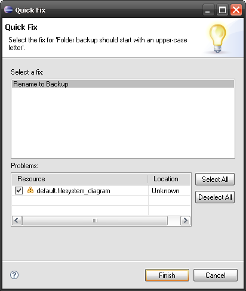
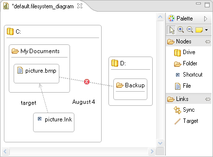

# Live validation and quick-fixes in GMF-based editors with EVL
In [this tutorial](../eugenia-gmf-tutorial/), we demonstrated how Eugenia can be used to easily implement a GMF-based editor for a small FileSystem DSL. Now, we demonstrate how the Epsilon Validation Language can be used to easily contribute validation/quick fixes to our GMF editor. 

!!! info 
    This applies to any GMF-based editor - not only to editors constructed with Eugenia.

!!! warning
	If you have not implemented your editor using Eugenia, before you start please make sure that you have turned on validation in your .gmfgen model. The flags you need to set to true are the `Validation Enabled` and `Validation Decorators` in the `Gen Diagram`.

## Step 1: Create the integration plugin
In the first step we create the integration plugin that will host our constraints and extensions. We name it `org.eclipse.epsilon.eugenia.examples.filesystem.validation`

## Step 2: Set the dependencies
We switch to the dependencies tab of `MANIFEST.MF` and add `org.eclipse.ui.ide` and `org.eclipse.epsilon.evl.emf.validation` to the list of dependencies.

## Step 3: Write the constraints
We create a new .evl file in the plugin. In our case we've created it under `validation/filesystem.evl` (make sure you switch to the Build tab to verify that the .evl file is included in your binary build).

In our example we define the following constraints:

```evl
context File {

	constraint HasName {

		check : self.name.isDefined()

		message : 'Unnamed ' + self.eClass().name + ' not allowed'

	}

}

context Folder {

	critique NameStartsWithCapital {

		guard : self.satisfies('HasName')

		check : self.name.firstToUpperCase() = self.name

		message : 'Folder ' + self.name +
			' should start with an upper-case letter'

		fix {

			title : 'Rename to ' + self.name.firstToUpperCase()

			do {
				self.name := self.name.firstToUpperCase();
			}
		}

	}

}

context Sync {

	constraint MustLinkSame {

		check : self.source.eClass() = self.target.eClass()

		message : 'Cannot synchronize a ' + self.source.eClass().name
			+ ' with a ' + self.target.eClass().name

		fix {

			title : 'Synchronize with another ' +
				self.source.eClass().name

			do {

				var target := UserInput.choose('Select target',
					_Model.getAllOfType(self.source.eClass().name));

				if (target.isDefined()) self.target := target;

			}

		}

	}

}
```

We have defined three constraints:

* The first (`HasName`) requires that each file has a non-empty name.
* The second one (`NameStartsWithCapital`) requires that every folder starts with a capital letter. Unlike the `HasName`, this is declared as a critique which means that if it is not satisfied by an element, this will be shown as a warning (instead of an error) on the editor. In the `guard` of this constraint we first check that the element satisfies the `HasName` constraint first (it wouldn't make sense to check this for an empty-named file). If the critique is not satisfied, a warning is generated and the user is presented with the option to invoke the fix which automatically renames the folder.
* The third one (`MustLinkSame`) requires that a sync synchronizes two things of the same type: i.e. a folder with a folder, a file with a file etc. If this fails, it generates an error and the user can invoke the fix to repair it. In the fix, the user is prompted to select one of the elements of the same type as the source of the sync to serve as the target.

## Step 4: Bind the constraints to the editor
Having written the constraints, the next step is to bind them to the GMF editor. To do this, we switch to the `Extensions` tab of MANIFEST.MF and add the `org.eclipse.epsilon.evl.emf.validation` extension. Then we right-click it and add a new `constraintBinding`. In the `namespaceURI` field of the extension we set the value to `filesystem` and in the `constraints` field we select the `validation/filesystem.evl` EVL file we created in Step 3.

Next, we add the `org.eclipse.ui.ide.markerResolution` extension and below it we create two `markerResolutionGenerator` with the following details

* `class` : `org.eclipse.epsilon.evl.emf.validation.EvlMarkerResolutionGenerator`
* `markerType` : `org.eclipse.epsilon.eugenia.examples.filesystem.diagram.diagnostic`

and

* `class` : `org.eclipse.epsilon.evl.emf.validation.EvlMarkerResolutionGenerator`
* `markerType` : `org.eclipse.emf.ecore.diagnostic`

## Step 5: Ready to go!
The next step is to run a new Eclipse instance and create a new filesystem diagram that looks like this:


To validate this we go to the `Diagram` menu and select `Validate` (depending on your version of Eclipse, the `Validate` option may be located under the `Edit` menu instead). The editor now looks like this:


There are two problems with our model:

* The sync between picture.bmp and backup is invalid as it syncs a file with a folder. As a result the `MustLinkSame` constraint has failed and the sync has been visually annotated with a red circle that shows this.
* Similarly, the `NameStartsWithCapital` constraints has failed for the backup folder (it should start with an upper-case letter) and this is indicated with a red triangle on the folder.

The generated errors/warnings also appear in the `Problems` view:


Double-clicking on an error/warning in this view brings us to the respective editor and highlights the failing element. What is more important however is that for constraints for which we have defined fixes (e.g. the `MustLinkSame` and `NameStartsWithCapital`) constraints, we can also apply the fixes using this view. To do this we need to right-click a problem that has quick fixes (indicated by a small lamp on the bottom right) and select `Quick Fix`.

Doing this for the "Folder backup should start with an upper-case letter" warning, brings up the following dialog:



Clicking `Finish` invokes the behaviour of the fix which renames the folder from backup to Backup (and resolves the problem). The change is also reflected to the diagram automatically due to the GMF MVC architecture. It is worth mentioning that any changes done during a quick fix can be undone/redone using the respective options from the `Edit` menu (or simply using `Ctrl-Z`, `Ctrl-Y`). Also, if an error occurs in the middle of a fix block, all changes to the model done in the block are automatically rolled back.



## Troubleshooting/Known issues
While errors/warnings are persisted across sessions, quick-fixes are not. Therefore, if you run validation and re-start Eclipse, in the new Eclipse instance the problems will still appear in the editor/problems view but quick-fixes will not be available until you run validation again. We are currently working on a fix for this.

## Recipes
If you need validation to be performed whenever your diagram is saved add the following line in the `doSaveDocument(IProgressMonitor monitor, Object element, IDocument document, boolean overwrite)` method of your `XXXDocumentProvider` class (located in the `.diagram.part` package) in your diagram plugin.

```java
ValidateAction.runValidation((View) document.getContent());
```
