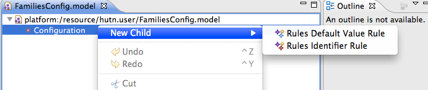

# Customising Epsilon HUTN documents with configuration

In this article we demonstrate how you can use the configuration features of Epsilon HUTN to customise your HUTN documents. For an introduction to modelling with HUTN, please refer to [this article](../hutn-basic).

## Getting started

Throughout this article, we'll use the following metamodel:

Suppose we've already constructed a Families model using the following HUTN source:

    @Spec {
      metamodel "families" {
        nsUri: "families"
      }
    }
    families {
      Family {
        name: "The Smiths"
        familyFriends: Family "does", Family "bloggs"
      }
      
      Family "does" {
        name: "The Does"
        migrant: true
      }
      
      Family "bloggs" {
        name: "The Bloggs"
        migrant: true
      }
    }

There is some duplication in the HUTN document above. Firstly, the identifiers used to reference Family objects are very similar to the families' names. Secondly, the migrant property is set to true in two of the three Families.

A HUTN configuration model can be used to customise the document and reduce the duplication. A HUTN configuration model comprises rules, which customise the HUTN document. The remainder of this article describes how to create and use a configuration model to specify default values for properties and inferred values for identifiers.

## Creating a HUTN configuration model

To create a HUTN configuration model, select **File→New→Other→Epsilon→EMF Model**. Specify a filename ending in .model, select the HUTN config metamodel URI and select Configuration as the root element. The dialogue should then look like this:

After opening the resulting configuration model, new rules can be added. Right-click the configuration element, select **New Child→Rules Default Value Rule** and **New Child→Rules Identifier Rule** to create two rules:

Default value rules are used to specify a value that will be used when the HUTN source document does not specify a value for a feature. Right-click the newly created default value rule and select **Show Properties View**. Specify Family as the classifier, migrant as the attribute and true as the value:

Identifier rules are used to specify an attribute that will be used to identify model elements in the HUTN source document. Right-click the identifier rule and select **Show Properties View**. Specify Family as the classifier, and name as the attribute:

## Using a HUTN configuration model

To make use of the configuration model, the preamble of the HUTN document must be changed to the following:

    @Spec {
      metamodel "families" {
        nsUri: "families"
        configFile: "FamiliesConfig.model"
      }
    }

Note the extra line that references the configuration model. The value of the configFile attribute is a path relative to the HUTN document.

The body of the HUTN document shown at the start of the article can now be rewritten as follows:

    families {
      Family {
        name: "The Smiths"
        familyFriends: Family "The Does", Family "The Bloggs"
        migrant: false
      }
      
      Family "The Does" {}
      Family "The Bloggs" {}
    }

The identifiers specified for the last two families also specify the value of their name attribute, and so there's no need to explicitly set the name attribute in the body of the Family element. Conversely, the first Family specifies a name (The Smiths), and no identifier. A reference to the first family can use The Smiths as an identifier.

Notice also that the migrant attribute values have been removed from the The Does and The Bloggs, as the default value is now true. However, The Smiths must now explicitly state that its migrant value should be false.

## Additional resources

- Article: [Using HUTN in Epsilon](../hutn-basic)