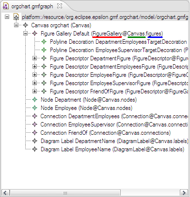

# Inspecting EMF models with Exeed
 
[Exeed](../../../doc/exeed) is an extended version of the built-in EMF reflective editor that enables customisation of labels and icons by adding annotations to ECore metamodels. Another feature it provides is the ability to display structural information about the elements of an EMF model. To see the types of all elements in the editor tree as well as the feature in which each element is contained, open your EMF model with Exeed and click `Exeed` --> `Show Structural Info`.

By doing this, the structural information of each element appears next to its label. For example, selecting this option for a GMF .gmfgraph model will make it look like this:

The red-underlined text shows the type of the element (FigureGallery), the blue-underlined text shows the feature in which it is contained (figures), and the green-underlined text shows the EClass that owns the containing feature (Canvas). So next time you need to open an EMF model with a text editor to inspect its structure by reading the underlying XMI, you may want to consider giving Exeed a try instead.