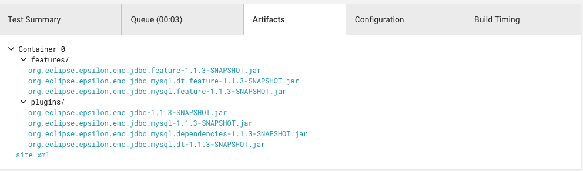

# Publishing your project to the Epsilon Labs Update Site

In this article we explain the steps required to publish your Epsilon related project in the Epsilon Labs update site.

## General Recommendations

As part of the process you will configure your project to be under continuous integration (CI) which is automatically triggered when you push changes to the main branch of your project's git repository. For this reason it is recommended that you create a *develop* branch in which you make frequent commits/pushes and only merge changes to the main branch when you want to release a new version (you might be interested in [GitFlow](https://www.atlassian.com/git/tutorials/comparing-workflows/gitflow-workflow))

## Creating Feature Plugins

In the Eclipse world, a *feature* is a group of one or more plugins that offer a specific functionality within Eclipse. For example, the **Epsilon Core** feature groups all the plugins that provide support for the core Epsilon languages (EOL, ETL, EGL, etc.) and drivers (CSV, XML, Bibtext, etc.). In order to publish your project you need to create feature plugins. As a minimum you would need to provide two features: one for the base functionality and other for the developer tools. The developer tools are the plugins that provide UI contributions (menus, launchers, etc.). For example, the JDBC project provides these two features (developer tools plugins and features should use the **dt** suffix):

-   org.eclipse.epsilon.emc.jdbc.mysql.feature
-   org.eclipse.epsilon.emc.jdbc.mysql.feature.dt

### Feature Information

**NOTE**: Correctly fill the feature information. This information is displayed within the **Install New Software** tool and therefore the first point of contact between your project and the user.

**Feature Description**

-   Optional URL: Leave blank
-   Text: Meaningful information about the plugins

**Copyright Notice**

-   Optional URL: Leave blank
-   Text:

    Copyright (c) 2008 The University of York.
    All rights reserved. 
    Contributors: <Your Name>
    <Other copyrights, e.g. third-party libraries>

**License Agreement** Use the appropriate license agreement. This depends on the libraries you are using.

**Sites to visit** Any important sites of interest (e.g. Epsilon's website)

### Group your project's plugins

Add each of your project plugins to the relevant feature. Remember that your **dt** plugins should go in your **dt** (development tools) feature.

### Create a *site.xml*

An update site contains information about the features and plugins that can be installed from it. In order to the *EpsilonLabs Updatesite* to know what features/plugins you provide you must add this information to a **site.xml** file. You can find a template [here](http://eclipse.org/epsilon/doc/articles/labsupdatesite/site.xml) or in the EpsilonLabs update site [repository](https://github.com/epsilonlabs/epsilonlabs-updatesite) (template folder). In a nutshell, site.xml lists the features of your project and provides a **category** (a logical grouping of features) for your project.

## Set up CI

Go to [CircleCi](https://circleci.com) and log in using your Github credentials (for simple configuration of the project).

### Add your project to CircleCI

-   In the **top left corner** select the epsilonlabs organization.
-   Click on Add Project
-   Click on **Setup Project**
-   In **Language** select *Maven(Java)*
-   Skip the circli configuration (we will show you this next)
-   Click on *Start Building*

### Set up EpsilonLabs build Trigger

Open the epsilonlabs CircleCI project

-   Go to settings
-   Go to API Permisssions
-   Copy the token value of the TRIGGER_TOKEN

Go to your project

-   Go to settings
-   Go to Environment Variables
-   Add variable: **Name**: TRIGGER_BUILD, **Value**: Paste the TRIGGER_TOKEN value

## Configure CircleCI for your project


-   Create a *.circleci* folder in the root of your project
-   Create a new *config.yml* file

Use the template provided ([here](http://eclipse.org/epsilon/doc/articles/labsupdatesite/config.yml) or in the EpsilonLabs updatesite [repository](https://github.com/epsilonlabs/epsilonlabs-updatesite)) and make sure you add an *store_artifacts* entry for each plugin and feature JAR. **Note**: The *path* information points to the *target* folder which will be populated by maven (see next).

## Use Maven + Tycho to build your project

We will use a *pom-less* configuration to build your project with maven and Tycho. Create a POM for your project. If you divide your projects into plugins, features, tests folders (btw, you should) you need to create a parent pom, and then a pom for each folder. A *pom-less* build avoids having a pom for each project, but still needs the structure ones. Use the provided template(s), change the artifact id and add your plugins and features to the modules section. The templates are [here](http://eclipse.org/epsilon/doc/articles/labsupdatesite/maven/) or in the EpsilonLabs updatesite [repository](https://github.com/epsilonlabs/epsilonlabs-updatesite)) To enable the pomless build, copy the [extensions.xml](http://eclipse.org/epsilon/doc/articles/labsupdatesite/extensions.xml) (or in the repository) file to a .mvn folder in your project.

### Local maven build

Install Maven and build your project to test that your poms are correct. You should also make sure that any tests you have coded are executed as part of the Maven build.

      mvn clean install

Check that the required JARs have been created in the *target* folder.

## Test your CI build

Merge your repository changes (new files) to your main branch and push to GitHub. This should trigger a new build. Go to CircleCI and verify that your build completed without errors. CircleCI will simply execute a maven build so if your local build succeeded the CircleCi should too.

Additionally check that all the JARs have been stored as artifacts. In your project's build information page click on the *Artifacts* tab:



## Add your project to the EpsilonLabs update site

Fork the EpsilonLabs update site repository and add your project in two places:

Add a new entry(line) to the projects.txt file. The line should have your project name (the name of the project in GitHub) and the target platform information. In most cases this can be *Any*. If you only support a specific platform you should provide the correct values.

Add a new local repository to the updasite's root pom (the **project** name should match the entry in the projects file):

```xml
<repository>
    <id>epsilonlabs-{project}</id>
    <url>file:///${main.basedir}/repository/{project}}</url>
    <layout>p2</layout>
</repository>
```

- Make a *pull request* to the main EpsilonLabs update site project.
- After your request has been merged you should see your project in the update site.

## Additional resources

- [Eclipse p2 publisher](https://help.eclipse.org/mars/index.jsp?topic=%2Forg.eclipse.platform.doc.isv%2Fguide%2Fp2_publisher.html)
