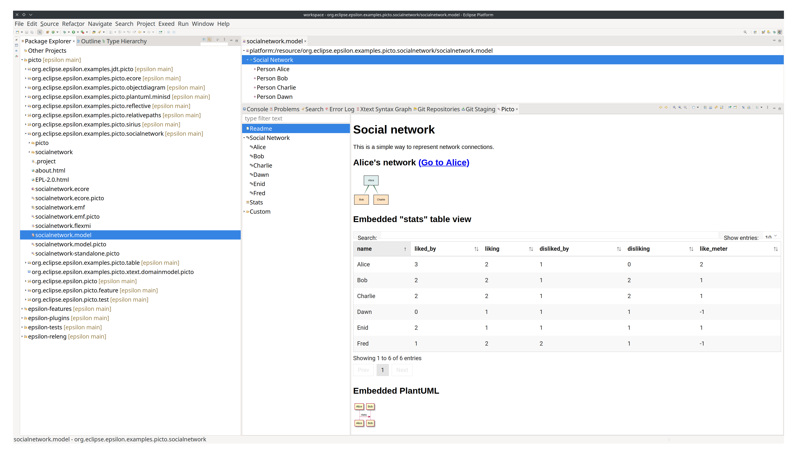

# Embedding Picto views in a static Markdown or HTML document

It is possible to include other [Picto](../../picto) views in a static Markdown or HTML document. This feature is very useful to e.g. create on-the-fly reports concerning one or more models that can be later exported and shared for discussion.

We will reuse the social network example depicted in the [Picto](../../picto) documentation. The complete source code of this example is available [here](https://github.com/eclipse/epsilon/tree/main/examples/org.eclipse.epsilon.examples.picto.socialnetwork/).



The screenshot above depicts a visusalisation of a social network model. The Picto window shows a "Readme" view that is written in Markdown, and that contains other views from Picto's view tree.

## Static views in Picto

Although it is possible to embed Picto views in any type of Picto visualisation, this embedding becomes specially useful in statically defined views, which are briefly introduced in the following.

By default, the views that are included in the tree of a Picto visualisation are determined by the transformation selected in the `.picto` configuration file, which is generally an special EGX transformation. It is possible to add extra views by using the `<view>` tag in a Picto file:

```xml
<?nsuri picto?>
<picto format="egx" transformation="picto/socialnetwork.egx">
	<view path="Custom, Alice and Bob" icon="diagram-ff00ff" type="Persons2Graphviz">
		<parameter name="names" values="Alice, Bob"/>
	</view>

	<view path="Readme" icon="document" format="markdown" source="socialnetwork/readme.md" position="0"/>
</picto>
```

The snippet above shows the contents of the `socialnetwork.model.picto` file. The `<picto>` tag specifies the EGX transformation to use via the `format` and `transformation` attributes. Additionally, two `<view>` elements are added, of which we focus on the second one in this article, which is a static Picto view.

A static Picto view depicts the contents of a static file. It can be defined by specifying its location in Picto's view tree (via the `path` and `position` attributes of the `<view>` tag) and the `source` and `format` of the file. In the example snippet, the "Readme" view appears first in the view tree (`position="0"`), and it is using the `socialnetwork/readme.md` file of the example project, whose contents are depicted below:

```markdown
# Social network

This is a simple way to represent network connections.

## Alice's network <a href="javascript:showView(['Social Network', 'Alice'])">(Go to Alice)</a>

<picto-view path="Social Network, Alice"/>

## Embedded "stats" table view

<picto-view path="Stats" autoresize="true"/>

## Embedded PlantUML (escaped backticks)

\```render-plantuml
@startuml
Alice -> Bob : Hello
@enduml
\```

## Static image


```

## Using the `<picto-view>` tag

Embedding a Picto view is as easy as using the `<picto-view>` tag, specifying as `path` attribute the path of the view to be embedded in Picto's view tree. The Markdown file depicted above embeds two Picto views: the first one is Alice's social network (present in the `Social Network > Alice` path in the view tree), while the second one is the stats table of the whole model.

As mentioned, the use of the `<picto-view>` tag is not limited to static views such as the one of the example, and can be used inside any kind of views (e.g. those created with EGL transformations).

## Iframes and Dynamic resizing of embedded views

By default, an embedded picto view becomes as tall as the height of the contents that are originally rendered. However, the height of such contents might change dynamically, as it is the case of the stats table view: we can modify the number of elements shown in each page of the table, thus altering the required vertical space.

For those cases where the height of a view might change dynamically, the `autoresize` attribute can be added to the `<picto-view>` tag to automatically adapt to such changes. In the example above, `autoresize` is set to `true` for the "Stats" view, so that pagination changes do not cause vertical cropping issues.

If we only want to ensure that embedded views do not affect the host visualisation, we can enforce the use of an iframe by setting the `iframe` attribute to `true`. Note that setting `autoresize` to true also implies that an iframe will be used, so it is not necessary to specify both.
