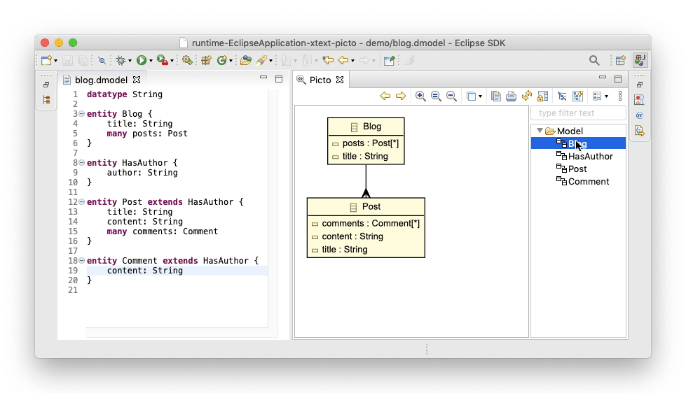

# Visualising Xtext Models with Picto

This article shows how [Picto](../../picto) can be used to produce graphical views from Xtext-based models. To demonstrate the Picto/Xtext integration, we use the Entity DSL showcased in the [15' Xtext tutorial](https://www.eclipse.org/Xtext/documentation/102_domainmodelwalkthrough.html).



## Setup

- Import the projects below from the `examples` folder of the [Epsilon Git repository](https://git.eclipse.org/c/epsilon/org.eclipse.epsilon.git/tree/examples)
    - `org.eclipse.epsilon.examples.picto.xtext.domainmodel`
    - `org.eclipse.epsilon.examples.picto.xtext.domainmodel.ide`
    - `org.eclipse.epsilon.examples.picto.xtext.domainmodel.ui`
    - `org.eclipse.epsilon.examples.picto.xtext.domainmodel.picto`
- Right-click on `Domainmodel.xtext` and select `Run As -> Generate Xtext Artefacts`
- Run a nested Eclipse instance.
- In the nested Eclipse instance workspace, create a new file named `blog.dmodel` with the content below:

```
datatype String
 
entity Blog {
    title: String
    many posts: Post
}
 
entity HasAuthor {
    author: String
}

entity Post extends HasAuthor {
    title: String
    content: String
    many comments: Comment
}
 
entity Comment extends HasAuthor {
    content: String
    many responses: Comment
}
```

- Open the Picto view from the `Window -> Show View` menu.
- Go through the produced graphical views as shown in the image above.

## The Picto-Xtext Integration Plugin Project

We now dive into the `org.eclipse.epsilon.examples.picto.xtext.domainmodel.picto` project which contains the Picto-Xtext integration code (the rest of the projects are standard Xtext projects).

### The DmodelPictoSource class

This class extends Picto's built-in `EglPictoSource` class and produces graphical views in Picto from `*.dmodel` files edited in an Xtext-based editor. In particular:

- The `supportsEditorType` method specifies that this class contributes visualisation capabilities to Xtext-based editors, the title of which ends with `.dmodel`
- The `getRenderingMetadata` method specifies the [EGL](../../egl) transformation that produces the graphical views every time an editor of interest is opened, activated or saved.
- The `getFile` and `getResource` methods extract an `IFile` and an EMF `Resource` from the editor of interest and should be reusable without changes for other Xtext-based languages too.

```java
{{{ example("org.eclipse.epsilon.examples.picto.xtext.domainmodel.picto/src/org/eclipse/epsilon/examples/picto/xtext/domainmodel/picto/DmodelPictoSource.java", false) }}}
```

Picto is made aware of this class through the `org.eclipse.epsilon.picto.pictoSource` [extension](../../picto/#extending-picto) in the project's `plugin.xml`.

```xml
{{{ example("org.eclipse.epsilon.examples.picto.xtext.domainmodel.picto/plugin.xml", false) }}}
```

### The Visualisation Transformation

The visualisation transformation has been implemented using Epsilon's [EGL model-to-text transformation language](../../egl) and produces Graphviz-based class diagrams from the active entity model. The transformation consists of the `dmodel.egx` coordination rules, and the `classdiagram.egl` template shown below. The transformation produces one view for each entity in the model, which consists of the entity itself, any super/sub-types it may have, as well as other entities that it is related to. 

=== "dmodel.egx"

    ```egx
    {{{ example("org.eclipse.epsilon.examples.picto.xtext.domainmodel.picto/dmodel.egx", true) }}}
    ```

=== "entity2graphviz.egl"

    ```egl
    {{{ example("org.eclipse.epsilon.examples.picto.xtext.domainmodel.picto/entity2graphviz.egl", true) }}}
    ```

#### Lazy Execution

Since Picto executes [EGL transformations lazily](../../picto/#scalability) when the entity model is saved, only the view that is currently visible is regenerated immediately, which is useful when working with large models.