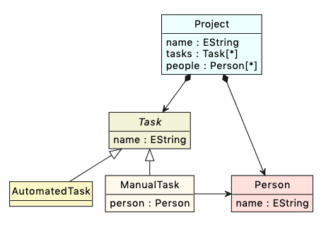
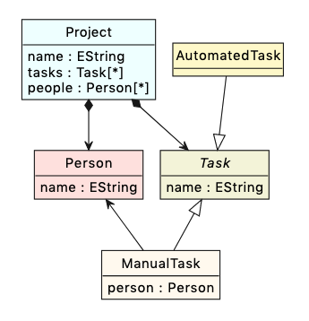
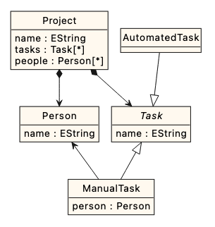

# Epsilon Playground

The [Epsilon Playground](../../../playground) is a web application for fiddling with metamodelling, modelling and automated model management using [Emfatic](https://eclipse.org/emfatic), [Flexmi](../../flexmi) and Epsilon's languages. Its back-end is implemented using [Google Cloud Platform Functions](https://cloud.google.com/functions) and the front-end builds heavily on the [Metro 4](https://metroui.org.ua) framework. Diagrams are rendered using [PlantUML](https://plantuml.com) and [Kroki](https://kroki.io).

## Emfatic Metamodels in the Playground

For metamodelling, the Playground uses Ecore's [Emfatic](https://eclipse.org/emfatic) textual syntax, augmented with a couple of [annotations](https://www.eclipse.org/emfatic/#annotations) to control the graphical appearance of the metamodels.

- `@diagram(direction="up/down/left/right/none")`: Can be attached to references (`val`/`ref`) and to attributes of enumeration type to specify the direction of the respective edge in the diagram (`right` by default for non-containment references, `left` for enumeration-typed attributes, and `down` for containment references). Setting the direction to `none` hides the edge.
- `@diagram(inheritance.direction="up/down/left/right/none")`: Can be attached to classes to specify the direction of its inheritance edges in the diagram (`up` by default).
- `@diagram(color="<color>")`: Can be attached to classes and enumerations to specify their color. Specified colors need to follow one of the [PlantUML color formats](https://plantuml.com/color).
- `@diagram(monochrome="true/false/<color>")`: Can be attached to packages to specify that all their classes/enumerations should be displayed with the same color.

For example, the plain Emfatic metamodel below is rendered as follows:

```emf
package ptl;

class Project {
    attr String name;
    val Task[*] tasks;
    val Person[*] people;
}

abstract class Task {
    attr String name;
}

class ManualTask extends Task {
    ref Person person;
}

class AutomatedTask extends Task {

}

class Person {
    attr String name;
}
```



while its annotated version produces the diagram below.

```emf
package ptl;

class Project {
    attr String name;
    val Task[*] tasks;
    val Person[*] people;
}

abstract class Task {
    attr String name;
}

class ManualTask extends Task {
    @diagram(direction="up")
    ref Person person;
}

@diagram(inheritance.direction="down")
class AutomatedTask extends Task {

}

class Person {
    attr String name;
}
```



Changing the first line to

```emf
@diagram(monochrome="true")
package ptl;
```

produces the monochrome diagram below.




## Save and share your work

To share your work, click the `Share` button. This will create a short link that you can copy to your clipboard. Please note that the contents of the editors **will be stored in the back-end of the Epsilon Playground** so that they can be retrieved when you visit that link again later.

## Download your work

To download a zipped archive of your work, click the `Download` button. Depending on your selection, the zipped archived will contain the model management program(s), the models and metamodels of the example, a `readme.md` file with instructions as well as:

- `Gradle`/`Maven`: a `build.gradle` or `pom.xml` file that includes the Epsilon dependencies and the [ANT tasks](../../workflow) you need to run the example from the command line
- `Ant (Eclipse)`: a `build.xml` file that in includes the [ANT tasks](../../workflow) you need to run the example from within Eclipse
- `Java (Gradle)`/`Java (Maven)`: a Java class that runs the model management program using Epsilon's API, and a `build.gradle` or `pom.xml` file that includes the Epsilon dependencies

## Custom examples

You can launch the Playground with a custom set of examples by appending an `examples` parameter to the URL, which points to a JSON file that contains your own examples. For instance, this link below launches the Playground with its default set of examples.

[https://eclipse.org/epsilon/playground/?examples=https://raw.githubusercontent.com/eclipse/epsilon-website/master/mkdocs/docs/playground/examples/examples.json](https://eclipse.org/epsilon/playground/?examples=https://raw.githubusercontent.com/eclipse/epsilon-website/master/mkdocs/docs/playground/examples/examples.json)

The structure of [examples.json](https://github.com/eclipse/epsilon-website/blob/master/mkdocs/docs/playground/examples/examples.json) should be self-explanatory but if you have any questions, please let us know.

## Settings

Through the `Settings` dialog, you can show/hide the different panels of the playground as well as line numbers in editors. You can also hide a panel by middle-clicking and maximise/restore it by double-clicking on its title.

If you hide the program panel, you can still run the program it contains using the <kbd>Ctrl+S</kbd> or <kbd>Cmd+S</kbd> keyboard shortcut.

## Docker container

If the Playground is a critical dependency for you (e.g. to support a training course), you may want to run your own instance through a [Docker container](https://github.com/epsilonlabs/playground-docker). Despite using [automated testing with Cypress](https://github.com/eclipse/epsilon-website/tree/master/mkdocs/docs/playground/cypress/e2e), as we are evolving the Playground, we may indadvertedly introduce regressions that break the Playground and make (parts of it) unusable for a period of time.

## Fair usage policy

The cost of running Epsilon Playground is proportional to the number of requests made to its Google Cloud Platform back-end (i.e. execution of programs and rendering of diagrams). With fair usage we can comfortably afford this cost and keep the Playground operational, but in case of excessive use we may have to take it down with no notice. To keep costs down, server-side operations that take more than 60 seconds to complete are automatically terminated. For extensive use, large models, or complex programs, please use the [development tools / Java libraries](../../../download) provided on the Epsilon website instead, or run your own instance of the Epsilon Playground in a [Docker container](https://github.com/epsilonlabs/playground-docker).

## Reporting bugs and requesting help
Please submit bug reports using [GitHub Issues](https://github.com/eclipse/epsilon-website/issues) and ask for help in [Epsilon's forum](../../../forum). You can submit feature requests too but please keep in mind that the Playground is not a replacement for Epsilon's [Eclipse-based development tools](../../../download). The Playground has been tested on recent versions of Firefox and Chrome. It's unlikely that we'll be able to invest too much effort in making it compatible with older/other browsers but any pull requests you may be able to contribute are always welcome.