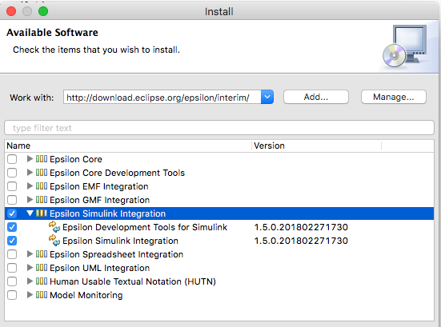
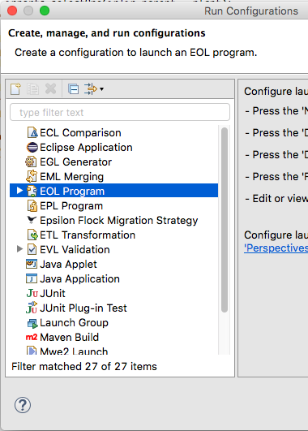
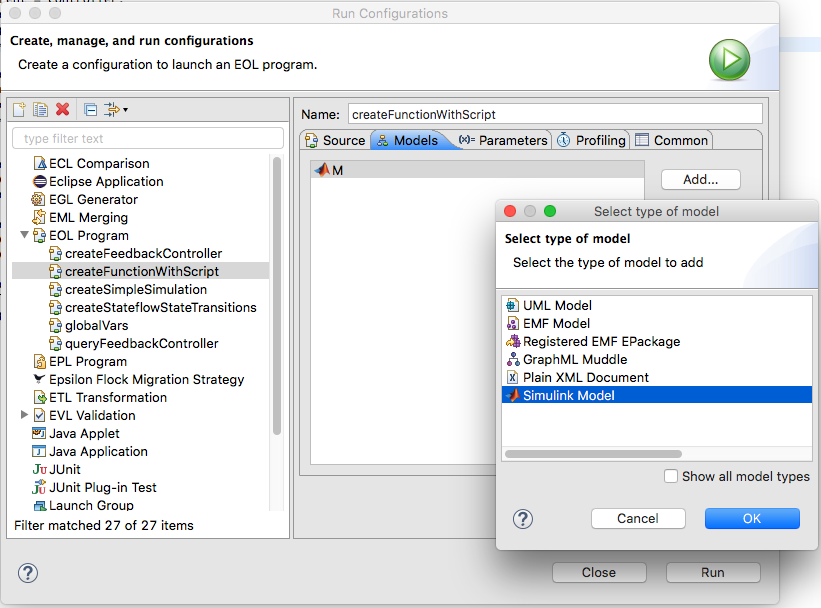
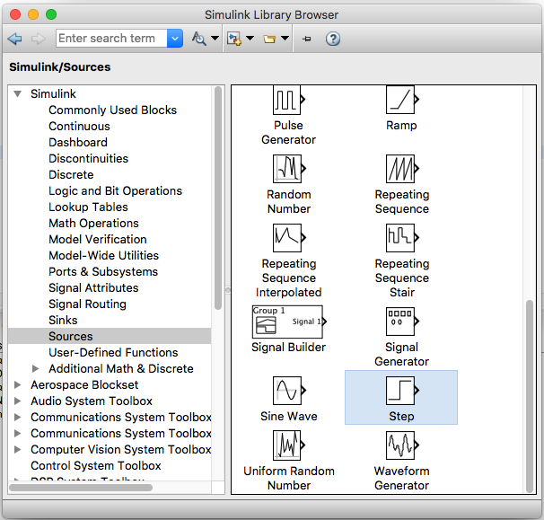

# Managing Matlab Simulink/Stateflow models from Epsilon

Epsilon supports Matlab Simulink models. This tutorial shows you how to manipulate Simulink and Stateflow blocks from within Epsilon.

!!! warning
    The Simulink driver only works with Java 8 for versions of MATLAB before 2021a. This is due to a limitation of the [official MATLAB Java API](https://uk.mathworks.com/help/matlab/matlab-engine-api-for-java.html). Support for Java 11 with MATLAB >= 2021a was added in Epsilon 2.5.
    
## [Pre-requisite] Setting up your Eclipse Installation



*Help > Install New Software...*

In your eclipse installation make sure to go to Help > Install New Software... and in the pop up window add the Epsilon's Update Site and select the "Epsilon Simulink Integration" and proceed with the installation. Make sure that you have "Epsilon Core", "Epsilon Core Developement Tools" and their dependencies already Installed. Click here for more details.

Once installed, make sure to add to the Eclipse Preferences (Eclipse > Preferences...) the path of the Simulink library directory and the Matlab Engine Jar. You will find them in the Preference dialog under the tabs Epsilon > Simulink.

For MATLAB version R2017a, the OSX paths for both are those in the figure below, whereas for Windows machines, the paths are as follow:

- `C:/Program Files/MATLAB/R2017b/bin/win64`
- `C:/Program Files/MATLAB/R2017b/extern/engines/java/jar/engine.jar`


## Loading/Creating a Simulink File as a model

Depending on what epsilon language you would like to run (EOL, EGL, ETL,
EVL, etc.) you will have to create the corresponding "Run Configuration"
(EOL Program, EGL Generator, ETL Transformation, EVL validation, etc.)



*Different types of Run Configurations*

Once you create an epsilon-based run configuration, in the "Models" tab
you should be able to add a Simulink Model.



In the model configuration window you may choose:

- **Simulink File:** The simulink file to read from or to store after the execution.
- **Hide Editor:** Do not open the Matlab Simulink editor if it is closed. Either option won't close the editor if it is opened.
- **Read on Load:** read the contents of the file before the execution.
- **Store on Disposal:** close without saving the changes to the file after the execution


*Model configuration window*

## Creating blocks


*Icon of the Simulink "Library Browser"*



The Step Block is found under Simulink/Sources/Step and therefore
created as new `simulink/Sources/Step`; To create Simulink Blocks you
may instantiate them using the following syntax. The full path of the
block matches their location in the Simulink "Library Browser". The EOL
syntax to create this blocks is as follows:

```eol
var step = new `simulink/Sources/Step`;
var sum = new `simulink/Math Operations/Sum`;
var chart = new `sflib/Chart`;
```

In contrast to Simulink Blocks, Stateflow Blocks don't require the full
library path but have to be instantiated with the Stateflow prefix (e.g.
`Stateflow.${Block_Type}`). These blocks also need to have a parent and there are three options to do this with the Epsilon
driver.

```eol
// Pass the parent as an argument of the constructor 
new `Stateflow.State`(parent);

// Add the child to the parent 
var state= new `Stateflow.State`; 
parent.add(state);

// Set the parent as an object attribute 
var state= new `Stateflow.State`;
state.parent = parent;
```

### Child Blocks

You can also retrieve the child blocks of a given Simulink or Stateflow
block using either syntax for both kinds of blocks:

```eol
state.getChildren();
chart.children;
```

Note that Stateflow Blocks will return Stateflow Blocks as children and
Simulink Blocks will return their Simulink children Blocks.

## Querying for existing blocks


If your Simulink file had preexisting blocks or if you just created some
with your EOL script, then you may query for all the blocks of a given
type.

For Simulink Blocks you may do this without having to specify their full
path.

```eol
// var sum = new `simulink/Math Operations/Sum`; // Full path 
var sumBlockList = Sum.all; // Type only
```

For Stateflow Blocks you must specify the fully qualified type i.e. the
same used for creation:

```eol
// var state= new `Stateflow.State`; // Fully qualified type
var stateBlockList = `Stateflow.State`.all; 
```

Be aware that some Simulink Blocks have different "BlockTypes" than the
path used for their construction.

```eol
var pidController = new `simulink/Continuous/PID Controller`; 
var subsystemBlockList = SubSystem.all; // Includes PID Controller
// PIDController.all or `PID Controller`.all would return an error
var transferFcn = new `simulink/Continuous/Transfer Fcn`;
var transferFcnBlockList = TransferFcn.all; // Removed the space
```

You may find the real Simulink Block type of the element by retrieving
the "BlockType" property of the Simulink Block.

```eol
var pidController = new `simulink/Continuous/PID Controller`;
pidController.BlockType.println; // prints "SubSystem"
```

Note that Simulink and Stateflow Block types are case sensitive for
instantiation and collection.

## Reading and Updating the block properties

You may read and update properties of Simulink and Stateflow blocks as
follows:

```eol
state.Name = "State A"; // Set
state.name.println; // Get
```

You may also set and get positioning attributes.

```eol
state.Position = "[50 50 310 200]"; // Set (receives a string type)
var seq = state.position; // Get position (returns a sequence type)
assert(seq.at(0) = 50); // element 0 of state block position
```

Note that properties are case insensitive.

## Deleting blocks

You can also delete blocks using the following syntax:

```eol
delete state; // `Stateflow.State`
delete chart; // `sflib/Chart`
```

## Summary

In this tutorial we've seen how to create, read, update, and delete
Simulink and Stateflow block types in epsilon and also how to set up
your eclipse installation to be able to run epsilon-based scripts on
Simulink files loaded as models.

For further information on how to perform more complex operations with
epsilon have a look at Epsilon's website or Epsilon's book. For more
examples with the Simulink/Stateflow Epsilon Driver have a look at this
folder in the official epsilon repository.
