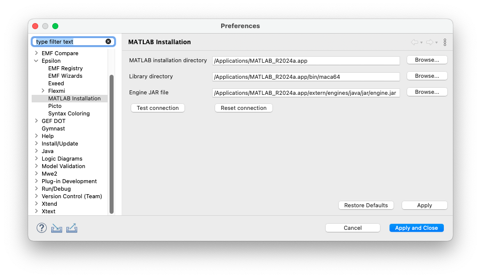
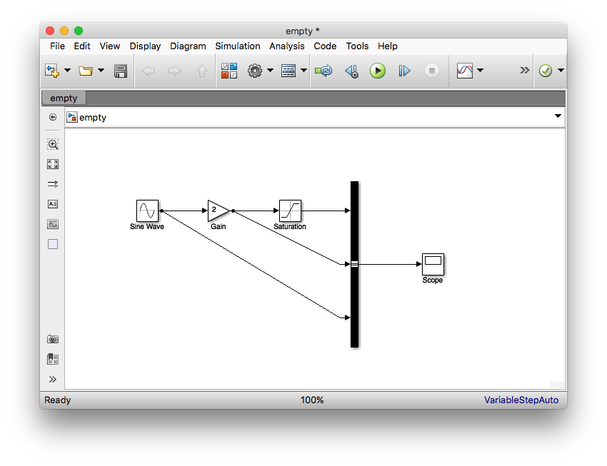

# Scripting Simulink models using Epsilon 

In this article we demonstrate how you can create, query and modify Simulink models in Epsilon programs. While the example in this article demonstrates using EOL to script Simulink models, it's worth stressing that Simulink models are supported throughout Epsilon. Therefore, you can use Epsilon to (cross-)validate, transform (to other models - Simulink or EMF-based -, or to text), compare and merge your Simulink models.

## Installation

The first time you run Eclipse after installing the Simulink driver you will need to point it to the location of your MATLAB installation through the Eclipse `Preferences -> Epsilon -> MATLAB Installation` dialog as shown below. In particular, you need to specify:

- The MATLAB Installation directory
- The MATLAB Library directory
    - `<matlab-root>/bin/win64` on Windows 
    - `/bin/maci64` on MacOS Intel 
    - `/bin/maca64` on MacOS Apple Silicon
- MATLAB's `engine.jar` 

Note that in most cases, if you installed MATLAB in the default location for your operating system, the paths should be automatically detected, and if not you should usually only need to set the MATLAB root directory in your preferences.



## Troubleshooting / Notes

- Please see the official [Matlab documentation](https://uk.mathworks.com/help/matlab/matlab_external/setup-environment.html) for instructions on setting up OS variables and the Java library path.
- If you start getting strange errors about dynamic libraries, chances are that the Matlab paths above are wrong. If restarting Eclipse and correcting the paths doesn't solve this, please post a message to the forum.
- In some cases, you may need to use the same Java runtime (JRE) as your MATLAB installation. For example in Windows, the path to MATLAB's Java is `<matlab-root>/sys/java/jre/win64/jre`. To configure an alternative JRE, please set the `MATLAB_JAVA` environment variable to point to a compatible JRE, and ensure that both your Eclipse and MATLAB are using the same JRE version.
- If you are having trouble configuring the MATLAB paths from the UI (or no alternative configuration method is available), you can set the `org.eclipse.epsilon.emc.matlab_path` environment variable to point to your MATLAB installation.

## Quick start

- Create a new General project
- Create an empty Simulink model in the project (e.g. `empty.slx`)
- Create a new EOL file (e.g. `demo.eol`) and add the content below to
    it:

```eol
// Create elements
var sineWave = new `simulink/Sources/Sine Wave`;
var gain = new `simulink/Math Operations/Gain`;
var saturation = new `simulink/Discontinuities/Saturation`;
var busCreator = new `simulink/Signal Routing/Bus Creator`;
var scope = new `simulink/Sinks/Scope`;

// Position them on the diagram
sineWave.position = "[100 100 130 130]";
gain.position = "[200 100 230 130]";
saturation.position = "[300 100 330 130]";
busCreator.position = "[400 70 410 300]";
scope.position = "[500 175 530 205]";

// Set their properties
gain.gain = 2;
busCreator.inputs = 3;

// Link them
sineWave.link(gain);
gain.link(saturation);
saturation.link(busCreator);
gain.linkTo(busCreator, 2);
sineWave.linkTo(busCreator, 3);
busCreator.link(scope);
```

- Create a new Run configuration for your EOL program and add a Simulink model to it, pointing at your .slx (e.g. `empty.slx`) model
- Launch the Run configuration. Simulink should pop up and you should see the model below (which you can edit/run as normal)



## Updates in Epsilon 2.6

While older versions of Java allowed altering the Java library path at runtime, this is no longer possible. Therefore, we have removed the respective configuration property and UI. Please check the official [Matlab documentation](https://uk.mathworks.com/help/matlab/matlab_external/setup-environment.html) for instructions on setting up OS variables and the Java library path. Epsilon 2.6 also adds support for Apple Silicon.