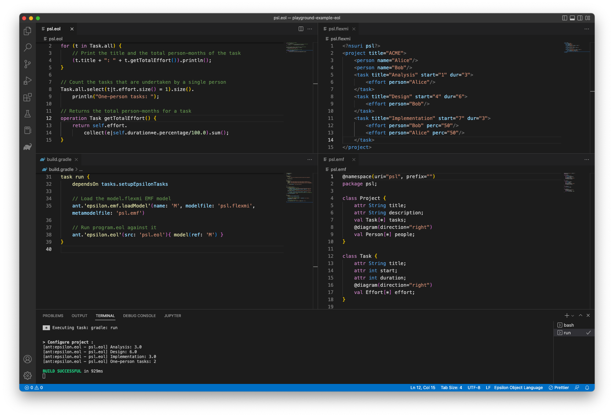
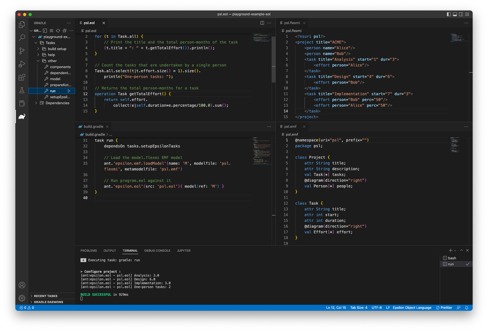

# Epsilon in VS Code

You can now edit and run Epsilon programs, and edit [Flexmi](../../flexmi) models and [Emfatic](https://eclipse.org/emfatic) metamodels in VS Code as shown below.

To do this you will need to install the following VS Code extensions:

- [Eclipse Epsilon Languages](https://marketplace.visualstudio.com/items?itemName=SamHarris.eclipse-epsilon-languages): Syntax highlighting, terminal hyperlinking, [debugging](../debugger.md#microsoft-visual-studio-code)
- [Gradle for Java](https://marketplace.visualstudio.com/items?itemName=vscjava.vscode-gradle): Support for running Gradle build files

## Give it a spin!

- Go to any example on the [Epsilon Playground](../../../playground)
- Download a zipped copy of the example (for Gradle) using the Download button
- Extract the downloaded zip file
- Open the folder using VS Code
- Go to the Gradle tab on the left hand side
- Run the `run` task under `Tasks`->`other` as shown below

