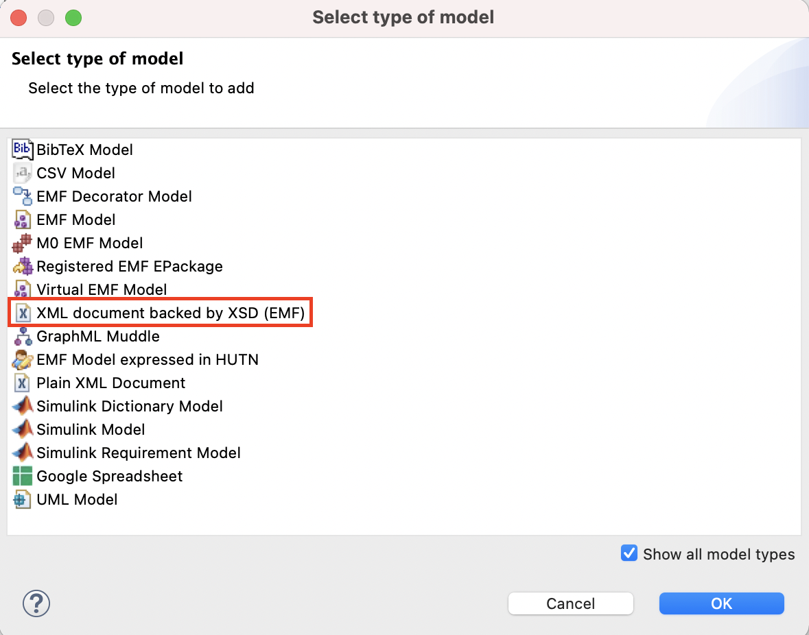

# Scripting XML documents that conform to an XSD schema using Epsilon

In this article we demonstrate how you can create, query and modify XML documents backed by an XSD schema in Epsilon.

## Querying an XML document
 
We use the following `library.xml` as a base for demonstrating the EOL syntax for querying XML documents.

```xml
<?xml version="1.0" encoding="UTF-8"?>
<library xsi:noNamespaceSchemaLocation="library.xsd">
    <book title="EMF Eclipse Modeling Framework" pages="744">
        <author>Dave Steinberg</author>
        <author>Frank Budinsky</author>
        <author>Marcelo Paternostro</author>
        <author>Ed Merks</author>
        <published>2009</published>
    </book>
    <book title="Eclipse Modeling Project: A Domain-Specific Language (DSL) Toolkit" pages="736">
        <author>Richard Gronback</author>
        <published>2009</published>
    </book>
    <book title="Official Eclipse 3.0 FAQs" pages="432">
        <author>John Arthorne</author>
        <author>Chris Laffra</author>
        <published>2004</published>
    </book>
</library>
```

The XSD schema `library.xsd` that backs the `library.xml` file is the following.

```xml
<?xml version="1.0" encoding="UTF-8"?>
<xs:schema xmlns:xs="http://www.w3.org/2001/XMLSchema" elementFormDefault="qualified" attributeFormDefault="unqualified">
<!-- XML Schema Generated from XML Document with XmlGrid.net Free Online Service http://xmlgrid.net -->
	<xs:element name="library">
		<xs:complexType>
			<xs:sequence>
				<xs:element name="book" maxOccurs="unbounded">
					<xs:complexType>
						<xs:sequence>
							<xs:element name="author" maxOccurs="unbounded" type="xs:string"></xs:element>
							<xs:element name="published" type="xs:int"></xs:element>
						</xs:sequence>
						<xs:attribute name="title" type="xs:string"></xs:attribute>
						<xs:attribute name="pages" type="xs:int"></xs:attribute>
					</xs:complexType>
				</xs:element>
			</xs:sequence>
		</xs:complexType>
	</xs:element>
</xs:schema>
```

## Querying XML documents in EOL
 
The XML driver uses a predefined naming convention to allow developers to programmatically access complex types in XML documents. 
 
### How can I query by element type?
The word `Type` should be appended at the end of the name of the tag that is used to represent a type. In addition, the first letter of the tag should be capitalised (no matter if it is in lowercase in the schema/xml file). For instance, `BookType.all()` can be used to get all elements tagged as `<book>` in the document. Also, if `b` is an element with a `<book>` tag, then `b.isTypeOf(BookType)` shall return true.

```eol
// Get the first library element in the document
var library = LibraryType.all().first();

// Get all the books contained in this library
var allBooks = library.book;

// We can get all the books in the document by querying directly the book type
var allBooksAlternative = BookType.all();

// Iterate through the collection of books, navigate the pages attribute and 
// return the title of the book if it has more than 700 pages
for (aBook in allBooks) {
	if (aBook.pages > 700) {
		aBook.isTypeOf(BookType).println();
		("The " + aBook.title + " is a large book!").println();
	}
}
```

### How can I get/set the attributes of an element?
 
You can use the attribute name as a property of the element object. For example, if `b` is the first book of `library.xml`, `b.title` will return `EMF Eclipse Modeling Framework`. Attribute properties are read/write.

In this example, `b.pages` will return `744` as an integer. Thus, the following program will return the total number of pages of all the books in the library. 

```eol
// Get all the books contained in this library
var allBooks = BookType.all();

// Print the total number of pages of all books
var total = 0;
for (aBook in allBooks) {
	total = total + aBook.pages;
}
("Total pages: " + total).println();

// ... the same using collect() and sum() 
// instead of a for loop
BookType.all().collect(b|b.pages).sum().println();
```

### How can I set the text of an element?
 
You can use the property name and the assignment symbol `=` for this.

```eol
// Get the first book contained in the library
var emfBook = BookType.all().first();

// Set the title to a new one
emfBook.title = "EMF Book";

// Print the changed title (NB.: You need to have selected the "Store on disposal" 
// option in the run configuration to save changes to the XML file.)
var changedEmfBook =  BookType.all().first();
changedEmfBook.title.println();
```

### How do I create an element and add it to an existing element?
 
You can use the `new` operator for this. 

```eol
// Get all the books contained in this library
var library = LibraryType.all().first();
var allBooks = library.book;

// Print the current number of books
allBooks.size().println();

// Create a new book
var newBook: new BookType;
newBook.title = "MDE in Practice";

// Add the book to the library
library.book.add(newBook);

// Get all books and print the new size
BookType.all().size().println();
```

## Adding an XML document to your launch configuration
 
To add an XML document to your Epsilon launch configuration, you need to select "XML document backed by XSD (EMF)" from the list of available model types.



Then you can configure the details of your document (name, file etc.) in the screen that pops up. If you are making changes to the XML document, remember to tick the "Store on disposal" check box to save the changes in your document. 

