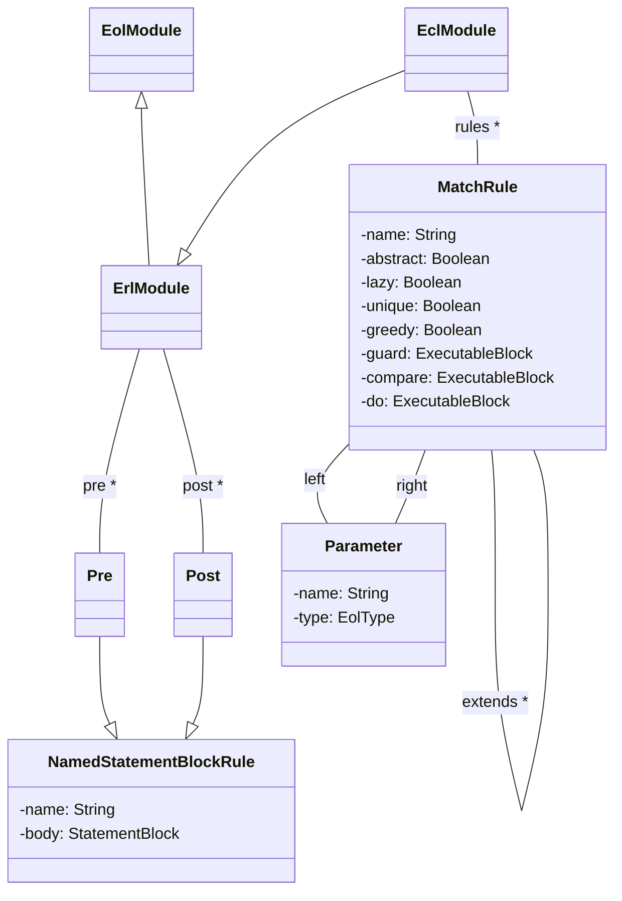
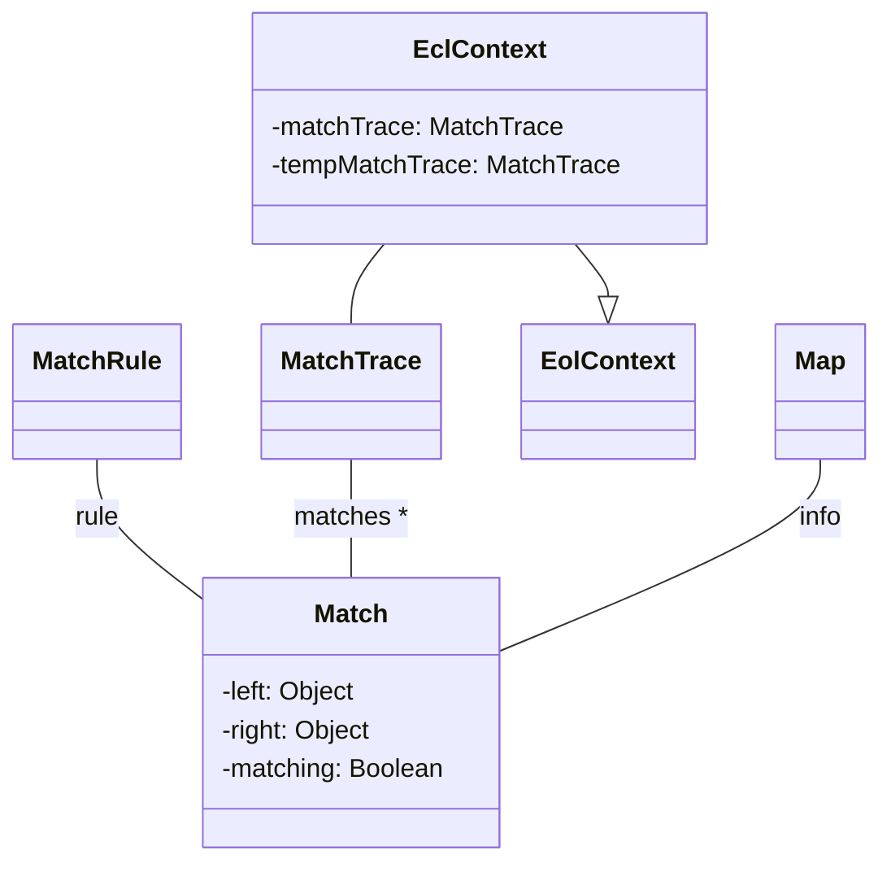
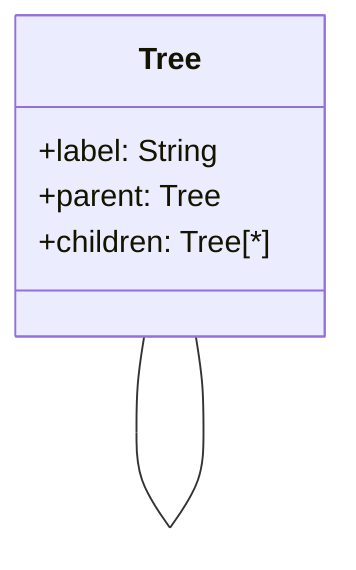

# The Epsilon Comparison Language (ECL)


Model comparison is the task of identifying *matching* elements between models. In general, *matching* elements are elements that are involved in a relationship of interest. For example, before merging homogeneous models, it is essential to identify overlapping (common) elements so that they do not appear in duplicate in the merged model. Similarly, in heterogeneous model merging, it is a prerequisite to identify the elements on which the two models will be merged. Finally, in transformation testing, matching elements are pairs consisting of elements in the input model and their generated counterparts in the output model.

The aim of the Epsilon Comparison Language (ECL) is to enable users to specify comparison algorithms in a rule-based manner to identify pairs of matching elements between two models of potentially different metamodels and modelling technologies. In this section, the abstract and concrete syntax, as well as the execution semantics of the language, are discussed in detail.

## Abstract Syntax

In ECL, comparison specifications are organized in modules (*EcLModule*). As illustrated below, *EclModule* (indirectly) extends *EolModule* which means that it can contain user-defined operations and import other library modules and ECL modules. Apart from operations, an ECL module contains a set of match-rules (*MatchRule*) and a set of *pre* and *post* blocks than run before and after all comparisons, respectively.

*MatchRules* enable users to perform comparison of model elements at a high level of abstraction. Each match-rule declares a name, and two parameters (*leftParameter* and *rightParameter*) that specify the types of elements it can compare. It also optionally defines a number of rules it inherits (*extends*) and if it is *abstract*, *lazy* and/or *greedy*. The semantics of the latter are discussed shortly.



A match rule has three parts. The *guard* part is an EOL expression or statement block that further limits the applicability of the rule to an even narrower range of elements than that specified by the *left* and *right* parameters. The *compare* part is an EOL expression or statement block that is responsible for comparing a pair of elements and deciding if they match or not. Finally, the *do* part is an EOL expression or block that is executed if the *compare* part returns true to perform any additional actions required.

*Pre* and *post* blocks are named blocks of EOL statements which as discussed in the sequel are executed before and after the match-rules have been executed respectively.

## Concrete Syntax

The concrete syntax of a match-rule is displayed below.

```
(@lazy)?
(@greedy)?
(@abstract)?
rule <name>
    match <leftParameterName>:<leftParameterType> 
    with <rightParameterName>:<rightParameterType>
        (extends <ruleName>(, <ruleName>)*)? { 

    (guard (:expression)|({statementBlock}))?
    compare (:expression)|({statementBlock})
    (do {statementBlock})?
}
```

*Pre* and *post* blocks have a simple syntax that, as shown below, consists of the identifier (*pre* or *post*), an optional name and the set of statements to be executed enclosed in curly braces.

```
(pre|post) <name> {
    statement+
}
```

## Execution Semantics

### Rule and Block Overriding

An ECL module can import a number of other ECL modules. In such a case, the importing ECL module inherits all the rules and pre/post blocks specified in the modules it imports (recursively). If the module specifies a rule or a pre/post block with the same name, the local rule/block overrides the imported one respectively.

### Comparison Outcome

As illustrated below, the result of comparing two models with ECL is a trace (*MatchTrace*) that consists of a number of matches (*Match*). Each match holds a reference to the objects from the two models that have been compared (*left* and *right*), a boolean value that indicates if they have been found to be *matching* or not, a reference to the *rule* that has made the decision, and a Map (*info*) that is used to hold any additional information required by the user (accessible at runtime through the *matchInfo* implicit variable). During the matching process, a second, temporary, match trace is also used to detect and resolve cyclic invocation of match-rules as discussed in the sequel.



### Rule Execution Scheduling

Non-abstract, non-lazy match-rules are evaluated automatically by the execution engine in a top-down fashion - with respect to their order of appearance - in two passes. In the first pass, each rule is evaluated for all the pairs of instances in the two models that have a type-of relationship with the types specified by the *leftParameter* and *rightParameter* of the rule. In the second pass, each rule that is marked as *greedy* is executed for all pairs that have not been compared in the first pass, and which have a kind-of relationship with the types specified by the rule. In both passes, to evaluate the compare part of the rule, the guard must be satisfied.

Before the compare part of a rule is executed, the compare parts of all of the rules it extends (super-rules) must be executed (recursively). Before executing the compare part of a super-rule, the engine verifies that the super-rule is actually applicable to the elements under comparison by checking for type conformance and evaluating the guard part of the super-rule.

If the compare part of a rule evaluates to true, the optional do part is executed. In the do part the user can specify any actions that need to be performed for the identified matching elements, such as to populate the *info* map of the established *match* with additional information. Finally, a new match is added to the match trace that has its *matching* property set to the logical conjunction of the results of the evaluation of the compare parts of the rule and its super-rules.

### The *matches()* built-in operation

To refrain from performing duplicate comparisons and to de-couple match-rules from each other, ECL provides the built-in *matches(opposite : Any)* operation for model elements and collections. When the *matches()* operation is invoked on a pair of objects, it queries the main and temporary match-traces to discover if the two elements have already been matched and if so it returns the cached result of the comparison. Otherwise, it attempts to find an appropriate match rule to compare the two elements and if such a rule is found, it returns the result of the comparison, otherwise it returns false. Unlike the top-level execution scheme, the *matches()* operation invokes both *lazy* and *non-lazy* rules.

In addition to objects, the *matches* operations can also be invoked to match pairs of collections of the same type (e.g. a Sequence against a Sequence). When invoked on ordered collections (i.e. *Sequence* and *OrderedSet*), it examines if the collections have the same size and each item of the source collection matches with the item of the same index in the target collection. Finally, when invoked on unordered collections (i.e. *Bag* and *Set*), it examines if for each item in the source collection, there is a matching item in the target collection irrespective of its index. Users can also override the built-in *matches* operation using user-defined operations with the same name, that loosen or strengthen the built-in semantics.

### Cyclic invocation of *matches()*

Providing the built-in *matches* operation significantly simplifies comparison specifications. It also enhances decoupling between match-rules from each other as when a rule needs to compare two elements that are outside its scope, it does not need to know/specify which other rule can compare those elements explicitly.

On the other hand, it is possible - and quite common indeed - for two rules to implicitly invoke each other. For example consider the match rule below that attempts to match nodes of the simple Tree metamodel.



```ecl
rule Tree2Tree 
    match l : T1!Tree
    with r : T2!Tree {
    
    compare : l.label = r.label and 
        l.parent.matches(r.parent) and
        l.children.matches(r.children)
}
```

The rule specifies that for two Tree nodes (*l* and *r*) to match, they should have the same label, belong to matching parents and have matching children. In the absence of a dedicated mechanism for cycle detection and resolution, the rule would end up in an infinite loop. To address this problem, ECL provides a temporary match-trace which is used to detect and resolve cyclic invocations of the *match()* built-in operation.

As discussed above, a match is added to the primary match-trace as soon as the compare part of the rule has been executed to completion. By contrast, a temporary match (with its *matching* property set to *true*) is added to the temporary trace before the compare part is executed. In this way, any subsequent attempts to match the two elements from invoked rules will not re-invoke the rule. Finally, when a top-level rule returns, the temporary match trace is reset.

## Fuzzy and Dictionary-based String Matching

In the example above, the rule specifies that to match, two trees must - among other criteria - have the same label. However, there are cases when a less-strict approach to matching string properties of model elements is desired. For instance, when comparing two UML models originating from different organizations, it is common to encounter ontologically equivalent classes which however have different names (e.g. Client and Customer). In this case, to achieve a more sound matching, the use of a dictionary or a lexical database (e.g. WordNet) is necessary. Alternatively, fuzzy string matching algorithms can be used.

As several such tools and algorithms have been implemented in various programming languages, it is a sensible approach to reuse them instead of re-implementing them. For example, in the listing below a wrapper for the Simmetrics fuzzy string comparison tool is used to compare the labels of the trees using the Levenshtein algorithm. To achieve this, line 11 invokes the *fuzzyMatch()* operation defined in lines 16-18 which uses the simmterics native tool (instantiated in lines 2-4) to match the two labels using their Levenshtein distance with a threshold of 0.5.

```ecl
pre {
    var simmetrics = 
        new Native("org.epsilon.ecl.tools.
            textcomparison.simmetrics.SimMetricsTool"); 
}

rule FuzzyTree2Tree 
    match l : T1!Tree
    with r : T2!Tree {
    
    compare : l.label.fuzzyMatch(r.label) and 
        l.parent.matches(r.parent) and
        l.children.matches(r.children)
}

operation String fuzzyMatch(other : String) : Boolean {
    return simmetrics.similarity(self,other,"Levenshtein") > 0.5;
}
```

## The Match Trace

Users can query and modify the match trace calculated during the comparison process in the post sections of the module or export it into another application or Epsilon program. For example, in a post section, the trace can be printed to the default output stream or serialized into a model of an arbitrary metamodel. In another use case, the trace may be exported to be used in the context of a validation module that will use the identified matches to evaluate inter-model constraints, or in a merging module that will use the matches to identify the elements on which the two models will be merged.
