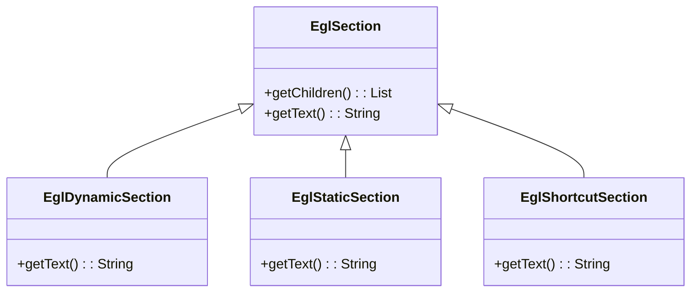

# The Epsilon Generation Language (EGL)

EGL provides a language tailored for model-to-text transformation (M2T). EGL can be used to transform models into various types of textual artefact, including executable code (e.g. Java), reports (e.g. in HTML), images (e.g. using DOT), formal specifications (e.g. Z notation), or even entire applications comprising code in multiple languages (e.g. HTML, Javascript and CSS).

EGL is a *template-based* code generator (i.e. EGL programs resemble the text that they generate), and provides several features that simplify and support the generation of text from models, including: a sophisticated and language-independent merging engine (for preserving hand-written sections of generated text), an extensible template system (for generating text to a variety of sources, such as a file on disk, a database server, or even as a response issued by a web server), formatting algorithms (for producing generated text that is well-formatted and hence readable), and traceability mechanisms (for linking generated text with source models).

## Abstract Syntax

The figure below shows the abstract syntax of EGL's core functionality.



<!--[The abstract syntax of EGL's
core.](images/EglAbstractSyntax.png)-->

Conceptually, an EGL program comprises one or more *sections*. The contents of static sections are emitted verbatim and appear directly in the generated text. The contents of dynamic sections are executed and are used to control the text that is generated.

In its dynamic sections, EGL re-uses EOL's mechanisms for structuring program control flow, performing model inspection and navigation, and defining custom operations. In addition, EGL provides an EOL object, `out`, which is used in dynamic sections to perform operations on the generated text, such as appending and removing strings; and specifying the type of text to be generated.

EGL also provides syntax for defining *dynamic output* sections, which provide a convenient shorthand for outputting text from within dynamic sections. Similar syntax is often provided by template-based code generators.

## Concrete Syntax

The concrete syntax of EGL closely resembles the style of other template-based code generation languages, such as PHP. The tag pair *\[% %\]* is used to delimit a dynamic section. Any text not enclosed in such a tag pair is contained in a static section. The listing below illustrates the use of dynamic and static sections to form a basic EGL template.

```egl
[% for (i in Sequence{1..5}) { %]
i is [%=i%]
[% } %]
```

Executing the EGL template above would produce the generated text below. The *\[%=expr%\]* construct (line 2) is shorthand for *\[% out.print(expr); %\]*, which appends *expr* to the output generated by the transformation.

```
i is 1
i is 2
i is 3
i is 4
i is 5
```

Any EOL statement can be contained in the dynamic sections of an EGL template. For example, the EGL template shown below generates text from a model that conforms to a metamodel that describes an object-oriented system.

```egl
[% for (c in Class.all) { %]
[%=c.name%]
[% } %]
```

### Comments and Markers

Inside an EGL dynamic section, EOL's comment syntax can be used. Additionally, EGL adds syntax for comment blocks `[* this is a comment *]` and marker blocks `[*- this is a marker *]`. Marker blocks are highlighted by the EGL editor and EGL outline view in Eclipse.

### User-Defined Operations

Like EOL, EGL permits users to define re-usable units of code via
operations.

```
[% c.declaration(); %]
[% operation Class declaration() { %]
[%=self.visibility%] class [%=self.name%] {}
[% } %]
```

In EGL, user-defined operations are defined in dynamic sections, but may mix static and dynamic sections in their bodies. Consider, for example, the EGL code in the listing above, which emits a declaration for a Java class (e.g. `public class Foo {}`). Lines 2-4 declare the operation. Note that the start and the end of the operation's declaration (on lines 2 and 4, respectively) are contained in dynamic sections. The body of the operation (line 3), however, mixes static and dynamic output sections. Finally, note that the operation is invoked from a dynamic section (line 1). It is worth noting that any loose (i.e. not contained in other operations) dynamic or static sections below the first operation of a template will be ignored at runtime.

When a user-defined operation is invoked, any static or dynamic sections contained in the body of the operation are immediately appended to the generated text. Sometimes, however, it is desirable to manipulate the text produced by an operation before it is appended to the generated text. To this end, EGL defines the `@template` annotation which can applied to operations to indicate that any text generated by the operation must be returned from the operation and not appended to the generated text. For example, the EGL program in the listing above could be rewritten using a `@template` annotation, as demonstrated below.

```
[%=c.declaration()%]
[% @template
   operation Class declaration() { %]
[%=self.visibility%] class [%=self.name%] {}
[% } %]
```

There is a subtle difference between the way in which standard (i.e. unannotated) operations and `@template` operations are invoked. Compare the first line of the two listings above. The former uses a dynamic section, because invoking the operation causes the evaluation of its body to be appended to the text generated by this program. By contrast, the latter uses a dynamic output section to append the result returned by the `@template` operation to the text generated by this program.

In general, `@template` operations afford more flexibility than standard operations. For example, line 1 of the listing above could perform some manipulation of the text returned by the `declaration()` operation before the text is outputted. Therefore, `@template` operations provide a mechanism for re-using common pieces of a code generator, without sacrificing the flexibility to slightly alter text before it is emitted. Standard (unannotated) operations also permit re-use, but in a less flexible manner.

Finally, it is worth noting that user-defined operations in EGL do not have to generate text. For example, the following listing illustrates two operations defined in an EGL program that do not generate any text. The former is a query that returns a Boolean value, while the latter alters the model, and does not return a value.

```egl
[%
  operation Class isAnonymous() : Boolean {
        return self.name.isUndefined();
  }

  operation removeOneClass() {
        delete Class.all.random();
    }
%]
```

## The OutputBuffer

As an EGL program is executed, text is appended to a data structure termed the *OutputBuffer*. In every EGL program, the *OutputBuffer* is accessible via the `out` built-in variable. The *OutputBuffer* provides operations for appending to and removing from the buffer, and for merging generated text with existing text.

For many EGL programs, interacting directly with the *OutputBuffer* is unnecessary. The contents of static and dynamic output sections are sent directly to the *OutputBuffer*, and no operation of the *OutputBuffer* need be invoked directly. However, in cases when generated text must be sent to the *OutputBuffer* from dynamic sections, or when generated text must be merged with existing text, the operations of *OutputBuffer* are provided in the table below. The [merge engine section]](#merge-engine) discusses merging generated and existing text, and presents several examples of invoking the operations of *OutputBuffer*.

| Signature | Description |
| --------- | ----------- |
| chop(numberOfChars : Integer) | Removes the specified number of characters from the end of the buffer|
|print(object : Any) | Appends a string representation of the specified object to the buffer|
| println(object : Any) | Appends a string representation of the specified object and a new line to the buffer|
| println() | Appends a new line to the buffer|
| setContentType(contentType : String) | Updates the content type of this template. Subsequent calls to `preserve` or `startPreserve` that do not specify a style of comment will use the style of comment defined by the specified content type.|
|preserve(id : String, enabled : Boolean, contents : String) | Appends a protected region to the buffer with the given identifier, enabled state and contents. Uses the current content type to determine how to format the start and end markers.|
|preserve(startComment : String, endComment : String, id : String, enabled : Boolean, contents : String) | Appends a protected region to the buffer with the given identifier, enabled state and contents. Uses the first two parameters as start and end markers.|
|startPreserve(id : String, enabled : Boolean) | Begins a protected region by appending the start marker for a protected region to the buffer with the given identifier and enabled state. Uses the current content type to determine how to format the start and end markers|
|startPreserve(startComment : String, endComment : String, id : String, enabled : Boolean) | Begins a protected region by appending the start marker to the buffer with the given identifier and enabled state. Uses the first two parameters as start and end markers.|
|stopPreserve() | Ends the current protected region by appending the end marker to the buffer. This operation should be invoked only if there a protected region is currently open (i.e. has been started by invoking `startPreserve` but not yet stopped by invoking `stopPreserve`).|

## Co-ordination

In the large, M2T transformations are used to generate text to various destinations. For example, code generators often produce files on disk, and web applications often generate text as part of the response for a resource on the web server. Text might be generated to a network socket during interprocess communication, or as a query that runs on a database. Furthermore, (parts of) a single M2T transformation might be re-used in different contexts. A M2T transformation that generates files on disk today might be re-purposed to generate the response from a web server tomorrow.

Given these concerns, EGL provides a co-ordination engine that provides mechanisms for modularising M2T transformations, and for controlling the destinations to which text is generated. The EGL co-ordination engine fulfils three requirements:

1.  **Reusability**: the co-ordination engine allows EGL programs to be decomposed into one or more templates, which can be shared between EGL programs.

2.  **Variety of destination**: the co-ordination engine provides an extensible set of template types that can generate text to a variety of destinations. The next section describes the default template type, which is tailored to generate text to files on disk, while a subsequent section discusses the way in which users can define their own template types for generating text to other types of destination.

3.  **Separation of concerns**: the co-ordination engine ensures that the logic for controlling the text that is generated (i.e. the content) and the logic for controlling the way in which text is emitted (i.e. the destination) are kept separate.

There is also the [EGX language](../egx/), which was introduced after this documentation was initially written, but provides a fully-fledged rule-based execution engine for paramterising EGL templates.

### The Template type

Central to the co-ordination engine is the *Template* type, which EGL provides in addition to the default EOL types. Via the *Template* type, EGL fulfils the three requirements identified above. Firstly, a *Template* can invoke other *Templates*, and hence can be shared and re-used between EGL programs. Secondly, the *Template* type has been implemented in an extensible manner: users can define their own types of *Template* that generate text to any destination (e.g. a database or a network socket), as described in the [custom coordination section](#customising-the-co-ordination-engine). Finally, the *Template* type provides a set of operations that are used to control the destination of generated text. Users typically define a "driver" template that does not generate text, but rather controls the destination of text that is generated by other templates.

For example, consider the EGL program in the listing below. This template generates no text (as it contains only a single dynamic section), but is used instead to control the destination of text generated by another template. Line 1 defines a variable, `t`, of type *Template*. Note that, unlike the EOL types, instances of *Template* are not created with the `new` keyword. Instead, the *TemplateFactory* built-in object is used to load templates from, for example, a file system path. On line 3, the *generate* operation of the *Template* type invokes the EGL template stored in the file "ClassNames.egl" and emits the generated text to "Output.txt".

```egl
[%
  var t : Template = TemplateFactory.load("ClassNames.egl");
  t.generate("Output.txt");
%]
```

In addition to `generate`, the Template type defines further operations for controlling the context and invocation of EGL templates. The following table lists all of the operations defined on *Template*, and a further example of their use is given in the sequel.

| Signature | Description |
| --------- | ----------- |
| populate(name : String, value : Any) | Makes a variable with the specified name and value available during the execution of the template.|
|process() : String | Executes the template and returns the text that is generated.|
|generate(destination : String) | Executes the template and stores the text to the specified destination. The format of the destination parameter is dictated by the type of template. For example, the default template type (which can generate files on disk) expects a file system path as the destination parameter. Returns a object representing the generated file.|
|append(destination : String) | Executes the template: if the destination exists, it will add a newline and the generated text at the end of the file. If the file does not exist, it will write the generated text to it (with no newline). Returns a object representing the generated file.|
|setFormatter(formatter : Formatter) | Changes the formatter for this template to the specified formatter. Subsequent calls to generate or process will produce text that is formatted with the specified formatter.|
|setFormatters(formatters : Sequence(Formatter)) | Changes the formatter for this template to the specified sequence of formatters. Subsequent calls to generate or process will produce text that is formatted with each of the specified formatters in turn.|

### The TemplateFactory object

As discussed above, instances of *Template* are not created with the `new` keyword. Instead, EGL provides a built-in object, the *TemplateFactory*, for this purpose. Users can customise the type of the *TemplateFactory* object to gain more control over the way in which text is generated.

By default, EGL provides a *TemplateFactory* that exposes operations for loading templates (by loading files from disk), preparing templates (by parsing a string containing EGL code), and for controlling the file system locations from which templates are loaded and to which text is generated.

The table below lists the operations provided by the built-in *TemplateFactory* object.

| Signature                                                | Description                                                  |
| -------------------------------------------------------- | ------------------------------------------------------------ |
| load(path : String) : Template                           | Returns an instance of *Template* that can be used to execute the EGL template stored at the specified path. |
| prepare(code : String)                                   | Changes the default path that is used to resolve relative paths when generating files to disk. Subsequent calls to load and prepare will create templates that use the new path. |
| setOutputRoot(path : String)                             | Changes the default path that is used to resolve relative paths when generating files to disk. Subsequent calls to load and prepare will create templates that use the new path. |
| setTemplateRoot(path : String)                           | Changes the default path that is used to resolve relative paths when loading templates with the load operation. Subsequent calls to load will use the new path. |
| setDefaultFormatter(formatter : Formatter)               | Changes the formatter for this template factory to the specified formatter. Templates that are constructed after this operation has been invoked will produce text that is, by default, formatted with the specified formatter. |
| setDefaultFormatters(format- ters : Sequence(Formatter)) | Sequence(Formatter)) & Changes the formatter for this template to the specified sequence of formatters. Templates that are constructed after this operation has been invoked will produce text that is, by default, formatted with each of the specified formatters in turn. |

### An Example of Co-ordination with EGL

The operations provided by the *TemplateFactory* object and *Template* type are demonstrated by the EGL program in the listing below. Lines 2-3 use operations on *TemplateFactory* to change the paths from which templates will be loaded (line 2) and to which generated files will be created (line 3). Line 5 demonstrates the use of the `prepare` operation for creating a template from EGL code. When the `interface` template is invoked, the EGL code passed to the `prepare` operation will be executed. Finally, line 9 (and line 12) illustrates the way in which the `populate` operation can be used to pass a value to a template before invoking it. Specifically, the interface and implementation templates can use a variable called *root*, which is populated by the driver template before invoking them.

```egl
[%
  TemplateFactory.setTemplateRoot("/usr/franz/templates");
    TemplateFactory.setOutputRoot("/tmp/output");

  var interface      : Template =
    TemplateFactory.prepare("public interface [%=root.name] {}");
    
    var implementation : Template = 
      TemplateFactory.load("Class2Impl.egl");

    for (c in Class.all) {
      interface.populate("root", c);    
    interface.generate("I" + c.name + ".java");
        
        implementation.populate("root", c);
        implementation.generate(c.name + ".java");
    }
%]
```

### Customising the Co-ordination Engine

EGL provides mechanisms for customising the co-ordination engine. Specifically, users can define and use their own *TemplateFactory*. In many cases, users need not customise the co-ordination engine, and can write transformations using the built-in *Template* type and *TemplateFactory* object. If, however, you need more control over the co-ordination process, the discussion in this section might be helpful. Specifically, a custom *TemplateFactory* is typically used to achieve one or more of the following goals:

1.  Provide additional mechanisms for constructing *Templates*. **Example:** facilitate the loading of templates from a database.

2.  Enrich / change the behaviour of the built-in *Template* type. **Example:** change the way in which generated text is sent to its destination.

3.  Observe or instrument the transformation process by, for instance, logging calls to the operations provided by the *Template* type of the *TemplateFactory* object. **Example:** audit or trace the transformation process.

Customisation is achieved in two stages: implementing the custom *TemplateFactory* (and potentially a custom *Template*) in Java, and using the custom *TemplateFactory*.

#### Implementing a custom TemplateFactory

A custom *TemplateFactory* is a subclass of `EglTemplateFactory`. Typically, a custom *TemplateFactory* is implemented by overriding one of the methods of `EglTemplateFactory`. For example, the `createTemplate` method is overriden to specify that a custom type of *Template* should be created by the *TemplateFactory*. Likewise, the `load` and `prepare` methods can be overriden to change the location from which *Template*s are constructed.

A custom *Template* is a subclass of `EglTemplate` or, most often, a subclass of `EglPersistentTemplate`. Again, customisation is typically achieved by overriding methods in the superclass, or by adding new methods. For example, to perform auditing activities whenever a template is used to generate text, the `doGenerate` method of `EglPersistentTemplate` is overriden.

```java
import org.eclipse.epsilon.egl.EglFileGeneratingTemplateFactory;
import org.eclipse.epsilon.egl.EglTemplate;
import org.eclipse.epsilon.egl.EglPersistentTemplate;
import org.eclipse.epsilon.egl.exceptions.EglRuntimeException;
import org.eclipse.epsilon.egl.execute.context.IEglContext;
import org.eclipse.epsilon.egl.spec.EglTemplateSpecification;

public class CountingTemplateFactory 
extends EglFileGeneratingTemplateFactory {

    @Override
    protected EglTemplate createTemplate(EglTemplateSpecification spec) 
    throws Exception {
        return new CountingTemplate(spec,
                                    context,
                                    getOutputRootOrRoot(),
                                    outputRootPath);
    }   

  public class CountingTemplate 
  extends EglPersistentTemplate {

        public static int numberOfCallsToGenerate = 0;

        public CountingTemplate(EglTemplateSpecification spec,
                                IEglContext context,
                                URI outputRoot,
                                String outputRootPath)
        throws Exception {
            super(spec, context, outputRoot, outputRootPath);
        }


        @Override
        protected void doGenerate(File file,
                                    String targetName,
                                    boolean overwrite,
                                    boolean protectRegions) 
        throws EglRuntimeException {
            numberOfCallsToGenerate++;
        }
    }
}
```

#### Using a custom TemplateFactory

When invoking an EGL program, the user may select a custom *TemplateFactory*. For example, the EGL development tools provide an Eclipse launch configuration that provides a tab named "Generated Text."On this tab, users can select a *TemplateFactory* (under the group called "Type of Template Factory"). Note that a *TemplateFactory* only appears on the launch configuration tab if it has been registered with EGL via an Eclipse extension. Similarly, the [workflow language](../workflow) provided by Epsilon allows the specification of custom types of *TemplateFactory* via the `templateFactoryType` parameter.

### Summary

The co-ordination engine provided by EGL facilitates the construction of modular and re-usable M2T transformations and can be used to generate text to various types of destination. Furthermore, the logic for specifying the contents of generated text is kept separate from the logic for specifying the destination of generated text.

## Merge Engine

EGL provides language constructs that allow M2T transformations to designate regions of generated text as *protected*. Whenever an EGL program attempts to generate text, any protected regions that are encountered in the specified destination are preserved.

Within an EGL program, protected regions are specified with the *preserve(String, String, String, Boolean, String)* method on the `out` keyword. The first two parameters define the comment delimiters of the target language. The other parameters provide the name, enable-state and content of the protected region, as illustrated in the listing below.

```
[%=out.preserve("/*", "*/", "anId", true,
                "System.out.println(foo);")
%]
```

A protected region declaration may have many lines, and use many EGL variables in the contents definition. To enhance readability, EGL provides two additional methods on the `out` keyword: *startPreserve(String, String, String, Boolean)* and `stopPreserve`. The listing below uses these to generate a protected region.

```egl
[%=out.startPreserve("/*", "*/", "anId", true)%]
System.out.println(foo);
[%=out.stopPreserve()%]
```

Because an EGL template may contain many protected regions, EGL also provides a separate method to set the target language generated by the current template, *setContentType(String)*. By default, EGL recognises Java, HTML, Perl and EGL as valid content types. An alternative configuration file can be used to specify further content types. Following a call to `setContentType`, the first two arguments to the `preserve` and `startPreserve` methods can be omitted, as shown in the listing below.

```egl
[% out.setContentType("Java"); %]
[%=out.preserve("anId", true, "System.out.println(foo);")%]
```

Because some languages define more than one style of comment delimiter, EGL allows mixed use of the styles for `preserve` and `startPreserve` methods.

Once a content type has been specified, a protected region may also be declared entirely from a static section, using the syntax in the listing below.

```egl
[% out.setContentType("Java"); %]
// protected region anId [on|off] begin
System.out.println(foo);
// protected region anId end
```

When a template that defines one or more protected regions is processed by the EGL execution engine, the target output destinations are examined and existing contents of any protected regions are preserved. If either the output generated by from the template or the existing contents of the target output destination contains protected regions, a merging process is invoked. The table below shows the default behaviour of EGL's merge engine.

| Protected Regions in Generated | Protected Regions in Existing | Contents taken from |
| - | - | - |
| On | On | Existing |
| On | Off | Generated |
| On | Absent | Generated |
| Off | On | Existing |
| Off | Off | Generated | 
| Off | Absent | Generated | 
| Absent | On | Neither (causes a warning)|
| Absent | Off | Neither (causes a warning)|

## Formatters

Often the text generated by a model-to-text transformation is not formatted in a desirable manner. Text generated with a model-to-text transformation might contain extra whitespace or inconsistent indentation. This is because controlling the formatting of generated text in a model-to-text transformation language can be challenging.

In a template-based model-to-text language, such as EGL, it can be difficult to know how best to format a transformation. On the one hand, the transformation must be readable and understandable, and on the other hand, the generated text must typically also be readable and understandable.

Conscientious developers apply various *conventions* to produce readable code. EGL encourages template developers to prioritise the readability of templates over the readability of generated text when writing EGL templates. For formatting generated text, EGL provides an extensible set of *formatters* that can be invoked during a model-to-text transformation.

### Using a Formatter

EGL provides several built-in formatters. Users can implement additional formatters. To use a formatter, invoke the `setFormatter` or `setFormatters` operation on an instance of the *Template* type. A formatter is a Java class that implements EGL's Formatter interface. From within an EGL program, formatters can be created using a Native (i.e. Java) type. The listing below demonstrates the use of a built-in formatter (XmlFormatter).

```egl
[%
    var f = new Native("org.eclipse.epsilon.egl.formatter.language.XmlFormatter");
    var t = TemplateFactory.load("generate_some_xml.egl");
    t.setFormatter(f);
    t.generate("formatted.xml");
%]
```

To facilitate the re-use of a formatter with many templates, the *TemplateFactory* object provides the `setDefaultFormatter` and `setDefaultFormatters` operations. Templates that are loaded or prepared after a call to `setDefaultFormatter` or `setDefaultFormatters` will, by default, use the formatter(s) specified for the *TemplateFactory*. Note that setting the formatter on a template overwrite any formatter that may have been set on that template by the *TemplateFactory*.

The default formatters for an EGL program can also be set when invoking the program. For example, the EGL development tools provide an Eclipse launch configuration that provides a tab named "Generated Text." On this tab, users can configure one or more formatters which will be used as the default formatters for this EGL program. Note that custom formatters only appear on the launch configuration tab if they have been registered with EGL via an Eclipse extension. Similarly, the [workflow language](../workflow) provided by Epsilon provides a `formatter` nested element that can be used to specify one or more default formatters.

### Implementing a Custom Formatter

Providing a user-defined formatter involves implementing the `Formatter` interface (in `org.eclipse.epsilon.egl.formatter`). For example, the listing below demonstrates a simple formatter that transforms all generated text to uppercase.

```java
import org.eclipse.epsilon.egl.formatter.Formatter;

public class UppercaseFormatter implements Formatter {

    @Override
    public String format(String text) {
        return text.toUpperCase();
    }
}
```

The set of built-in formatters provided by EGL includes some partial implementations of the `Formatter` interface that can be re-used to simplify the implementation of custom formatters. For instance, the `LanguageFormatter` class can correct the indentation of a program written in most languages, when given a start and end regular expression.

Finally, an Eclipse extension point is provided for custom formatters. Providing an extension that conforms to the custom formatter extension point allows EGL to display the custom formatter in the launch configuration tabs of the EGL development tools.

## Traceability

EGL also provides a traceability API, as a debugging aid, to support auditing of the M2T transformation process, and to facilitate change propagation. This API facilitates exploration of the templates executed, files affected and protected regions processed during a transformation. The figure below shows sample output from the traceability API after execution of an EGL M2T transformation to generate Java code from an instance of an OO metamodel. The view shown is accessed via the \... menu in Eclipse. Traceability information can also be accessed programmatically, as demonstrated in the listing below.


```java
EglTemplateFactoryModuleAdapter module = 
      new EglTemplateFactoryModuleAdapter(new EglTemplateFactory());
    
    boolean parsed = module.parse(new File("myTemplate.egl"));
    
    if (parsed && module.getParseProblems().isEmpty()) {
        module.execute();

        Template base = module.getContext().getBaseTemplate();
        
        // traverse the template hierachy
        // display data 
        
    } else {
        // error handling
    }
```
