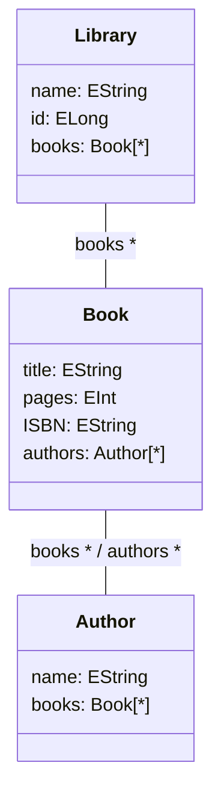

# The EGL Co-Ordination Language (EGX)

EGX is a rule-based co-ordination language designed for automating the parametrised execution of model-to-text template transformations. Although built on top of the Epsilon Generation Language (EGL), EGX can in principle work with any template-based model-to-text transformation language. The rationale for this co-ordination language comes from the need to invoke text generation templates multiple times with various parameters, usually derived from input models. To better understand EGX, it is helpful to be familiar with template-based text generation. 


## Epsilon Generation Language

[EGL](../egl/) is Epsilon's model-to-text transformation language. EGL in principle is similar in purpose to server-side scripting languages like PHP (and can indeed be used for such purposes, as demonstrated [in this article](../articles/egl-server-side/)). To recap, a template is a text file which has both static and dynamic regions. As the name implies, a static region is where text appears as-is in the output, whereas a dynamic region uses code to generate the output, often relying on data which is only available at runtime (hence, "dynamic"). Dynamic regions are expressed using [EOL](../eol). One can think of an EGL template as a regular text file with some EOL embedded in it, or as an EOL program with the added convenience of verbatim text generation. Indeed, it is possible to use EGL without any static regions, relying on the output buffer variable to write the output text. In EGL, the output variable is called "out" and the markers for the start and end of dynamic regions are `[%` and `%]` respectively. For convenience, `[%=` outputs the string value of the expression which follows. EGL has many advanced features, such as recording traceability information, post-process formatting (to ensure consistent style in the final output) and protected regions, which allow certain parts of the text to be preserved if modified by hand, rather than being overwritten on each invocation of the template. EGL can handle merges, and also supports outputting text to any output stream.

As an example, consider a simple Library metamodel (shown below). Suppose each model may have multiple Libraries, and each Library has a name, multiple Books and Authors. Similarly, each Book has one or more Authors, and each Author has multiple Books, similar to the relation between Actors and Movies in the IMDb metamodel used in previous chapters. Now suppose we have a single monolithic model and want to transform this into multiple structured files, such as web pages (HTML) or XML documents. One possible decomposition of this is to generate a page for each Library in the model.



```egl
<?xml version="1.0" encoding="UTF-8"?>
<library id=[%=lib.id%] name="[%=name%]">
[% for (book in books) {%]
  <book>
    <title>[%=book.title%]</title>
    <isbn>[%=book.isbn%]</isbn>
    <pages>[%=book.pages.asString()%]</pages>
    <authors>
    [% for (author in book.authors) {%]
      <author name="[%=author.name%]"/>
    [%}%]
    </authors>
  </book>
[%}%]
</library>
```

Notice how the template refers to `books` (which is a collection of Book elements) without deriving them directly from the underlying model (i.e. there are no uses of allInstances). This is because the variables were provided to the template before invocation.


## Template Orchestration

In the previous example, we stated that we want to invoke the template for all instances of Library in the model. To do this, we need to loop through all Library instances in the model(s), load the template, populate it with the required variables derived from the current Library instance and execute the template. However since we want each Library's contents to be written to a distinct XML file (perhaps identified by its name or id), we also need to set the output file for each template based on the current instance. In more complex cases, we may also want to have certain rules for whether a Library should be generated at all (e.g. if it does not have a threshold number of Books), and whether we should overwrite an existing file. For example, we may decide that for Libraries with a large number of books, we do not want to overwrite the file. Furthermore, we may want to have a different naming convention for certain libraries based on their name or ID, which may be decided based on an arbitrarily complex function. Also, we may not want to include all of the Books in the output file, but a subset, which requires additional processing logic. We may even have different templates for libraries based on the number of Books they hold – for example, with a large Library, we may want to inline all of the properties of each Book to save disk space, rather than having the title, pages, authors etc. enumerated as children. Or we may want to omit the authors. This can be achieved by modifying the template with conditionals, but this makes the template much less readable and harder to modify, so it can be easier to have a separate template instead.

All of these factors are tedious to implement manually and can be difficult to maintain and modify by domain experts using handwritten imperative code. Therefore, a more declarative way of achieving this is needed. This is precisely the purpose of EGX.


## Features and Execution Algorithm

Like all of Epsilon's rule-based (ERL) languages, an EGX module consists of any number of named rules, as well as optional *pre* and *post* blocks which can be used to perform arbitrarily complex tasks using imperative code before and after the execution of rules, respectively. The execution algorithm of EGX is quite simple, since the language itself is essentially a means to parameterise a `for` loop. EGX adds on top of ERL only a single top-level rule construct: the `GenerationRule`. The execution algorithm is thus as simple as executing all of these rules, in the order they are defined in the module. Thus, the remainder of this section describes the components and execution semantics of `GenerationRule`. Note that since variables declared in an earlier scope (executable block) within a `GenerationRule` are visible to later blocks, the order in which the engine executes each component block is important. Thus, we summarise each component block in execution order; which should also be the order in which they are declared by the user in the program. Note also that all of the component blocks of a `GenerationRule` are optional – that is, one can use any combination of them, including all or none.

* **transform**: A parameter (name and type), optionally followed by the collection of elements to run the rule over. The parameter name is bound to the current element, and this rule is executed for all elements in the specified collection. If the user does not specify a domain from which the elements are drawn using the in: construct, the engine will retrieve all model elements matching the type (but not subtypes) of the parameter type. To include all types and subtypes of the specified parameter, rule must be marked with the `@greedy` annotation, otherwise the entire rule must be repeated for each subtype.
* **guard**: True by default. If this returns false, the `GenerationRule` will skip execution of the remaining blocks for the current element (or altogether if the rule has no input elements).
* **pre**: Arbitrary block of code, can be used to set up variables or any other pre-processing.
* **overwrite**: Whether to overwrite the target file if it already exists. True by default.
* **merge**: Whether to merge new contents with existing contents. True by default.
* **template**: The path (usually relative) and name of the template to invoke.
* **parameters**: Key-value pairs mapping variable names to values, which will be passed to the template. That is, the template will be populated with variable names (the keys) and values based on the provided Map.
* **target**: The path of the file to which the output of the template should be written.
* **post**: Arbitrarily code block for post-processing. In addition to having access to all variable declared in previous blocks, a new variable called `generated` is also available, which is usually a reference to the generated file so the user can call any methods available on `java.io.File`. If the EGL execution engine has not been configured to output to files, or the `target` is ommitted, then this variable will be the output of the template as a String instead.

The only other noteworthy aspect of EGX's execution algorithm is that it keeps a cache of templates which have been loaded, to avoid re-parsing and re-initialising them every time. Of course, the variables for the template are reset and rebound every time, as they may be different. The purpose of the cache is only to avoid the potentially expensive process of parsing EGL templates.

### Parallel Execution

Owing to its rule-based declarative nature, EGX can execute rules independently, and even if you only have a single rule, it can be invoked on a per-element basis by separate threads. You can declare a rule to be executed in parallel using the `@parallel` annotation, or by using the automatic parallelisation execution engine.


## Example Program

Returning to our example, we can orchestrate the generation of Libraries as shown below, which demonstrates most of the features of EGX. Here we see how it is possible to screen eligible Library instances for generation, populate the template with the necessary parameters, invoke a different version of the template and direct the output to the desired file, all based on arbitrary user-defined criteria expressed declaratively using EOL. We can also compute aggregate metadata thanks to the pre and post blocks available both globally and on a per-rule basis. In this example, we simply compute the size of each file and print them once all transformations have taken place. Furthermore, we demonstrate that not all rules need to transform a specific model element: EGX can be used for convenience to invoke EGL templates with parameters, as shown by the `AuthorsAndBooks` rule. Here we only want to generate a single file from the Authors and Books in the model, where the logic for doing this is in a single EGL template. Although it wouldn't make much sense to use EGX purely for invoking single templates without parameters, the reader can perhaps appreciate that in large and complex models, there may be many different templates - e.g. one for each type - so all of the co-ordination in invoking them can be centralised to a single declarative file. EGX can thus be used as a workflow language in directing model-to-text transformations and is suitable for various use cases of almost any complexity.

```egx
operation Book isValid() : Boolean {
  return self.isbn.isDefined() and self.isbn.length() == 13;
}

pre {
  var outDirLib : String = "../libraries/";
  var libFileSizes = new Map;
}

rule Lib2XML transform lib : Library {
  guard : lib.name.length() > 3 and lib.books.size() > 10
  pre {
    var eligibleBooks = lib.books.select(b | b.isValid());
    var isBigLibrary = eligibleBooks.size() > 9000;
  }
  merge : isBigLibrary
  overwrite : not isBigLibrary
  template {
    var libTemplate = "rel/path/to/Lib2XML";
    if (isBigLibrary) {
      libTemplate += "_minified";
    }
    return libTemplate+".egl";
  }
  parameters : Map {
    "name" = lib.name,
    "id" = lib.id,
    "books" = lib.books
  }
  target {
    var outFile = outDirLib + lib.name;
    if (isBigLibrary) {
      outFile += "_compact";
    }
    return outFile+".xml";
  }
  post {
    libFileSizes.put(generated.getName(), generated.length());
  }
}

rule AuthorsAndBooks {
  parameters : Map {
    "authors" = Authors.allInstances(),
    "books" = Book.allInstances()
  }
  template : "AuthorsAndBooks.egl"
  target : "AllAuthorsBooks.txt"
}

post {
  libFileSizes.println();
    ("Total: "+libFileSizes.values().sum()).println();
}
```

## Additional Resources

Additional resources about EGL/EGX are available [here](../articles/#epsilon-generation-language).