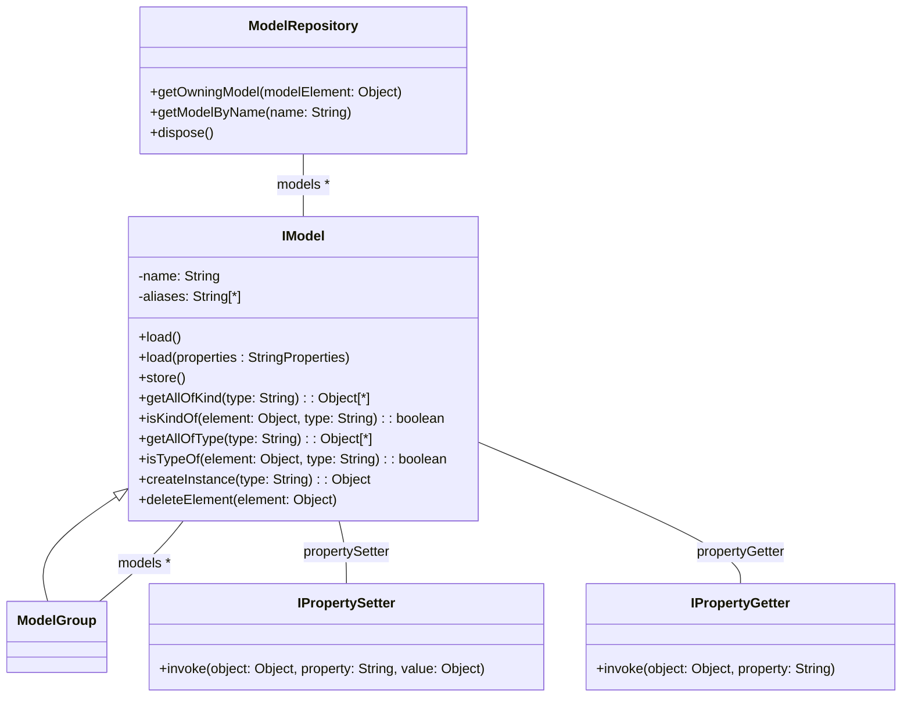

# The Epsilon Model Connectivity Layer (EMC)

The Epsilon Model Connectivity (EMC) layer provides abstraction facilities over concrete modelling technologies such as [EMF](#eclipse-modeling-framework), [XML](#xmlcsv), [Simulink](#matlab-simulink) etc. and enables Epsilon programs to interact with models conforming to these technologies in a uniform manner. A graphical overview of the core classes and methods of EMC is displayed below.

!!! tip
	If you are interested in examples of EMC-based drivers for Epsilon, rather than on the organisation of EMC itself, please scroll to the [bottom of this page](#emc-drivers).

To abstract away from diverse model representations and APIs provided by different modelling technologies, EMC defines the *IModel* interface. *IModel* provides a number of methods that enable querying and modifying the model elements it contains at a higher level of abstraction. To enable languages and tools that build atop EMC to manage multiple models simultaneously, the *ModelRepository* class acts as a container that offers façade services. The following sections discuss these two core concepts in detail.

## The IModel interface

Each model specifies a name which must be unique in the context of the model repository in which it is contained. Also, it defines a number of aliases; that is non-unique alternate names; via which it can be accessed. The interface also defines the following services.

### Loading and Persistence

The *load()* and *load(properties : Properties)* methods enable extenders to specify in a uniform way how a model is loaded into memory from the physical location in which it resides. Similarly, the *store()* and *store(location : String)* methods are used to define how the model can be persisted from memory to a permanent storage location.

### Type-related Services

The majority of metamodelling architectures support inheritance between meta-classes and therefore two types of type-conformance relationships generally appear between model elements and types. The *type-of* relationship appears when a model element is an instance of the type and the *kind-of* relationship appears when the model element is an instance of the type or any of its sub-types. Under this definition, the *getAllOfType(type: String)* and the *getAllOfKind(type: String)* operations return all the elements in the model that have a type-of and a kind-of relationship with the type in question respectively.

Similarly, the *isTypeOf(element: Object, type : String)* and *isKindOf(element: Object, type : String)* return whether the element in question has a type-of or a kind-of relationship with the type respectively. The *getTypeOf(element: Object)* method returns the fully-qualified name of the type an element conforms to.

The *hasType(type: String)* method returns true if the model supports a type with the specified name. To support technologies that enable users to define abstract (non-instantiable) types, the *isInstantiable(type: String)* method returns if instances of the type can be created.

### Ownership

The *allContents()* method returns all the elements that the model contains and the *owns(element: Object)* method returns true if the element under question belongs to the model.

### Creation, Deletion and Modifications 
Model elements are created and deleted using the *createInstance(type: String)* and *deleteElement(element: Object)* methods respectively.

To retrieve and set the values of properties of its model elements, *IModel* uses its associated *propertyGetter* (*IPropertyGetter*) and *propertySetter* (*IPropertySetter*) respectively. Technology-specific implementations of those two interfaces are responsible for accessing and modifying the value of a property of a model element through their *invoke(element: Object, property : String)* and *invoke(value: Object)* respectively.

## The ModelRepository class

A model repository acts as a container for a set of models that need to be managed in the context of a task or a set of tasks. Apart from a reference to the models it contains, *ModelRepository* also provides the following façade functionality.

The *getOwningModel(element: Object)* method returns the model that owns a particular element. The *transactionSupport* property specifies an instance of the *ModelRepositoryTransactionSupport* class which is responsible for aggregate management of transactions by delegating calls to its *startTransaction()*, *commitTransaction()* and *abortTransaction()* methods, to the respective methods of instances of *IModelTransactionSupport* associated with models contained in the repository.

## The ModelGroup class

A *ModelGroup* is a group of models that have a common alias. *ModelGroups* are calculated dynamically by the model repository based on common model aliases. That is, if two or more models share a common alias, the repository forms a new model group. Since *ModelGroup* implements the *IModel* interface, clients can use all the methods of *IModel* to perform aggregate operations on multiple models, such as collecting the contents of more than one models. An exception to that is the *createInstance(type: String)* method which cannot be defined for a group of models as it cannot be determined in which model of the group the newly created element should belong.

## Assumptions about the underlying modelling technologies

The discussion provided above has demonstrated that EMC makes only minimal assumptions about the structure and the organization of the underlying modelling technologies. Thus, it intentionally refrains from defining classes for concepts such as *model element*, *type* and *metamodel*. By contrast, it employs a lightweight approach that uses primitive strings for type names and objects of the target implementation platforms as model elements. There are two reasons for this decision.

- The primary reason is that by minimizing the assumptions about the underlying technologies EMC becomes more resistant to future changes of the implementations of the current technologies and can also embrace new technologies without changes.

- Another reason is that if a heavy-weight approach was used, extending the platform with support for a new modelling technology would involve providing wrapping objects for the native objects which represent model elements and types in the specific modelling technology. Experiments in the early phases of the design of EMC demonstrated that such a heavy-weight approach significantly increases the amount of memory required to represent the models in memory, degrades performance and provides little benefits in reward.

## EMC Drivers

Below are known *drivers* that implement the EMC interfaces discussed above and allow Epsilon programs to access different types of models and structured data.

### Eclipse Modeling Framework

The Eclipse Modelling Framework (EMF) is one of the most robust and widely used open-source modelling frameworks, and the cornerstone of an extensive ecosystem of technologies for graphical/textual model editing, model comparison and merging etc. Being an Eclipse project, Epsilon naturally provides support for all flavours of EMF models (e.g. textual, graphical, XSD-based XML), and most of the [screencasts](../screencasts), [articles](../articles/) and [examples](../examples) in Epsilon's Git repository use EMF models.

### Matlab Simulink

Epsilon also provides mature support for querying and modifying Matlab Simulink models as shown in [these articles](../articles/#epsilon-and-simulink-models).

### Cameo / MagicDraw Systems Modeler

Cameo Systems Modeler is a widely-used graphical systems modelling tool. A driver that allows Epsilon programs to read/write Cameo models is available under [EpsilonLabs on GitHub](https://github.com/epsilonlabs/emc-cameo).

### XML/CSV/Excel

For quick and dirty metamodel-less modelling, Epsilon also supports [plain XML documents](../articles/plain-xml), [Excel spreadsheets](../articles/excel), and [CSV files](../articles/csv-emc).

### Eclipse Hawk

[Hawk](https://www.eclipse.org/hawk) is an Eclipse project that provides tools for monitoring, indexing and querying *repositories* (i.e. local folders, Eclipse workspaces, Git/SVN repositories) containing models. Hawk provides an EMC driver through which model indices can be queried with Epsilon languages.

### Other Drivers

There are also less mature/well-documented drivers for Epsilon for tools and formats such as:

- [ArgoUML](https://github.com/epsilonlabs/emc-argouml)
- [Connected Data Objects (CDO)](https://github.com/epsilonlabs/emc-cdo)
- [Eclipse C/C++ Development Tools](https://github.com/epsilonlabs/emc-cdt)
- [Eclipse Java Development Tools](https://github.com/epsilonlabs/emc-jdt)
- [MagicDraw / Cameo Systems Modeler](https://github.com/epsilonlabs/emc-cameo)
- [MetaEdit+](https://github.com/epsilonlabs/emc-metaedit)
- [NeoEMF](https://github.com/gdaniel/emc-neoemf)
- [PTC Integrity Modeller](https://github.com/epsilonlabs/emc-ptcim)
- [Relational Databases (JDBC)](https://github.com/epsilonlabs/emc-jdbc/)

These drivers have not had much external use historically, but if you're interested in them, please [give us a shout](../../forum).
