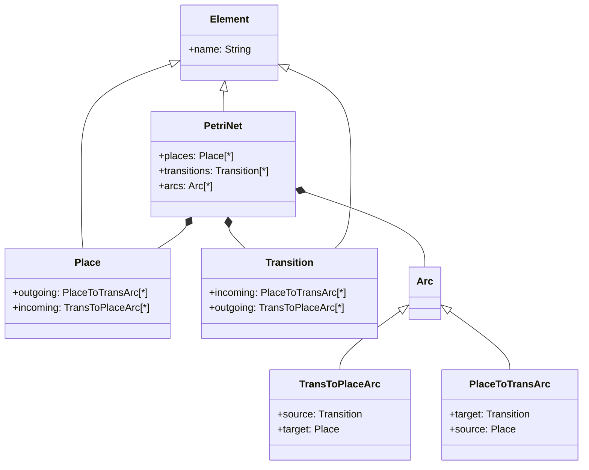

# The Epsilon Model Generation Language (EMG)

At some point, programs written in any of the Epsilon model management languages might need to be tested in order to find defects (bugs) and assert their correctness, or benchmarked in order to assess their performance. Both testing and benchmarking activities require appropriate test data, i.e. models that conform to specific metamodels and their constraints, satisfy additional requirements or characteristics (e.g. certain size), and/or contain data and provide a structure that exercises particular aspects of the program under test.

Manual assembly of test models is an error prone, time and labour consuming activity. This type of activities are perfect candidates for automation. Given that it is also a model management activity, it follows that the automation can be provided by a model generation engine that can execute model generation scripts. The scripts should be written in a model generation language that allows the user to generate models that conform to specific metamodels and its arbitrarily complex constraints (e.g constraints formulated in compound first-order OCL operations), satisfy particular characteristics, and contain specific data and exhibit particular structures. The model generation engine should exhibit characteristics such as randomness, repeatability, scalability and easy parametrization. The Epsilon Model Generation Language addresses the automated generation of complex models.

### Approaches to Model Generation

The model generation approaches found in literature provide fully-automated behaviour. In a fully-automated approach, the tool loads the metamodel (and in some cases its constraints) and generates models that conform to the metamodel (and satisfy the constraints, if constraints are supported). However, the existing solutions can generate invalid models and in the case where constraints are supported, only simple constraints are supported.

The Epsilon Model Generation follows a semi-automated generation approach. There are three main tasks in model generation:

-   Create instances of types in the metamodel(s).

-   Assign values to the instance's attributes (properties typed by primitive types: String, Integer, etc.).

-   Create links between instances to assign values to references (properties typed by complex types: other types in the metamodel).

In the semi-automated approach, all of these tasks can be configured to execute statically or dynamically (with randomness). Statically, the user must specify every single aspect of the generation. Dynamically, for example, the number of instances to create of a given type can be random, or the value of a given attribute can be set to random values, or the links between elements can be done between random pairs of elements. The combination of random and static definition of the generation tasks allows the user to generate models that can satisfy complex constraints, guarantee additional characteristics and exercise particular aspects of the program under test.

This chapter discusses the concrete syntax of EMG as well as its execution semantics. To aid understanding, the discussion of the syntax and the semantics of the language revolves around an exemplar generation which is developed incrementally throughout the chapter.

## Syntax

The EMG language does not provide additional syntax. Instead it provides a set of predefined annotations that can be added to EOL operations and EPL patterns in order to perform the model generation. The predefined EOL operation annotations are:

|Name|Description|
|-|-|
instances | Defines the number of instances to create. This annotation accepts one parameter. The parameter can be an expression that resolves to an Integer (e.g. literal, variable name, etc.) or a sequence in the form `Sequence {min, max}`). An integer value statically defines how many instances are to be created. A sequence defines a range that is used by the engine to generates a random number *n* of instances, with `min <= n <= max`.|
list | Defines an identifier (*listID*) for a placeholder list for the elements created. This annotation accepts one parameter. The parameter is the identifier (String) that can later be used in operations that accept it as an argument in order to access the elements created by the operation.|
parameters | If the instantiated type accepts/needs arguments for instantiation, the parameters annotation can be used to provide them. This annotation accepts one parameter. The parameter must be a Sequence that contains the desired arguments in the order expected by the constructor.

All three annotations are executable and hence must be prefixed with a `$` symbol when used. Further, these annotations are only evaluated on *create* operations.

The EPL pattern annotations are:

|Name|Description|
|-|-|
number | This limits the number of times the pattern is matched, to constraint the number of links created between elements. This annotation accepts one parameter. The parameter can be an expression that resolves to an Integer (e.g. literal, variable name, etc.) or a sequence in the form `Sequence {min, max}`). An integer value statically defines how many instances are to be created. A sequence defines a range that is used by the engine to generates a random number *n* of instances, with `min <= n <= max`.
probability | This defines the probability that the body of the pattern will be executed for a matching set of elements. The effect is that not all matching elements are linked. Effectively this also limits the number of times links are created.
noRepeat | This forbids previous matched elements to be re-linked.

The first two annotations are executable and hence must be prefixed with a `$` symbol when used and the last one is a simple annotation and must be prefixed with `@`.

Additionally the EMG engine provides a set of predefined operations that provide support for generating random data that can be used to set the attributes and references of the generated model elements, to select random elements from collections, etc.

### EMG predefined operations

| Signature | Description |
| - | - |
nextAddTo(n : Integer, m : Integer): Sequence(Integer) | Returns a sequence of *n* integers who's sum is equal to *m*.
nextBoolean() | Returns the next pseudorandom, uniformly distributed `boolean` value.
nextCamelCaseString(length : Integer, minWordLength : Integer) : String | Generates a string of the given length formatted as CamelCase, with subwords of a minimum length of the *minWordLength* argument.
nextCapitalisedString(charSet : String, length : Integer) : String | Generates a Capitalized string of the given length using characters from the given *charSet*.
nextFromCollection(c : Sequence) : Any | Returns the next `object` from the collection, selected pseudorandomly using the uniform distribution. If the collection is empty, returns null.
nextFromList(listID : String) : Any | Returns the next `object` from the list, selected pseudorandomly using the uniform distribution. If the list is empty, returns null. The *listID* can either be a name defined by the `@list` annotation or a parameter name from the run configuration. In the latter case, the parameter value can be either a comma separated string or a file path. If it is a comma separated string, then a list is created by splitting the string; if the value is a path, then the file will be read and each line will be treated as a list element.
nextFromListAsSample(listID : String) : Any | Same as *nextFromList*, but in this case the list is treated as a sample without replacement, i.e. each call will return a unique member of the list.
nextHttpURI(addPort : Boolean, addPath : Boolean, addQuery : Boolean, addFragment : Boolean) : String | Generates a random URI that complies to `http:[//host[:port]][/]path [?query][#fragment]`. The path, query and fragment parts are optional and will be added if the respective argument is True.
nextInt() : Integer | Returns the next pseudorandom, uniformly distributed integer. All `2^32` possible integer values should be produced with (approximately) equal probability.
nextInt(upper : Integer) : Integer | Returns a pseudorandom, uniformly distributed integer value between 0 (inclusive) and *upper* (exclusive). The argument must be positive.
nextInt(lower: Integer, upper : Integer) : Integer | Returns a pseudorandom, uniformly distributed integer value between lower and upper (endpoints included). The arguments must be positive and `upper >= lower`.
nextReal() : Real | Returns the next pseudorandom, uniformly distributed `real` value between `0.0` and `1.0`.
nextReal(upper : Real) : Real | Returns the next pseudorandom, uniformly distributed `real` value between `0.0` and *upper* (inclusive).
nextReal(lower: Real, upper : Real) : Real | Returns a pseudorandom, uniformly distributed `real` value between *lower* and *upper* (endpoints included).
nextSample(c : Sequence, k : Integer) : Sequence(Any) | Returns a Sequence of `k` objects selected randomly from the Sequence `c` using a uniform distribution. Sampling from `c` is without replacement; but if c contains identical objects, the sample may include repeats. If all elements of `c` are distinct, the resulting object collection represents a Simple Random Sample of size `k` from the elements of `c`.
nextSample(listID : String, k : Integer) : Sequence(Any) | Same as nextSample but the sequence is referenced by *listID*. The *listID* has the same meanings as for operation *nextFromList*.
nextString() : String | Returns the next string made up from characters of the `LETTER` character set, pseudorandomly selected with a uniform distribution. The length of the string is between 4 and 10 characters. 
nextString(length : Integer) : String | Returns the next String made up from characters of the `LETTER` character set, pseudorandomly selected with a uniform distribution. The length of the String is equal to *length*.
nextString(charSet : String, length : Integer) : String | Returns the next String of the given *length* using the specified character set, pseudorandomly selected with a uniform distribution.
nextURI() : String | Generates a random URI that complies to: `scheme:[//[user:password]host[:port]][/]path [?query][#fragment]`. The port, path, query and fragment are added randomly. The scheme is randomly selected from: http, ssh and ftp. For ssh and ftp, a user and pasword are randomly generated. The host is generated from a random string and uses a top-level domain. The number of paths and queries are random between 1 and 4.
nextURI(addPort : Boolean, addPath : Boolean, addQuery : Boolean, addFragment : Boolean) : String | Same as nextURI, but the given arguments control what additional port, path, query and fragment information is added.
nextUUID() : String | Returns a type 4 (pseudorandomly generated) UUID. The UUID is generated using a cryptographically strong pseudorandom number generator.
nextValue() : Real | Returns the next pseudorandom value, picked from the configured distribution (by default the uniform distribution is used).
nextValue(d : String, p : Sequence) : Real | Returns the next pseudorandom, from the provided distribution `d`. The parameters `p` are used to configure the distribution (if required). The supported distributions are: Binomial, Exponential and Uniform. For Binomial parameters are: *numberOfTrials* and *probabilityOfSuccess*. For Exponential, the mean. For Uniform, the lower and upper values (lower inclusive).
setNextValueDistribution(d : String, p : Sequence) | Define the distribution to use for calls to *nextValue()*. Parameters are the same as for *nextValue(d, p)*.

#### Character Sets for String operations

For the operations that accept a character set, the supported sets are
defined as follows:

| Name | Characters |
| - | - |
ID | abcdefghijklmnopqrstuvwxyz ABCDEFGHIJKLMNOPQRSTUVWXYZ 1234567890
NUMERIC | 1234567890
LETTER | abcdefghijklmnopqrstuvwxyz ABCDEFGHIJKLMNOPQRSTUVWXYZ
LETTER\_UPPER | ABCDEFGHIJKLMNOPQRSTUVWXYZ
LETTER\_LOWER | abcdefghijklmnopqrstuvwxyz
UPPER\_NUM | ABCDEFGHIJKLMNOPQRSTUVWXYZ 1234567890
LOWER\_NUM | abcdefghijklmnopqrstuvwxyz 1234567890
ID\_SYMBOL | abcdefghijklmnopqrstuvwxyz ABCDEFGHIJKLMNOPQRSTUVWXYZ 1234567890 ~{}!@\#\$%\^&( ) \_+-=\[\] \\\|;': \" \< \> ? , . /\
HEX\_LOWER | abcdef1234567890
HEX\_UPPER | ABCDEF1234567890

## Creating Model Elements

The EMG engine will search for EOL operations that follow a particular signature in order to determine what elements to create in the generated model. The signature is: `create <OutputType> () { ... }`. That is, the operation must be named *create*, the operation's context type defines the type of the created instance and no parameters should be passed. By default the create operation only creates one instance. Hence, the provided annotations can be used to tailor the behaviour of the operation.

Consider the case of the PetriNet metamodel in the figure below. 



The code excerpt displayed below creates a PetriNet and then adds some places and transitions to it. Note that the instances annotation is executable and hence you can use absolute values, variables or expressions. The `list` annotation in the PetriNet creation will result in all PetriNet instances to be stored in a sequence called *net*. The list name is then used in the Place and Transition create operations to add the places and transitions to a random (*nextFromList*) PetriNet. In this example there is only one, but we could easily create more PetriNet instances and hence have them contain random number of Places and Transitions. The name of the elements is generated using the random string generation facilities.

```epl
pre {
    var num_p = 10
}

$instances 1
@list net
operation PetriNet create() {
    self.name = nextCamelCaseWords("LETTER_LOWER", 15, 10);
}

$instances num_p
operation Place create() {
    self.name = "P_" + nextString("LETTER_LOWER", 15);
    nextFromList("net").transitions.add(self);
}

$instances num_p / 2
operation Transition create() {
    self.name = "T_" + nextString("LETTER_LOWER", 15);
    nextFromList("net").transitions.add(self);
}
```

## Creating Model Links

In the previous section, the *places* and *transitions* references of the PetriNet were defined during the creation of the Place and Transition elements. For more complex reference patterns, EMG leverages the use of EPL patterns. For example, Arcs can have complex constraints in order to determine the source and target transition/place, and possibly even having separate rules for each type of Arc.

The EPL pattern in the listing below creates two arcs in order to connect a source and a target Place via a Transition. The pattern matches all transitions in a given PetriNet. The pattern body selects a random Place for the source and a random Place for the target (the while loops are used to pick places that have the lowest incoming/outgoing arcs possible). The weight of the arc is generated randomly from 0 to 10 (*nextInt(10)*). The pattern has been annotated with the `@probability` annotation which will effectively only use 70% of the transitions to create arcs (i.e. of all the possible PetriNet-Transition matches, the code of the pattern will only be executed with a probability of 0.70).

```epl
@probability 0.7
pattern Transition
net:PetriNet,
tra:Transition
from: net.transitions {
    onmatch {
        var size = 0;
        var freeSources = Place.all().select(s | s.incoming.size() == size);
        while (freeSources.isEmpty()) {
            size += 1;
            freeSources = Place.all().select(s | s.incoming.size() == size);
        }
        size = 0;
        var freeTarget = Place.all().select(s | s.outgoing.size() == size);
        while (freeTarget.isEmpty()) {
            size += 1;
            freeTarget = Place.all().select(s | s.outgoing.size() == size);
        }
        var source = nextFromCollection(freeSources);
        var target = nextFromCollection(freeTarget);
        var a1:Arc = new PlaceToTransArc();
        a1.weight = nextInt(10);
        a1.source = source;
        net.places.add(source);
        a1.target = tra;
        net.arcs.add(a1);
        var a2:Arc = new TransToPlaceArc();
        a1.weight = nextInt(10);
        a2.source = tra;
        a2.target = target;
        net.places.add(target);
        net.arcs.add(a2);
    }
}
```

## Meaningful Strings

In some scenarios having completely random Strings for some of the element fields might not be desirable. In this case EMG has an embedded mechanism to facilitate the use of meaningful attribute values (not only for Strings) and we show a second approach based on additional models.

### Values as a parameter

The *nextFromList()* operation will first look for a list with that name, if it can't find it will look for a parameter (from the run configuration) with that name. The value of the parameter can be either an absolute path to a file or a comma separated list of values.

If it is a comma separated list of values, then the individual values will be loaded as a Collection. For example, if we added the parameter `names: John, Rose, Juan, Xiang, Joe` to the run configuration, the listing below shows how to use that information to define the instance attributes.

```eol
$instances num_p
operation Place create() {
    self.name = nextFromList("name");
    nextFromList("net").transitions.add(self);
}
```

If it is a file path, then each line of the file will be loaded as an item to the Collection. Note that the distinction between paths and comma separated values is the assumption that paths don't contain commas.

### Values as a model

A more powerful approach would be to use an existing model to serve as the source for attribute values. Given that there are several websites[^1] to generate random data in the form of CSV files, we recommend the use of a CSV model to serve as an attribute value source. A CSV file with *name*, *lastName*, and *email* can be easily generated and loaded as a second model in the EMG script. Then, a Row of data can be picked randomly to set an element's attributes. The listing below shows this approach.

```eol
$instances num_p
operation Person create() {
    var p = nextFromCollection(dataModel.Row.all());
    self.name = p.name;
    self.lastName = p.lastName;
    self.email = p.email;
}
```

Note that in this case, by using different rows for each value you can further randomize the data.

[^1]: https://www.mockaroo.com/, https://www.generatedata.com/,
    www.freedatagenerator.com/, etc.
