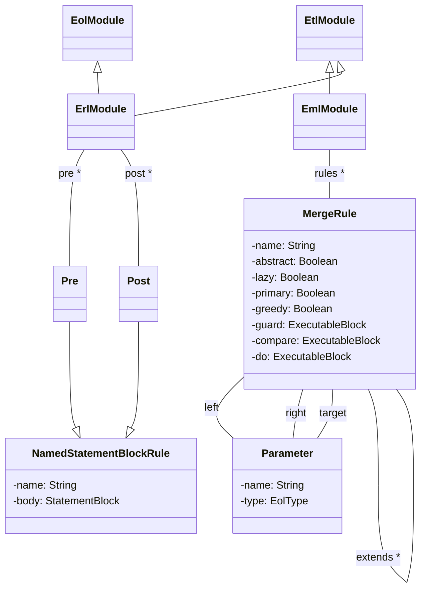
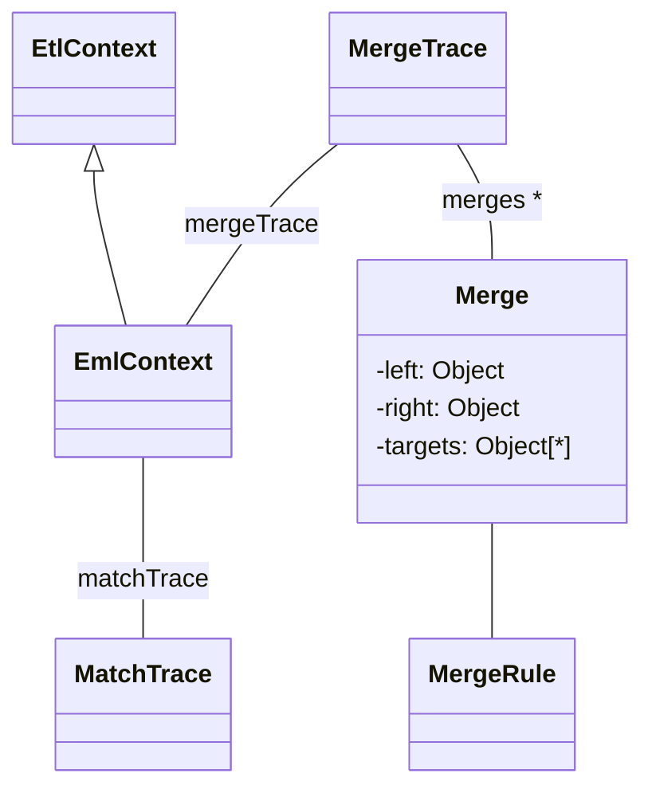
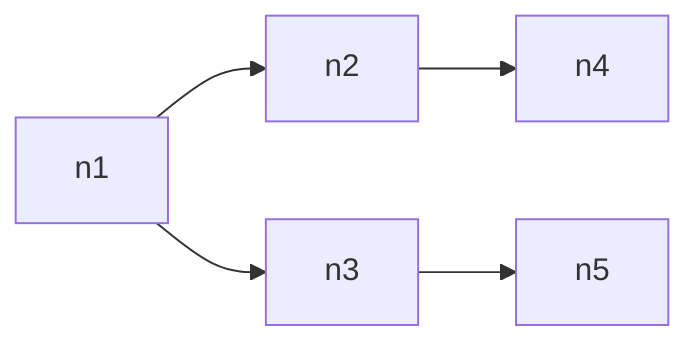
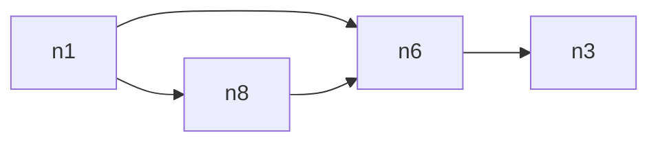
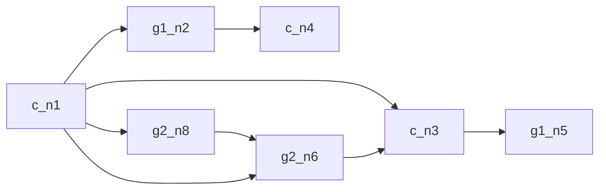

# The Epsilon Merging Language (EML)

The aim of EML is to contribute model merging capabilities to Epsilon. More specifically, EML can be used to merge an arbitrary number of input models of potentially diverse metamodels and modelling technologies. This section provides a discussion on the abstract and concrete syntax of EML, as well as its execution semantics. It also provides two examples of merging homogeneous and heterogeneous models.

## Abstract Syntax

In EML, merging specifications are organized in modules (*EmlModule*). As displayed below, *EmlModule* inherits from *EtlModule*.



By extending *EtlModule*, an EML module can contain a number of transformation rules and user-defined operations. An EML module can also contain one or more merge rules as well as a set of *pre* and *post* named EOL statement blocks. As usual, *pre* and *post* blocks will be run before and after all rules, respectively.

Each merge rule defines a name, a left, a right, and one or more target parameters. It can also extend one or more other merge rules and be defined as having one or more of the following properties: abstract, greedy, lazy and primary.

## Concrete Syntax

The listing below demonstrates the concrete syntax of EML merge-rules.

```
(@abstract)?
(@lazy)?
(@primary)? (@greedy)? 
rule <name>
    merge <leftParameter>
    with <rightParameter>
    into (<targetParameter>(, <targetParameter>)*)? 
        (extends <ruleName>(, <ruleName>)*)? {

    statementBlock

}
```

*Pre* and *post* blocks have a simple syntax that consists of the identifier (*pre* or *post*), an optional name and the set of statements to be executed enclosed in curly braces.

```
(pre|post) <name> {
    statement+
}
```

## Execution Semantics

### Rule and Block Overriding

An EML module can import a number of other EML and ETL modules. In this case, the importing EML module inherits all the rules and pre/post blocks specified in the modules it imports (recursively). If the module specifies a rule or a pre/post block with the same name, the local rule/block overrides the imported one respectively.

### Rule Scheduling

When an EML module is executed, the *pre* blocks are executed in the order in which they have been defined.

Following that, for each *match* of the established *matchTrace* the applicable non-abstract, non-lazy merge rules are executed. When all *matches* have been merged, the transformation rules of the module are executed on all applicable elements - that have not been merged - in the models.

Finally, after all rules have been applied, the *post* blocks of the module are executed.

### Rule Applicability

By default, for a merge-rule to apply to a *match*, the *left* and *right* elements of the match must have a *type-of* relationship with the *leftParameter* and *rightParameter* of the rule respectively. This can be relaxed to a *kind-of* relationship by specifying that the merge rule is *greedy* (using the *\@greedy* annotation in terms of concrete syntax).

### Source Elements Resolution

As with model transformation, in model merging it is often required to resolve the counterparts of an element of a source model into the target models. In EML, this is achieved by overloading the semantics of the *equivalents()* and *equivalent()* operations defined by ETL. In EML, in addition to inspecting the transformation trace and invoking any applicable transformation rules, the *equivalents()* operation also examines the *mergeTrace* (displayed in the figure below) that stores the results of the application of merge-rules and invokes any applicable (both lazy and non-lazy) rules.

Similarly to ETL, the order of the results of the *equivalents()* operation respects the order of the (merge or transform) rules that have produced them. An exception to that occurs if one of the rules has been declared as primary, in which case its results are prepended to the list of elements returned by equivalent.



## Homogeneous Model Merging Example

In this scenario, two models conforming to the Graph metamodel need to be merged. The first step is to compare the two graphs using the ECL module below.

```ecl
rule MatchNodes
    match l : Left!Node
    with r : Right!Node {

    compare : l.label = r.label
}

rule MatchEdges
    match l : Left!Edge
    with r : Right!Edge {

    compare : l.source.matches(r.source)
        and l.target.matches(r.target)
}

rule MatchGraphs
    match l : Left!Graph
    with r : Right!Graph {

    compare : true
}
```

The *MatchNodes* rule in line 1 defines that two nodes match if they have the same label. The *MatchEdges* rule in line 8 specifies that two edges match if both their source and target nodes match (regardless of whether the labels of the edges match or not as it is assumed that there can not be two distinct edges between the same nodes). Finally, since only one instance of Graph is expected to be in each model, the *MatchGraphs* rule in line 16 returns *true* for any pair of Graphs.

Having established the necessary correspondences between matching elements of the two models, the EML specification below performs the merge.

```eml
import "Graphs.etl";

rule MergeGraphs
    merge l : Left!Graph
    with r : Right!Graph
    into t : Target!Graph {
    
    t.label = l.label + " and " + r.label;
    
}

@abstract
rule MergeGraphElements
    merge l : Left!GraphElement
    with r : Right!GraphElement
    into t : Target!GraphElement {
    
    t.graph ::= l.graph;
    
}

rule MergeNodes
    merge l : Left!Node
    with r : Right!Node
    into t : Target!Node 
    extends GraphElements {
    
    t.label = "c_" + l.label;
    
}
rule MergeEdges
    merge l : Left!Edge
    with r : Right!Edge
    into t : Target!Edge 
    extends GraphElements {
    
    t.source ::= l.source;
    t.target ::= l.target;
    
}
```

In line 3, the *MergeGraphs* merge rule specifies that two matching Graphs (*l* and *r*) are to be merged into one Graph *t* in the target model that has as a label, the concatenation of the labels of the two input graphs separated using 'and'. The *mergeNodes* rule In line 22 specifies that two matching Nodes are merged into a single Node in the target model. The label of the merged node is derived by concatenating the c (for common) static string with the label of the source Node from the left model. Similarly, the *MergeEdges* rule specifies that two matching Edges are merged into a single Edge in the target model. The source and target nodes of the merged Edge are set to the equivalents (::=) of the source and target nodes of the edge from the left model.

 To reduce duplication, the *MergeNodes* and *MergeEdges* rules extend the abstract *MergeGraphElements* rule specified in line 13 which assigns the *graph* property of the graph element to the equivalent of the left graph.

The rules displayed above address only the matching elements of the two models. To also copy the elements for which no equivalent has been found in the opposite model, the EML module imports the ETL module below.

```etl
rule TransformGraph 
    transform s : Source!Graph
    to t : Target!Graph {
    
    t.label = s.label;
    
}

@abstract
rule TransformGraphElement 
    transform s : Source!GraphElement
    to t : Target!GraphElement {
    
    t.graph ::= s.graph;
}

rule TransformNode
    transform s : Source!Node
    to t : Target!Node 
    extends TransformGraphElement {
    
    t.label = s.graph.label + "_" + s.label;
}

rule TransformEdge 
    transform s : Source!Edge
    to t : Target!Edge 
    extends TransformGraphElement {
    
    t.source ::= s.source;
    t.target ::= s.target;  
} 
```

The rules of the ETL module apply to model elements of both the Left and
the Right model as both have been aliased as Source. Of special interest
is the TransformNode rule in line 17 that specifies that non-matching nodes
in the two input models will be transformed into nodes in the target
model the labels of which will be a concatenation of their input graph
and the label of their counterparts in the input models.

Executing the ECL and EML modules on the exemplar models displayed in the following two figures creates the target model of the final figure.


Left model


Right model


Merged model