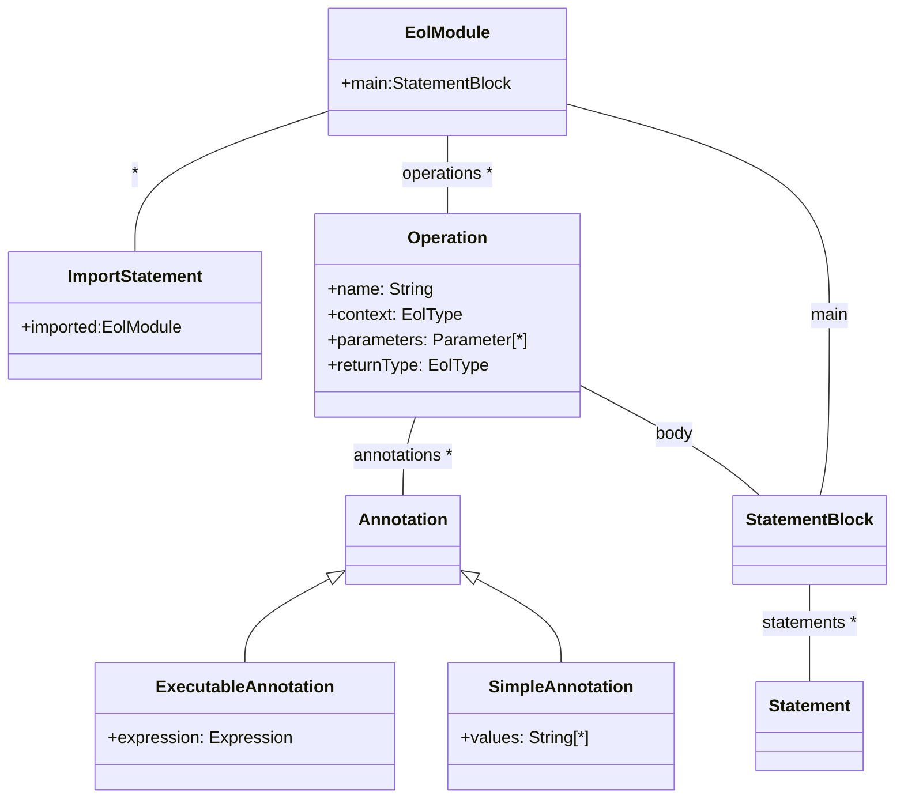
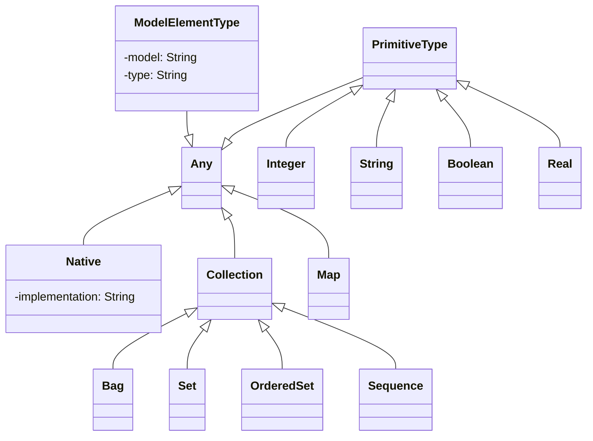
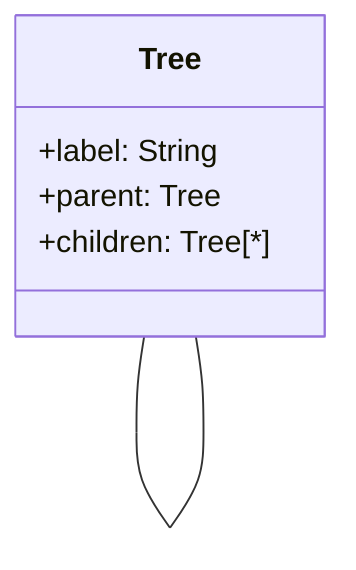

# The Epsilon Object Language (EOL)

EOL is the core expression language of Epsilon, and the foundation for task-specific languages for tasks such as [model-validation](../evl), [model-to-text transformation](../egl), [model-to-model transformation](../etl) and [model migration](../flock). EOL can also be used as a general-purpose standalone model management language for automating tasks that do not fall into the patterns targeted by task-specific languages.

!!! tip "Try EOL online"
    You can run and fiddle with an EOL program that queries a project scheduling model in the [online Epsilon Playground](../../playground/?eol).

## Syntax

EOL programs are organized in `modules`. Each module defines a `body` and a number of `operations`. The body is a block of statements that are evaluated when the module is executed. Each operation defines the kind of objects on which it is applicable (`context`), a `name`, a set of `parameters` and optionally a `return type`. Modules can also import other modules using `import` statements and access their operations, as shown in the listing below.

```eol
// file imported.eol
operation hello() {
  "Hello world!".println();
}
```
&nbsp;
```eol
// file importer.eol
// We can use relative/absolute paths or platform:/ URIs
import "imported.eol";

hello(); // main body

// ... more operations could be placed here ...
```



## User-Defined Operations 

In mainstream object oriented languages such as Java and C++, operations are defined inside classes and can be invoked on instances of those classes. EOL on the other hand is not object-oriented in the sense that it does not define classes itself, but nevertheless needs to manage objects of types defined externally to it (e.g. in metamodels). By defining the context-type of an operation explicitly, the operation can be called on instances of the type as if it was natively defined by the type.

For example, consider the code excerpts displayed in the listings below. In the first listing, the operations `add1` and `add2` are defined in the context of the built-in `Integer` type, which is specified before their names. Therefore, they can be invoked in line 1 using the `1.add1().add2()` expression: the context (the integer `1`) will be assigned to the special variable `self`.

```eol
1.add1().add2().println();

operation Integer add1() : Integer {
  return self + 1;
}

operation Integer add2() : Integer {
  return self + 2;
}
```

On the other hand, in the following listing where no context is defined, they have to be invoked in a nested manner which follows an in-to-out direction instead of the left to right direction used by the former excerpt. As complex model queries often involve invoking multiple properties and operations, this technique is particularly beneficial to the overall readability of the code.

```eol
add2(add1(1)).println();

operation add1(base : Integer) : Integer {
  return base + 1;
}

operation add2(base : Integer) : Integer {
  return base + 2;
}
```

EOL supports polymorphic operations using a runtime dispatch mechanism. Multiple operations with the same name and parameters can be defined, each defining a distinct context type. For example, in the listing below, the statement in line 1 invokes the test operation defined in line 4, while the statement in line 2 invokes the test operation defined in line 8.

```eol
"1".test();
1.test();

operation String test() {
  (self + " is a string").println();
}

operation Integer test() {
  (self + "is an integer").println();
}
```

!!! warning "Statements after operations are ignored"
    Any loose statements after the first operation of an EOL program will be ignored by the EOL interpreter e.g.
    ```eol
    "This statement will be executed".println();
    
    operation foo() {}

    "This statement won't be executed".println();
    ```

!!! warning "Statements outside operations in imported modules are ignored"
    Any statements outside operations in imported EOL modules will be ignored.

    For example, suppose you had this `utilities.eol` file:
    ```eol
    "This statement will be ignored".println();

    operation useful() { /* code */ }
    ```

    If you tried to run this `main.eol` file, the above `println()` call would not be executed:
    ```eol
    import "utilities.eol";

    useful();
    ```

### Annotations

EOL supports two types of annotations: simple and executable. A simple annotation specifies a name and a set of String values while an executable annotation specifies a name and an expression. The concrete syntaxes of simple and executable annotations are displayed in the listing below.

```eol
// Simple annotation
@name value(,value)

// Executable annotation
$name expression
```

Several examples for simple annotations are shown the listing below. Examples for executable annotations will be given in the following sections.

```eol
@colors red
@colors red, blue
@colors red, blue, green
```

In stand-alone EOL, annotations are supported only in the context of operations, however as discussed in the sequel, task-specific languages also make use of annotations in their constructs, each with task-specific semantics. EOL operations support three particular annotations: the `pre` and `post` executable annotations for specifying pre and post-conditions, and the `cached` simple annotation, which are discussed below.

### Pre/post conditions in user-defined operations

A number of `pre` and `post` executable annotations can be attached to EOL operations to specify the pre- and post-conditions of the operation. When an operation is invoked, before its body is evaluated, the expressions of the `pre` annotations are evaluated. If all of them return `true`, the body of the operation is executed, otherwise, an error is raised. Similarly, once the body of the operation has been executed, the expressions of the `post` annotations of the operation are executed to ensure that the operation has had the desired effects. `Pre` and `post` annotations can access all the variables in the parent scope, as well as the parameters of the operation and the object on which the operation is invoked (through the `self` variable). Moreover, in `post` annotations, the returned value of the operation is accessible through the built-in `_result` variable. An example of using pre and post conditions in EOL appears below.

```eol
1.add(2); 
1.add(-1);

$pre i > 0 
$post _result > self 
operation Integer add(i : Integer) : Integer {
  return self + i;
}
```

In line 4 the `add` operation defines a pre-condition stating that the parameter `i` must be a positive number. In line 5, the operation defines that result of the operation (`_result`) must be greater than the number on which it was invoked (`self`). Thus, when executed in the context of the statement in line 1 the operation succeeds, while when executed in the context of the statement in line 2, the pre-condition is not satisfied and an error is raised.

### Operation Result Caching

EOL supports caching the results of parameter-less operations using the `@cached` simple annotation. In the following example, the Fibonacci number of a given Integer is calculated using the `fibonacci` recursive operation displayed in the listing below. Since the `fibonacci` operation is declared as `cached`, it is only executed once for each distinct Integer and subsequent calls on the same target return the cached result. Therefore, when invoked in line 1, the body of the operation is called 16 times. By contrast, if no `@cached` annotation was specified, the body of the operation would be called recursively 1973 times. This feature is particularly useful for performing queries on large models and caching their results without needing to introduce explicit variables that store the cached results.

It is worth noting that caching works `by reference`, which means that all clients of a cached method for a given context will receive the same returned object. As such, if the first client modifies the returned object in some way (e.g. sets a property in the case of an object or adds an element in the case of the collection), subsequent clients of the method for the same context will receive the modified object/collection.

```eol
15.fibonacci().println();

@cached
operation Integer fibonacci() : Integer {
  if (self = 1 or self = 0) {
    return 1;
  }
  else {
    return (self-1).fibonacci() + (self-2).fibonacci();
  }
}
```

## Types

As is the case for most programming languages, EOL defines a built-in system of types, illustrated in the figure below. The `Any` type, inspired by the `OclAny` type of OCL, is the basis of all types in EOL including Collection types.



<!---->

The operations supported by
instances of the Any type are outlined in the table below[^1].

Signature |Description
----------|-----------
asBag() : Bag                           | Returns a new Bag containing the object
asBoolean() : Boolean                   | Returns a Boolean based on the string representation of the object. If the string representation is not of an acceptable format, an error is raised
asInteger() : Integer                   | Returns an Integer based on the string representation of the object. If the string representation is not of an acceptable format, an error is raised
asOrderedSet() : OrderedSet             | Returns a new OrderedSet containing the object
asReal() : Real                         | Returns a Real based on the string representation of the object. If the string representation is not of an acceptable format, an error is raised
asDouble() : Double                     | Returns a Java Double based on the string representation of the object. If the string representation is not of an acceptable format, an error is raised
asFloat() : Float                       | Returns a Java Float based on the string representation of the object. If the string representation is not of an acceptable format, an error is raised
asSequence() : Sequence                 | Returns a new Sequence containing the object
asSet() : Set                           | Returns a new Set containing the object
asString() : String                     | Returns a string representation of the object
err(\[prefix : String\]) : Any          | Prints a string representation of the object on which it is invoked to the error stream prefixed with the optional `prefix` string and returns the object on which it was invoked. In this way, the `err` operation can be used for debugging purposes in a non-invasive manner
errln(\[prefix : String\]) : Any        | Has the same effects as the `err` operation but also produces a new line in the output stream.
format(\[pattern : String\]) : String   | Uses the provided pattern to form a String representation of the object on which the method is invoked. The pattern argument must conform to the format string syntax defined by Java[^2].
hasProperty(name : String) : Boolean    | Returns true if the object has a property with the specified name or false otherwise
ifUndefined(alt : Any) : Any            | If the object is undefined, it returns alt else it returns the object
isDefined() : Boolean                   | Returns true if the object is defined and false otherwise
isKindOf(type : Type) : Boolean         | Returns true if the object is of the given type or one of its subtypes and false otherwise
isTypeOf(type : Type) : Boolean         | Returns true if the object is of the given type and false otherwise
isUndefined() : Boolean                 | Returns true if the object is undefined and false otherwise
owningModel() : Model                   | Returns the model that contains this object or an undefined value otherwise
print(\[prefix : String\]) : Any        | Prints a string representation of the object on which it is invoked to the regular output stream, prefixed with the optional `prefix` string and returns the object on which it was invoked. In this way, the `print` operation can be used for debugging purposes in a non-invasive manner
println(\[prefix : String\]) : Any      | Has the same effects as the `print` operation but also produces a new line in the output stream.
type() : Type                           | Returns the [type](#types) of the object.

### Primitive Types

EOL provides four primitive types: String, Integer, Real and Boolean. The String type represents a finite sequence of characters and supports the following operations which can be invoked on its instances.

 Signature |Description
----------|-----------
characterAt(index : Integer) : String                               |Returns the character in the specified index
concat(str : String) : String                                       |Returns a concatenated form of the string with the `str` parameter
endsWith(str : String) : Boolean                                    |Returns true iff the string ends with `str`
escapeXml() : String |Returns a new string with escaped XML-reserved characters
firstToLowerCase() : String                                         |Returns a new string the first character of which has been converted to lower case
ftlc() : String |Alias for `firstToLowerCase()`
firstToUpperCase() : String                                         |Returns a new string, the first character of which has been converted to upper case
ftuc : String |Alias for `firstToUpperCase()`
isInteger() : Boolean                                               |Returns true iff the string is an integer
isReal() : Boolean                                                  |Returns true iff the string is a real number
isSubstringOf(str : String) : Boolean                               |Returns true iff the string the operation is invoked on is a substring of `str`
length() : Integer                                                  |Returns the number of characters in the string
matches(reg : String) : Boolean                                     |Returns true if there are occurrences of the regular expression `reg` in the string
pad(length : Integer, padding : String, right : Boolean) : String   |Pads the string up to the specified length with specified padding (e.g. `"foo".pad(5, "*", true)` returns `"foo**"`)
replace(source : String, target : String) : String                  |Returns a new string in which all instances of `source` have been replaced with instances of `target`
split(reg : String) : Sequence(String)                              |Splits the string using as a delimiter the provided regular expression, `reg`, and returns a sequence containing the parts
startsWith(str : String) : Boolean                                  |Returns true iff the string starts with `str`
substring(index : Integer) : String                                 |Returns a sub-string of the string starting from the specified `index` and extending to the end of the original string
substring(startIndex : Integer, endIndex : Integer) : String        |Returns a sub-string of the string starting from the specified `startIndex` and ending at `endIndex`
toCharSequence() : Sequence(String)                                 |Returns a sequence containing all the characters of the string
toLowerCase() : String                                              |Returns a new string where all the characters have been converted to lower case
toUpperCase() : String                                              |Returns a new string where all the characters have been converted to upper case
trim() : String                                                     |Returns a trimmed copy of the string

The Real type represents real numbers and provides the following operations.

 Signature |Description
----------|-----------
abs() : Real                  |Returns the absolute value of the real
ceiling() : Integer           |Returns the nearest Integer that is greater than the real
floor() : Integer             |Returns the nearest Integer that is less than the real
log() : Real                  |Returns the natural logarithm of the real
log10() : Real                |Returns the 10-based logarithm of the real
max(other : Real) : Real      |Returns the maximum of the two reals
min(other : Real) : Real      |Returns the minimum of the two reals
pow(exponent : Real) : Real   |Returns the real to the power of exponent
round() : Integer             |Rounds the real to the nearest Integer

The Integer type represents natural numbers and negatives and extends the Real primitive type. It also defines the following operations:

 Signature |Description
----------|-----------  
iota(end : Integer, step : Integer) : Sequence(Integer)   |Returns a sequence of integers up to `end` using the specified step (e.g. 1.iota(10,2) returns Sequence{1,3,5,7,9})
mod(divisor : Integer) : Integer                          |Returns the remainder of dividing the integer by the divisor
to(other : Integer) : Sequence(Integer)                   |Returns a sequence of integers (e.g. 1.to(5) returns Sequence{1,2,3,4,5})
toBinary() : String                                       |Returns the binary representation of the integer (e.g. 6.toBinary() returns "110")
toHex() : String                                          |Returns the hexadecimal representation of the integer (e.g. 42.toBinary() returns "2a")

Finally, the Boolean type represents true/false states and provides no additional operations to those provided by the base Any type.

### Collections and Maps

EOL provides several types of collections and a Map type:

* The `Bag` type represents non-unique, unordered collections and implements the `java.util.Collection` interface.
* The `Sequence` type represents non-unique, ordered collections and implements the `java.util.List` interface.
* The `Set` type represents unique and unordered collections and implements the `java.util.Set` interface.
* The `OrderedSet` represents unique and ordered collections.
* Since version 2.0, there are also two concurrent collection types, which can safely be modified from multiple threads. These are `ConcurrentBag` and `ConcurrentSet`, which are thread-safe variants of the `Bag` and `Set` types respectively.

All collection types inherit from the abstract `Collection` type.

Apart from simple operations, EOL also supports logic operations on collections. The following operations (along with any operations declared on the `java.util.Collection` interface) apply to all types of collections:

Signature |Description
----------|----------- 
add(item : Any) : Boolean                     |Adds an item to the collection. If the collection is a set, addition of duplicate items has no effect. Returns true if the collection increased in size: this is always the case for bags and sequences, and for sets and ordered sets it is true if the element was not part of the collection before.
addAll(col : Collection) : Boolean            |Adds all the items of the `col` argument to the collection. If the collection is a set, it only adds items that do not already exist in the collection. Returns true if this collection changed as a result of the call
asBag()                                       |Returns a Bag that contains the same elements as the collection.
asOrderedSet()                                |Returns a duplicate-free OrderedSet that contains the same elements as the collection.
asSequence()                                  |Returns a Sequence that contains the same elements as the collection.
asSet()                                       |Returns a duplicate-free Set that contains the same elements as the collection.
clear()                                       |Empties the collection
clone() : Collection                          |Returns a new collection of the same type containing the same items with the original collection
concat() : String                             |Returns the string created by converting each element of the collection to a string (equivalent to the `join` method used in some other languages)
concat(separator : String) : String           |Returns the string created by converting each element of the collection to a string, using the given argument as a separator (equivalent to the `join` method used in some other languages)
count(item : Any) : Integer                   |Returns the number of times the item exists in the collection
excludes(item : Any) : Boolean                |Returns true if the collection excludes the `item`
excludesAll(col : Collection) : Boolean       |Returns true if the collection excludes all the items of collection col
excluding(item : Any) : Collection            |Returns a new collection that excludes the item -- unlike the remove() operation that removes the `item` from the collection itself
excludingAll(col : Collection) : Collection   |Returns a new collection that excludes all the elements of the col collection
flatten() : Collection                        |Recursively flattens all items that are of collection type and returns a new collection where no item is a collection itself
includes(item : Any) : Boolean                |Returns true if the collection includes the `item`
includesAll(col : Collection) : Boolean       |Returns true if the collection includes all the items of collection `col`
including(item : Any) : Collection            |Returns a new collection that also contains the `item` -- unlike the add() operation that adds the `item` to the collection itself
includingAll(col : Collection) : Collection   |Returns a new collection that is a union of the two collections. The type of the returned collection (i.e. Bag, Sequence, Set, OrderedSet) is same as the type of the collection on which the operation is invoked
isEmpty() : Boolean                           |Returns true if the collection does not contain any elements and false otherwise
min() : Real                                  |Returns the minimum of all reals/integers in the collection, or 0 if it is empty
min(default : Real) : Real                    |Returns the minimum of all reals/integers in the collection, or the default value if it is empty
max() : Real                                  |Returns the maximum of all reals/integers in the collection, or 0 if it is empty
max(default : Real) : Real                    |Returns the maximum of all reals/integers in the collection, or the default value if it is empty
notEmpty() : Boolean                          |Returns true if the collection contains any elements and false otherwise
powerset() : Set                              |Returns the set of all subsets of the collection
product() : Real                              |Returns the product of all reals/integers in the collection
random() : Any                                |Returns a random item from the collection
remove(item : Any) : Boolean                  |Removes an `item` from the collection. Returns true if the collection contained the specified element
removeAll(col : Collection) : Boolean         |Removes all the items of `col` from the collection. Returns true if the collection changed as a result of the call
size() : Integer                              |Returns the number of items the collection contains
sum() : Real                                  |Returns the sum of all reals/integers in the collection

The following operations apply to ordered collection types (i.e. Sequence and OrderedSet):

Signature |Description
----------|----------- 
at(index : Integer) : Any         |Returns the item of the collection at the specified index
first() : Any                     |Returns the first item of the collection
fourth() : Any                    |Returns the fourth item of the collection
indexOf(item : Any) : Integer     |Returns the index of the item in the collection or -1 if it does not exist
invert() : Collection             |Returns an inverted copy of the collection
last() : Any                      |Returns the last item of the collection
removeAt(index : Integer) : Any   |Removes and returns the item at the specified index.
second() : Any                    |Returns the second item of the collection
third() : Any                     |Returns the third item of the collection

Also, EOL collections support the following first-order operations. Apart from `aggregate` and `closure`, all of these operations have a parallel variant which can take advantage of multiple cores to improve performance. All computations contained in these operations are assumed to be free from side-effects (i.e. do not mutate global variables).

Aside from the following built-in first-order operations which are evaluated eagerly, all Collection types in the Java implementation of EOL support Streams. This allows for chains of queries and transformations on collections to be evaluated more efficiently. A stream can be obtained by calling the `stream()` method on the collection. The API is defined by the Java standard library[^3].

Signature |Description
----------|----------- 
atLeastNMatch(iterator : Type \| condition, n : Integer) : Boolean   |Returns true if there are `n` or more items in the collection that satisfy the condition
atMostNMatch(iterator : Type \| condition, n : Integer) : Boolean    |Returns true if there are `n` or fewer items in the collection that satisfy the condition
aggregate(iterator : Type \| keyExpression, valueExpression) : Map   |Returns a map containing key-value pairs produced by evaluating the key and value expressions on each item of the collection that is of the specified type
closure(iterator : Type \| expression) : Collection                  |Returns an ordered set containing the results of evaluating the transitive closure of the results produced by the expression on each item of the collection that is of the specified type. For example, if `t` is a tree model element, `t.closure(it|it.children)` will return all its descendants
collect(iterator : Type \| expression) : Collection                  |Returns a collection containing the results of evaluating the expression on each item of the collection that is of the specified type
count(iterator : Type \| condition) : Integer                        |Returns the number of elements in the collection that satisfy the condition
exists(iterator : Type \| condition) : Boolean                       |Returns true if there exists at least one item in the collection that satisfies the condition
forAll(iterator : Type \| condition) : Boolean                       |Returns true if all items in the collection satisfy the condition
mapBy(iterator : Type \| expression) : Map |Returns a map containing the results of the expression [as keys and the respective items of the collection as values](https://www.eclipse.org/epsilon/playground/?14131930).
nMatch(iterator : Type \| condition, n : Integer) : Boolean          |Returns true if there are exactly `n` items in the collection that satisfy the condition
none(iterator : Type \| condition) : Boolean                         |Returns true if there are no items in the collection that satisfy the condition
one(iterator : Type \| condition) : Boolean                          |Returns true if there exists exactly one item in the collection that satisfies the condition
reject(iterator : Type \| condition) : Collection                    |Returns a sub-collection containing only items of the specified type that do not satisfy the condition
rejectOne(iterator : Type \| condition) : Collection                 |Returns a sub-collection containing all elements except the first element which does not satisfy the condition
select(iterator : Type \| condition) : Collection                    |Returns a sub-collection containing only items of the specified type that satisfy the condition
selectByKind(Type) : Collection                    |Returns a sub-collection containing only items of the specified type and subtypes
selectByType(Type) : Collection                    |Returns a sub-collection containing only items of the specified type only
selectOne(iterator : Type \| condition) : Any                        |Returns any element that satisfies the condition
sortBy(iterator: Type \| expression) : Collection                    |Returns a copy of the collection sorted by the results of evaluating the expression on each item of the collection that conforms to the iterator type. The expression should return either an Integer, a String or an object that is an instance of Comparable. The ordering is calculated as follows: for integers, smaller to greater; for Strings, as defined by the compareTo method of Java strings; for Comparable objects, according to the semantics of the type's compareTo method implementation.

The Map type (which implements the `java.util.Map` interface) represents a Set of key-value pairs in which the keys are unique. Since version 2.0, there is also a thread-safe `ConcurrentMap` type, which implements the `java.util.concurrent.ConcurrentMap` interface. The following operations are supported:

Signature |Description
----------|----------- 
clear()                                |Clears the map
containsKey(key : Any) : Boolean       |Returns true if the map contains the specified key
containsValue(value : Any) : Boolean   |Returns true if this map maps one or more keys to the specified value.
get(key : Any) : Any                   |Returns the value for the specified key
isEmpty() : Boolean                    |Returns true if the map contains no key-value mappings.
keySet() : Set                         |Returns the keys of the map
put(key : Any, value : Any)            |Adds the key-value pair to the map. If the map already contains the same key, the value is overwritten
putAll(map : Map)                      |Copies all of the mappings from the specified map to this map.
remove(key : Any) : Any                |Removes the mapping for the specified key from this map if present. Returns the previous value associated with key.
size() : Integer                       |Returns the number of key-value mappings in this map.
values() : Bag                         |Returns the values of the map

### Tuples

Since version 2.2, EOL supports Tuples, which can be used to compose arbitrary data structures on-the-fly. A `Tuple` in EOL behaves like a `Map<String, Object>`, except that the values of the map can be accessed using literal property call expressions. There are three ways to instantiate a tuple, as shown below.

```eol
// After construction
var alice = new Tuple;
alice.name = "Alice";
alice.age = 32;

// During construction
var bob = new Tuple(name = "Bob", age = 28);

// Map Literal
var charlie = Tuple{"name" = "Charlie", "age" = 36};
```

If a non-existent property on a Tuple is accessed, an exception is thrown.

```eol
var p = new Tuple(name = "Alice", age = 32);

p.name.substring(0, 3); // "Ali"
p.age; // 32
p.occupation.isDefined(); // false
p.occupation.toUpperCase(); // Property 'occupation' not found
```

### Native Types

As discussed earlier, while the purpose of EOL is to provide significant expressive power to enable users to manage models at a high level of abstraction, it is not intended to be a general-purpose programming language. Therefore, there may be cases where users need to implement some functionality that is either not efficiently supported by the EOL runtime (e.g. complex mathematical computations) or that EOL does not support at all (e.g. developing user interfaces, accessing databases). To overcome this problem, EOL enables users to create objects of the underlying programming environment by using `native` types. A native type specifies an `implementation` property that indicates the unique identifier for an underlying platform type. For instance, in a Java implementation of EOL the user can instantiate and use a Java class via its class identifier. Thus, the EOL excerpt in the listing below creates a Java window (Swing JFrame) and uses its methods to change its title and dimensions and make it visible.

```eol
var frame = new Native("javax.swing.JFrame");
frame.title = "Opened with EOL";
frame.setBounds(100,100,300,200);
frame.visible = true;
```

To pass arguments to the constructor of a native type, a parameter list must be added, such as that in the listing below. 

```eol
var file = new Native("java.io.File")("myfile.txt");
file.absolutePath.println();
```

Static types can also be referenced in EOL and stored in a variable for convenience, as shown below.

```eol
var Collectors = Native("java.util.stream.Collectors");
```

### Model Element Types

A model element type represents a meta-level classifier for model elements. Epsilon intentionally refrains from defining more details about the meaning of a model element type, to be able to support diverse modelling technologies where a type has different semantics. For instance an Ecore EClass, an XSD complex type and a Java class can all be regarded as model element types according to the implementation of the underlying modelling framework.

!!! info
    As EOL is decoupled from modelling technologies (e.g. EMF, Simulink), through [Epsilon's Model Connectivity Layer](../emc), we refrain from referring to specific modelling technologies in this section as much as possible.

In case of multiple models, as well as the name of the type, the name of the model is also required to resolve a particular type since different models may contain elements of homonymous but different model element types. In case a model defines more than one type with the same name (e.g. in different packages), a fully qualified type name must be provided.

In terms of concrete syntax, inspired by [ATL](https://eclipse.org/atl), the `!` character is used to separate the name of the type from the name of the model it is defined in. For instance, `Ma!A` represents the type `A` of model `Ma`. Also, to support modelling technologies that provide hierarchical grouping of types (e.g. using packages) the `::` notation is used to separate between packages and classes. A model element type supports the following operations:

Signature |Description
----------|----------- 
all() : Collection                  |Alias for getAllOfKind() (for syntax-compactness purposes)
allInstances() : Collection         |Alias for getAllOfKind() (for compatibility with OCL)
getAllOfKind() : Collection            |Returns all the elements in the model that are instances either of the type itself or of one of its subtypes
getAllOfType() : Collection            |Returns all the elements in the model that are instances of the type
createInstance() : Any       |Creates an instance of the type in the model. The same can be achieved using the `new` operator (see below)
isInstantiable() : Boolean   |Returns true if the type is instantiable (i.e. non-abstract)

As an example of the concrete syntax, the listing below retrieves all the instances of the Class type (including instances of its subtypes) defined in the Core package of the UML 1.4 metamodel that are contained in the model named
UML14.

```
UML14!Core::Foundation::Class.allInstances();
```

### Creating and Deleting Model Elements

EOL provides the `new` and `delete` operators for creating and deleting model elements as shown below. The `new` operator is an alias for the `createInstance()` method above, and can also be used to create instances of primitive and [native types](#native-types) (i.e Java classes).

```eol
var t : new Tree; // Creates a new instance of type Tree
var p : new Source!Person; // Creates a new Person in model Source
delete t; // Deletes the element created in line 1
```

## Expressions


### Literal Values

EOL provides special syntax constructs to create instances of each of
the built-in types:

- Integer literals are defined by using one or more decimal digits (such as `42` or `999`). Optionally, long integers (with the same precision as a Java `Long`) can be produced by adding a "l" suffix, such as `42l`.
- Real literals are defined by:
    -   Adding a decimal separator and non-empty fractional part to the
        integer part, such as `42.0` or `3.14`. Please note that `.2`
        and `2.` are `not` valid literals.
    -   Adding a floating point suffix: "f" and "F" denote single
        precision, and "d" and "D" denote double precision. For example,
        `2f` or `3D`.
    -   Adding an exponent, such as `2e+1` (equal to `2e1`) or `2e-1`.
    -   Using any combination of the above options.

- String literals are sequences of characters delimited by single (`'hi'`) or double (`"hi"`) quotes. Quotes inside the string can be escaped by using a backslash, such as in `'A\'s'` or `"A\"s"`. Literal backslashes need to be escaped as well, such as in `'A\\B'`. Special escape sequences are also provided: `\n` for a newline, `\t` for a horizontal tab and `\r` for a carriage return, among others.

- Boolean literals use the `true` reserved keyword for the true Boolean value, and `false` reserved keyword for the false Boolean value.

- Sequence and most other collections (except `Map`s) also have literals. Their format is `T {e}`, where `T` is the name of the type and `e` are zero or more elements, separated by commas. For instance, `Sequence{}` is the empty sequence, and `Set {1, 2, 3}` is the set of numbers between 1 and 3.

- Map literals are similar to the sequential collection literals, but their elements are of the form `key = value`. For instance, `Map{"a" = 1, "b" = 2}` is a map which has two keys, "a" and "b", which map to the integer values 1 and 2, respectively.

    Please note that, when defining an element such as `1 = 2 = 3`, the
    key would be `1` and the value would be the result of evaluating `2
    = 3` (false). If you would like to use the result of the expression
    `1 = 2` as key, you will need to enclose it in parenthesis, such as
    in `(1 = 2) = 3`.

### Feature Navigation

Since EOL needs to manage models defined using object oriented modelling technologies, it provides expressions to navigate properties and invoke simple and declarative operations on objects.

In terms of concrete syntax, `.` is used as a uniform operator to access a property of an object and to invoke an operation on it. The `->` operator, which is used in OCL to invoke first-order logic operations on sets, has been also preserved for syntax compatibility reasons. In EOL, every operation can be invoked both using the `.` or the `->` operators, with a slightly different semantics to enable overriding the built-in operations. If the `.` operator is used, precedence is given to the user-defined operations, otherwise precedence is given to the built-in operations. For instance, the Any type defines a println() method that prints the string representation of an object to the standard output stream. In the listing below, the user has defined another parameterless println() operation in the context of Any. Therefore the call to `println()` in line 1 will be dispatched to the user-defined `println()` operation defined in line 3. In its body the operation uses the `->` operator to invoke the built-in `println()` operation (line 4).

```eol
"Something".println();

operation Any println() : Any {
  ("Printing : " + self)->println();
}
```

!!! info "Navigating to the parent/children of model elements"
    EOL does not provide a technology-independent way of navigating to the parent/children of a model element. If you need to do this, you should use any methods provided by the underlying modelling platform. For example, as all elements of EMF models are instances of the [EObject](https://download.eclipse.org/modeling/emf/emf/javadoc/2.5.0/org/eclipse/emf/ecore/EObject.html) Java class, the `me.eContainer()` and `me.eContents()` method calls in EMF return the parent and children of element `me` respectively.

### Escaping Reserved Keywords

Due to the variable nature of (meta-)models and the various domain-specific languages of Epsilon (including EOL itself), feature navigation calls may clash with reserved keywords, leading to a parsing error. Back-ticks can be used to escape such keywords. For example, if a model element contains a feature called `operation`, then this can be navigated as shown in the listing below.

```eol
var op = modelElement.`operation`;
```

### Arithmetical and Comparison Operators

EOL provides common operators for performing arithmetical computations and comparisons illustrated in the following two tables respectively.

Operator | Description
---------|------------
+            | Adds reals/integers and concatenates strings
-            | Subtracts reals/integers
- (unary).   | Returns the negative of a real/integer
*            | Multiplies reals/integers
/            | Divides reals/integers
+=           | Adds the r-value to the l-value
-=           | Subtracts the r-value from the l-value
*=           | Multiplies the l-value by the r-value
/=           | Divides the l-value by the r-value
++           | Increments the integer by one
--           | Decrements the integer by one

Operator | Description
---------|------------
=            | Returns true if the left hand side equals the right hand side. In the case of primitive types (String, Boolean, Integer, Real) the operator compares the values; in the case of objects it returns true if the two expressions evaluate to the same object
==           | Same as =
<>           | Is the logical negation of the (=) operator
!=           | Same as <>
>            | For reals/integers returns true if the left hand side is greater than the right hand side number
<            | For reals/integers returns true if the left hand side is less than the right hand side number
>=           | For reals/integers returns true if the left hand side is greater or equal to the right hand side number
<=           | For reals/integers returns true if the left hand side is less or equal to then right hand side number

### Logical Operators

EOL provides common operators for performing logical computations illustrated in the table below. Logical operations apply only to instances of the Boolean primitive type.

!!! warning "Operator Precedence"
    All logical operators in EOL have the same priority. This is in contrast to other languages like Java where e.g. `and` has a higher priority than `or`. As a result, while `true || true && false` returns `true` in Java, the equivalent `true or true and false` expression in EOL returns `false`. Default priorities can be overridden using brackets (`true or (true and false)` in this case.)

Operator | Description
---------|------------
and            |Returns the logical conjunction of the two expressions
or             |Returns the logical disjunction of the two expressions
not            |Returns the logical negation of the expression
implies        |Returns the logical implication of the two expressions (see below)
xor            |Returns true if only one of the involved expressions evaluates to true and false otherwise

The truth table for the `implies` logical operator is below.

Left|Right|Result
----|-----|------
true|true|true
true|false|false
false|true|true
false|false|true

### Ternary Operator

As of version 2.0, EOL has a ternary operator which is a concise way of using if/else as an expression. The semantics and syntax are similar to Java, but can be used anywhere as an expression, not only in variable assignments or return statements. The listing below shows some examples of this[^4]. Note that is also possible to use the `else` keyword in place of the colon for separating the true and false expressions for greater clarity. As one would expect, the branches are evaluated lazily: only one of the branches is executed and returned as the result of the expression depending on the value of the Boolean expression before the question mark.

```eol
var result = 2+2==4 ? "Yes" else "No";
return ((result == "Yes" ? 1 : 0) * 2 == 2).mod(2) == 0;
```

### Safe Navigation and Elvis Operator

As of version 2.1, EOL supports [safe null navigation](https://en.wikipedia.org/wiki/Safe_navigation_operator) `?.`, which makes it more concise to chain feature call expressions without resorting to defensive `null` / `isDefined()` checks. In the following example, the variable `result` will be `null`, and the program won't crash since the safe navigation operator is used.

```eol
var a = null;
var result = a?.someProperty?.anotherProperty;
```

The null variant of the ["Elvis operator"](https://en.wikipedia.org/wiki/Elvis_operator#Object_reference_variant) can also be used to simplify null check ternary expressions, as shown in the example below.

```eol
var a = null;
var b = "result";
var c = a != null ? a : b;
var d = a ?: b;
assert(c == d);
```
As with the ternary operator, the Elvis operator can also be used anywhere an expression is expected, not just in assignments.

As of Epsilon 2.2, there is also the `?=` shortcut assignment operator. This is useful for reassigning a variable if it is null.
In other words, `a ?= b` is equivalent to `if (a == null) a = b;`.

```eol
var a = null;
var b = "result";
a ?= b;
assert(a == b);
```

### Enumerations

EOL provides the `#` operator for accessing enumeration literals. For example, the `VisibilityEnum#vk_public` expression returns the value of the literal `vk_public` of the `VisibilityEnum` enumeration. For EMF metamodels, `VisibilityEnum#vk_public.instance` can also be used.

Since 2.5.0, you can optionally omit the type when referring to enumeration literals. All these options are available:

* `#vk_public`
* `VisibilityEnum#vk_public`
* `Model!#vk_public`
* `Model!VisibilityEnum#vk_public`

If a reference to an enumeration literal is ambiguous (i.e. there are several enumerations with a literal with the given name), EOL will report a warning and continue executing by assuming it refers to the first match.

Statements
----------

### Variable Declaration Statement

A variable declaration statement declares the name and (optionally) the type and initial value of a variable in an EOL program. If no type is explicitly declared, the variable is assumed to be of type `Any`. For variables of primitive type, declaration automatically creates an instance of the type with the default values presented in the table below. For non-primitive types the user has to explicitly assign the value of the variable either by using the `new` keyword or by providing an initial value expression. If neither is done the value of the variable is undefined. Variables in EOL are strongly-typed. Therefore a variable can only be assigned values that conform to its type (or a sub-type of it).

Type|Default value
----|-------------
Integer|0
Boolean|false
String|""
Real|0.0


##### Scope

The scope of variables in EOL is generally limited to the block of statements where they are defined, including any nested blocks. Nevertheless, as discussed in the sequel, there are cases in task-specific languages that build atop EOL where the scope of variables is expanded to other non-nested blocks as well. EOL also allows variable shadowing; that is to define a variable with the same name in a nested block that overrides a variable defined in an outer block.

The listing below provides an example of declaring and using variables. 

- Line 1 defines a variable named `i` of type `Integer` and assigns it an initial value of `5`. 
- Line 2 defines a variable named `c` of type `Class` (from model Uml) and creates a new instance of the type in the model (by using the `new` keyword). 
- The commented out assignment statement of line 3 would raise a runtime error since it would attempt to assign a `String` value to an `Integer` variable. 
- The condition of line 4 returns true since the `c` variable has been initialized before. 
- Line 5 defines a new variable also named `i` that is of type `String` and which overrides the `Integer` variable declared in line 1. 
- Therefore the assignment statement of line 6 is legitimate as it assigns a string value to a variable of type String. 
- Finally, as the program has exited the scope of the `if` statement, the assignment statement of line 7 is also legitimate as it refers to the `i` variable defined in line 1.

```eol
var i : Integer = 5;
var c : new Uml!Class;
//i = "somevalue";
if (c.isDefined()) {
  var i : String;
  i = "somevalue";
}
i = 3;
```

### Assignment Statement

The assignment statement is used to update the values of variables and properties of native objects and model elements.

##### Variable Assignment

When the left hand side of an assignment statement is a variable, the value of the variable is updated to the object to which the right hand side evaluates to. If the type of the right hand side is not compatible (kind-of relationship) with the type of the variable, the assignment is illegal and a runtime error is raised. Assignment to objects of primitive types is performed by value while assignment to instances of non-primitive values is performed by reference. For example, in the listing below, in line 1 the value of the a variable is set to a new Class in the Uml model. In line 2, a new untyped variable b is declared and its value is assigned to a. In line 3 the name of the class is updated to Customer and thus, line 4 prints Customer to the standard output stream.

```eol
var a : new Uml!Class;
var b = a;
a.name = "Customer";
b.name.println();
```

On the other hand, in the listing below, in line 1 the a String variable is declared. In line 2 an untyped variable b is declared. In line 3, the value of a is changed to Customer (which is an instance of the primitive `String` type). This has no effect on b and thus line 4 prints an empty string to the standard output stream.

```eol
var a : String;
var b = a;
a = "Customer";
b.println();
```

##### Native Object Property Assignment

When the left hand side of the assignment is a property of a native object, deciding on the legality and providing the semantics of the assignment is delegated to the execution engine. For example, in a Java-based execution engine, given that x is a native object, the statement `x.y = a` may be interpreted as `x.setY(a)` or if x is an instance of a map `x.put("y",a)`. By contrast, in a C# implementation, it can be interpreted as `x.y = a` since the language natively supports properties in classes.

##### Model Element Property Assignment

When the left hand side of the assignment is a property of a model element, the model that owns the particular model element (accessible using the `ModelRepository.getOwningModel()` operation) is responsible for implementing the semantics of the assignment using its [associated](../emc) `propertyGetter`. For example, if x is a model element, the statement `x.y = a` may be interpreted using the Java code of the first listing below if x belongs to an EMF-based model or using the Java code of the second listing if it belongs to an MDR-based model.

```java
EStructuralFeature feature = x.eClass().getEStructuralFeature("y");
x.eSet(feature, a);
```

```java
StructuralFeature feature = findStructuralFeature(x.refClass(), "y");
x.refSetValue(feature, a);
```

### Special Assignment Statement

In task-specific languages, an assignment operator with task-specific semantics is often required. Therefore, EOL provides an additional assignment operator. In standalone EOL, the operator has the same semantics with the primary assignment operator discussed above, however task-specific languages can redefine its semantics to implement custom assignment behaviour. For example, consider the simple model-to-model transformation of the listing below where a simple object oriented model is transformed to a simple database model using an ETL transformation.

```etl
rule Class2Table
  transform c : OO!Class
  to t : DB!Table {

    t.name = c.name;
}

rule Attribute2Column
  transform a : OO!Attribute
  to c : DB!Column {
    
    c.name = a.name;
    //c.owningTable = a.owningClass;
    c.owningTable ::= a.owningClass;
}
```

The `Class2Table` rule transforms a `Class` of the OO model into a `Table` in the DB model and sets the name of the table to be the same as the name of the class. Rule `Atribute2Column` transforms an `Attribute` from the OO model into a `Column` in the DB model. Except for setting its name (line 12), it also needs to define that the column belongs to the table which corresponds to the class that defines the source attribute. The commented-out assignment statement of line 13 cannot be used for this purpose since it would illegally attempt to assign the owningTable feature of the column to a model element of an inappropriate type (`OO!Class`). However, the special assignment operator in ETL has [language-specific semantics](../etl/#overriding-the-semantics-of-the-eol-specialassignmentoperator), and thus in line 14 it assigns to the `owningTable` feature not the class that owns the attribute but its corresponding table (calculated using the `Class2Table` rule) in the DB model.

### If Statement

As in most programming languages, an if statement consists of a condition, a block of statements that is executed if the condition is satisfied and (optionally) a block of statements that is executed otherwise. As an example, in the listing below, if variable a holds a value that is greater than 0 the statement of line 3 is executed, otherwise the statement of line 5 is executed.

```eol
if (a > 0) {
  "A is greater than 0".println();
}
else { "A is less equal than 0".println(); }
```

### Switch Statement

A switch statement consists of an expression and a set of cases, and can be used to implement multi-branching. Unlike Java/C, switch in EOL doesn't by default fall through to the next case after a successful one. Therefore, it is not necessary to add a `break` statement after each case. To enable falling through to all subsequent cases you can use the `continue` statement. Also, unlike Java/C, the switch expression can return anything (not only integers). As an example, when executed, the code in the listing below prints `2` while the code in the following listing prints `2,3,default`.

```eol
var i = "2";

switch (i) {
  case "1" : "1".println(); 
  case "2" : "2".println();
  case "3" : "3".println();
  default : "default".println(); 
}
```

```eol
var i = "2";

switch (i) {
  case "1" : "1".println(); 
  case "2" : "2".println(); continue;
  case "3" : "3".println();
  default : "default".println(); 
}
```

### While Statement

A while statement consists of a condition and a block of statements which are executed as long as the condition is satisfied. For example, in the listing below, the body of the while statement is executed 5 times printing the numbers 0 to 4 to the output console. Inside the body of a `while` statement, the built-in read-only `loopCount` integer variable holds the number of times the innermost loop has been executed so far (including the current iteration). Right after entering the loop for the first time and before running the first statement in its body, `loopCount` is set to 1, and it is incremented after each following iteration.

```eol
var i : Integer = 0;
while (i < 5) {
  // both lines print the same thing
  i.println();
  (loopCount - 1).println();
  // increment the counter
  i = i+1;
}
```

### For Statement

In EOL, for statements are used to iterate the contents of collections. A for statement defines a typed iterator and an iterated collection as well as a block of statements that is executed for every item in the collection that has a kind-of relationship with the type defined by the iterator. As with the majority of programming languages, modifying a collection while iterating it raises a runtime error. To avoid this situation, users can use the clone() built-in operation of the [Collection](#collections-and-maps) type.

```eol
var col : Sequence = Sequence{"a", 1, 2, 2.5, "b"};
for (r : Real in col) {
  r.print();
  if (hasMore){",".print();}
}
```

Inside the body of a `for` statement, two built-in read-only variables are visible: the `loopCount` integer variable and the `hasMore` boolean variable. `hasMore` is used to determine if there are more items if the collection for which the loop will be executed. For example, in the listing below the `col` heterogeneous `Sequence` is defined that contains two strings (`a` and `b`), two integers (`1`,`2`) and one real (`2.5`). The for loop of line 2 only iterates through the items of the collection that are of kind Real and therefore prints `1,2,2.5` to the standard output stream.

### Break, BreakAll and Continue Statements

To exit from for and while loops on demand, EOL provides the break and breakAll statements. The break statement exits the innermost loop while the breakAll statement exits all outer loops as well. On the other hand, to skip a particular loop and proceed with the next one, EOL provides the continue statement. For example, the program in the listing below, prints `2,1 3,1` to the standard output stream.

```eol
for (i in Sequence{1..3}) {
  if (i = 1) {continue;}
  for (j in Sequence{1..4}) {
    if (j = 2) {break;}
    if (j = 3) {breakAll;}
    (i + "," + j).println();
  }
}
```

### Throw Statement

EOL provides the throw statement for throwing a value as an Java exception. This is especially useful when invoking EOL scripts from Java code: by catching and processing the exception, the Java code may be able to automatically handle the problem without requiring user input. Any value can be thrown, as shown in the listing below where we throw a number and a string.

```eol
throw 42;
throw "Error!";
```

### Transaction Statement

The underlying [EMC layer](../emc) provides support for transactions in models. To utilize this feature EOL provides the transaction statement. A transaction statement (optionally) defines the models that participate in the transaction. If no models are defined, it is assumed that all the models that are accessible from the enclosing program participate. When the statement is executed, a transaction is started on each participating model. If no errors are raised during the execution of the contained statements, any changes made to model elements are committed. On the other hand, if an error is raised the transaction is rolled back and any changes made to the models in the context of the transaction are undone. The user can also use the abort statement to explicitly exit a transaction and roll-back any changes done in its context. In the listing below, an example of using this feature in a simulation problem is illustrated.

```eol
var system : System.allInstances.first();

for (i in Sequence {1..100}) {

  transaction {
    
    var failedProcessors : Set; 

    while (failedProcessors.size() < 10) {
        failedProcessors.add(system.processors.random());
    }

    for (processor in failedProcessors) {
        processor.failed = true;
        processor.moveTasksElsewhere();
    }

    system.evaluateAvailability();

    abort;
  }

}
```

In this problem, a system consists of a number of processors. A processor manages some tasks and can fail at any time. The EOL program in the listing above performs 100 simulation steps, in every one of which 10 random processors from the model (lines 7-11) are marked as failed by setting their `failed` property to true (line 14). Then, the tasks that the failed processors manage are moved to other processors (line 15). Finally the availability of the system in this state is evaluated.

After a simulation step, the state of the model has been drastically changed since processors have failed and tasks have been relocated. To be able to restore the model to its original state after every simulation step, each step is executed in the context of a transaction which is explicitly aborted (line 20) after evaluating the availability of the system. Therefore after each simulation step the model is restored to its original state for the next step to be executed.

### Extended Properties 

Quite often, during a model management operation it is necessary to associate model elements with information that is not supported by the metamodel they conform to. For instance, the EOL program in the listing below calculates the depth of each Tree element in a model that conforms to the Tree metamodel displayed below.



As the Tree metamodel doesn't support a `depth` property in the Tree metaclass, each Tree has to be associated with its calculated depth using the `depths` map defined in line 1. Another approach would be to extend the Tree metamodel to support the desired `depth` property; however, applying this technique every time an additional property is needed for some model management operation would quickly pollute the metamodel with properties of secondary importance.

```eol
var depths = new Map;

for (n in Tree.allInstances.select(t|not t.parent.isDefined())) {
  n.setDepth(0);
}

for (n in Tree.allInstances) {
  (n.name + " " + depths.get(n)).println();
}

operation Tree setDepth(depth : Integer) {
  depths.put(self,depth);
  for (c in self.children) {
    c.setDepth(depth + 1);
  }
}
```

To simplify the code required in such cases, EOL provides the concept of *extended properties*. In terms of concrete syntax, an extended property is a normal property, the name of which starts with the tilde character (`~`). With regards to its execution semantics, the first time the value of an extended property of an object is assigned, the property is created and associated with the object. Then, the property can be accessed as a normal property. If an extended property is accessed before it is assigned, it returns `null`. The listing below demonstrates using a `~depth` extended property to eliminate the need for using the `depths` map in the listing that follows it.

```eol
for (n in Tree.allInstances.select(t|not t.parent.isDefined())) {
  n.setDepth(0);
}

for (n in Tree.allInstances) {
  (n.name + " " + n.~depth).println();
}

operation Tree setDepth(depth : Integer) {
  self.~depth = depth;
  for (c in self.children) {
    c.setDepth(depth + 1);
  }
}
```

### Context-Independent User Input 

A common assumption in model management languages is that model management tasks are only executed in a batch-manner without human intervention. However, as demonstrated in the sequel, it is often useful for the user to provide feedback that can precisely drive the execution of a model management operation.

Model management operations can be executed in a number of runtime environments in each of which a different user-input method is more appropriate. For instance when executed in the context of an IDE (such as Eclipse) visual dialogs are preferable, while when executed in the context of a server or from within an ANT workflow, a command-line user input interface is deemed more suitable. To abstract away from the different runtime environments and enable the user to specify user interaction statements uniformly and regardless of the runtime context, EOL provides the `IUserInput` interface that can be realized in different ways according to the execution environment and attached to the runtime context via the `IEolContext.setUserInput(IUserInput userInput)` method. The `IUserInput` specifies the methods presented in the table below.

Signature |Description
----------|-----------   
inform(message : String) |Displays the specified message to the user
confirm(message : String, [default : Boolean]) : Boolean |Prompts the user to confirm if the condition described by the message holds
prompt(message : String, [default : String]) : String |Prompts the user for a string in response to the message
promptInteger(message : String, [default : Integer]) : Integer |Prompts the user for an Integer
promptReal(message : String, [default : Real]) : Real |Prompts the user for a Real
choose(message : String, options : Sequence, [default : Any]) : Any  |Prompts the user to select one of the options
chooseMany(message : String, options : Sequence, [default : Sequence]) : Sequence |Prompts the user to select one or more of the options

As displayed above, all the methods of the `IUserInput` interface accept
a `default` parameter. The purpose of this parameter is dual. First, it
enables the designer of the model management program to prompt the user
with the most likely value as a default choice and secondly it enables a
concrete implementation of the interface
(`UnattendedExecutionUserInput`) which returns the default values
without prompting the user at all and thus, can be used for unattended
execution of interactive Epsilon programs. The figures below demonstrate the interfaces through
which input is required by the user when the exemplar
`System.user.promptInteger("Please enter a number", 1);` statement is
executed using an Eclipse-based and a command-line-based `IUserInput`
implementation respectively.


User-input facilities have been found to be particularly useful in all model management tasks. Such facilities are essential for performing operations on live models such as model validation and model refactoring but can also be useful in model comparison where marginal matching decisions can be delegated to the user and model transformation where the user can interactively specify the elements that will be transformed into corresponding elements in the target model.


## Additional Resources

Additional resources about EOL are available [here](../articles/#epsilon-object-language).

[^1]: Parameters within square brackets are optional

[^2]: <http://download.oracle.com/javase/8/docs/api/java/util/Formatter.html#syntax>

[^3]: <https://docs.oracle.com/javase/8/docs/api/java/util/stream/Stream.html>

[^4]: For further examples of ternary operator, see <https://github.com/eclipse/epsilon/tree/main/tests/org.eclipse.epsilon.eol.engine.test.acceptance/src/org/eclipse/epsilon/eol/engine/test/acceptance/TernaryTests.eol>
