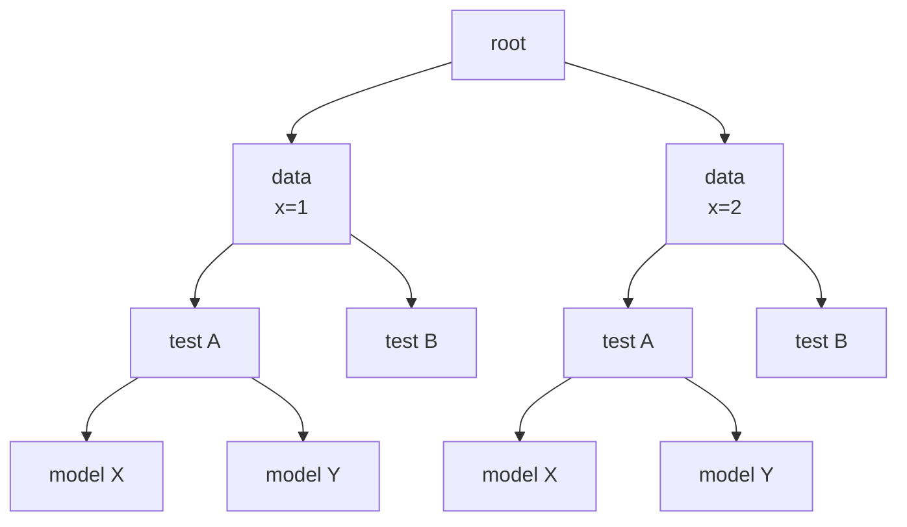
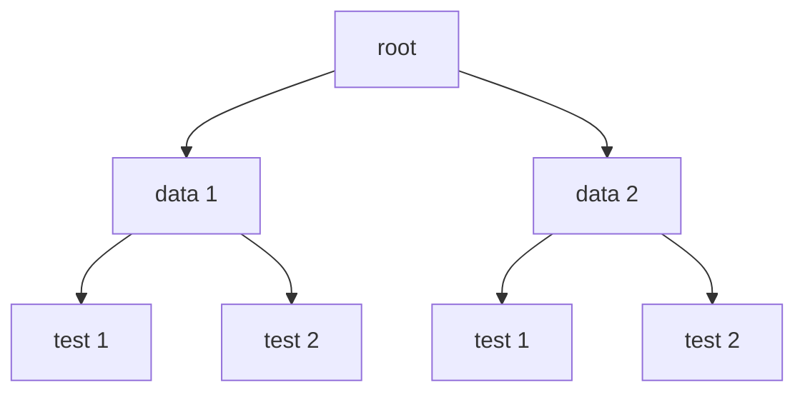
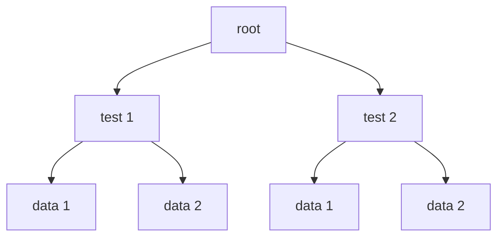

# The Epsilon Unit Testing Framework (EUnit)

EUnit is an unit testing framework specifically designed to test model management tasks, based on EOL and the Ant workflow tasks. It provides assertions for comparing models, files and directories. Tests can be reused with different sets of models and input data, and differences between the expected and actual models can be graphically visualized. This chapter describes how tests are organized and written and shows two examples of how a model-to-model transformation can be tested with EUnit. This chapter ends with a discussion of how EUnit can be extended to support other modelling and model management technologies.

### Common Issues

While each type of model management task does have specific complexity, below is a list of common concerns:

-   There is usually a large number of models to be handled. Some may be created by hand, some may be generated using hand-written programs, and some may be generated automatically following certain coverage criteria.

-   A single model or set of models may be used in several tasks. For instance, a model may be validated before performing an in-place transformation to assist the user, and later on it may be transformed to another model or merged with a different model. This requires having at least one test for each valid combination of models and sets of tasks.

-   Test oracles are more complex than in traditional unit testing: instead of checking scalar values or simple lists, entire graphs of model objects or file trees may have to be compared. In some cases, complex properties in the generated artifacts may have to be checked.

-   Models and model management tasks may use a wide range of technologies. Models may be based on Ecore, XML files or Java object graphs, among many others. At the same time, tasks may use technologies from different platforms, such as Epsilon, or AMMA. Many of these technologies offer high-level tools for running and debugging the different tasks using several models. However, users wishing to do automated unit testing need to learn low-level implementation details about their modelling and model management technologies. This increases the initial cost of testing these tasks and hampers the adoption of new technologies.

-   Existing testing tools tend to focus on the testing technique itself, and lack integration with external systems. Some tools provide graphical user interfaces, but most do not generate reports which can be consumed by a continuous integration server, for instance.

### Testing with JUnit

The previous issues are easier to understand with a concrete example. This section shows how a simple transformation between two EMF models in ETL using JUnit 4 would be normally tested, and points out several issues due to JUnit's limitations as a general-purpose unit testing framework for Java programs.

For the sake of brevity, only an outline of the JUnit test suite is included. All JUnit test suites are defined as Java classes. This test suite has three methods:

1.  The test setup method (marked with the `@Before` JUnit annotation) loads the required models by creating and configuring instances of . After that, it prepares the transformation by creating and configuring an instance of , adding the input and output models to its model repository.

2.  The test case itself (marked with `@Test`) runs the ETL transformation and uses the generic comparison algorithm implemented by EMF Compare to perform the model comparison.

3.  The test teardown method (marked with `@After`) disposes of the models.

Several issues can be identified in each part of the test suite. First, test setup is tightly bound to the technologies used: it depends on the API of the and classes, which are both part of Epsilon. Later refactorings in these classes may break existing tests.

The test case can only be used for a single combination of input and output models. Testing several combinations requires either repeating the same code and therefore making the suite less maintainable, or using parametric testing, which may be wasteful if not all tests need the same combinations of models.

Model comparison requires the user to manually select a model comparison engine and integrate it with the test. For comparing EMF models, EMF Compare is easy to use and readily available. However, generic model comparison engines may not be available for some modelling technologies, or may be harder to integrate.

Finally, instead of comparing the obtained and expected models, several properties could have been checked in the obtained model. However, querying models through Java code can be quite verbose.

### Selected Approach

Several approaches could be followed to address these issues. Our first instinct would be to extend JUnit and reuse all the tooling available for it. A custom test runner would simplify setup and teardown, and modelling platforms would integrate their technologies into it. Since Java is very verbose when querying models, the custom runner should run tests in a higher-level language, such as EOL. However, JUnit is very tightly coupled to Java, and this would impose limits on the level of integration we could obtain. For instance, errors in the model management tasks or the EOL tests could not be reported from their original source, but rather from the Java code which invoked them. Another problem with this approach is that new integration code would need to be written for each of the existing platforms.

Alternatively, we could add a new language exclusively dedicated to testing to the Epsilon family. Being based on EOL, model querying would be very concise, and with a test runner written from scratch, test execution would be very flexible. However, this would still require all platforms to write new code to integrate with it, and this code would be tightly coupled to Epsilon.

As a middle ground, we could decorate EOL to guide its execution through a new test runner, while reusing the Apache Ant tasks already provided by several of the existing platforms, such as AMMA or Epsilon. Like Make, Ant is a tool focused on automating the execution of processes such as program builds. Unlike Make, Ant defines processes using XML *buildfiles* with sets of interrelated *targets*. Each target contains in turn a sequence of *tasks*. Many Ant tasks and Ant-based tools already exist, and it is easy to create a new Ant task.

Among these three approaches, EUnit follows the last one. Ant tasks take care of model setup and management, and tests are written in EOL and executed by a new test runner, written from the ground up.

## Test Organization

EUnit has a rich data model: test suites are organized as trees of tests, and each test is divided into many parts which can be extended by the user. This section is dedicated to describing how test suites and tests are organized. The next section indicates how they are written.

### Test Suites

EUnit test suites are organized as trees: inner nodes group related test cases and define *data* bindings. Leaf nodes define *model* bindings and run the test cases.

Data bindings repeat all test cases with different values in one or more variables. They can implement parametric testing, as in JUnit 4. EUnit can nest several data bindings, running all test cases once for each combination.

Model bindings are specific to EUnit: they allow developers to repeat a single test case with different subsets of models. Data and model bindings can be combined. One interesting approach is to set the names of the models to be used in the model binding from the data binding, as a quick way to try several test cases with the same subsets of models.

The figure below shows an example of an EUnit test tree: nodes with data bindings are marked with `data`, and nodes with model bindings are marked with `model`.



EUnit will perform a preorder traversal of this tree, running the following tests:

1. `A` with `x = 1` and model X.

2. `A` with `x = 1` and model Y.

3. `B` with `x = 1` and both models.

4. `A` with `x = 2` and model X.

5. `A` with `x = 2` and model Y.

6. `B` with `x = 2` and both models.

Optionally, EUnit can filter tests by name, running only `A` or `B`. Similarly to JUnit, EUnit logs start and finish times for each node in the tree, so the most expensive test cases can be quickly detected. However, EUnit logs CPU time[^1] in addition to the usual wallclock time.

Parametric testing is not to be confused with *theories*: both repeat a test case with different values, but results are reported quite differently. While parametric testing produces separate test cases with independent results, theories produce aggregated tests which only pass if the original test case passes for every data point. The figures below illustrate these differences. EUnit does not support theories yet: however, they can be approximated with data bindings.


Parametric Testing


Theories

### Test Cases

The execution of a test case is divided into the following steps:

1.  Apply the data bindings of its ancestors.

2.  Run the model setup sections defined by the user.

3.  Apply the model bindings of this node.

4.  Run the regular setup sections defined by the user.

5.  Run the test case itself.

6.  Run the teardown sections defined by the user.

7.  Tear down the data bindings and models for this test.

An important difference between JUnit and EUnit is that setup is split into two parts: model setup and regular setup. This split allows users to add code before and after model bindings are applied. Normally, the model setup sections will load all the models needed by the test suite, and the regular setup sections will further prepare the models selected by the model binding. Explicit teardown sections are usually not needed, as models are disposed automatically by EUnit. EUnit includes them for consistency with the xUnit frameworks.

Due to its focus on model management, model setup in EUnit is very flexible. Developers can combine several ways to set up models, such as model references, individual Apache Ant tasks, Apache Ant targets or [Human-Usable Text Notation (HUTN)](../hutn) fragments.

A test case may produce one among several results. `SUCCESS` is obtained if all assertions passed and no exceptions were thrown. `FAILURE` is obtained if an assertion failed. `ERROR` is obtained if an unexpected exception was thrown while running the test. Finally, tests may be `SKIPPED` by the user.

## Test Specification

In the previous section, we described how test suites and test cases are organized. In this section, we will show how to write them.

As discussed before, after evaluating several approaches, we decided to combine the expressive power of EOL and the extensibility of Apache Ant. For this reason, EUnit test suites are split into two files: an Ant buildfile and an EOL script with some special-purpose annotations. The next subsections describe the contents of these two files and revisit the previous example with EUnit.

### Ant Buildfile

EUnit uses standard Ant buildfiles: running EUnit is as simple as using its Ant task. Users may run EUnit more than once in a single Ant launch: the graphical user interface will automatically aggregate the results of all test suites.

#### EUnit Invocations

An example invocation of the EUnit Ant task using the most common features is shown in the listing below. Users will normally only use some of these features at a time, though. Optional attributes have been listed between brackets. Some nested elements can be repeated 0+ times (`*`) or 0-1 times (`?`). Valid alternatives for an attribute are separated with `|`.

```xml
<epsilon.eunit src="..."
    [failOnErrors="..."]
    [package=".."]
    [toDir="..."]
    [report="yes|no"]>
  (<model     ref="OldName" [as="NewName"]/>)*
  (<uses      ref="x" [as="y"] />)*
  (<exports   ref="z" [as="w"] />)*
  (<parameter name="myparam" value="myvalue" />)*
  (<modelTasks><!-- Zero or more Ant tasks --></modelTasks>)?
</epsilon.eunit>
```

The EUnit Ant task is based on the Epsilon abstract executable module task, inheriting some useful features. The attribute `src` points to the path of the EOL file, and the optional attribute `failOnErrors` can be set to false to prevent EUnit from aborting the Ant launch if a test case fails. EUnit also inherits support for importing and exporting global variables through the `<uses>` and `<exports>` elements: the original name is set in `ref`, and the optional `as` attribute allows for using a different name. For receiving parameters as name-value piars, the `<parameter>` element can be used.

Model references (using the `<model>` nested element) are also inherited from the Epsilon abstract executable module task. These allow model management tasks to refer by name to models previously loaded in the Ant buildfile. However, EUnit implicitly reloads the models after each test case. This ensures that test cases are isolated from each other.

The EUnit Ant task adds several new features to customize the test result reports and perform more advanced model setup. By default, EUnit generates reports in the XML format of the Ant `<junit>` task. This format is also used by many other tools, such as the TestNG unit testing framework, the Jenkins continuous integration server or the JUnit Eclipse plug-ins. To suppress these reports, report must be set to no.

By default, the XML report is generated in the same directory as the Ant buildfile, but it can be changed with the `toDir` attribute. Test names in JUnit are formed by its Java package, class and method: EUnit uses the filename of the EOL script as the class and the name of the EOL operation as the method. By default, the package is set to the string "default": users are encouraged to customize it with the `package` attribute.
The optional `<modelTasks>` nested element contains a sequence of Ant tasks which will be run after reloading the model references and before running the model setup sections in the EOL file. This allows users to run workflows more advanced than simply reloading model references.


#### Helper Targets

Ant buildfiles for EUnit may include *helper targets*. These targets can be invoked using from anywhere in the EOL script. Helper targets are quite versatile: called from an EOL model setup section, they allow for reusing model loading fragments between different EUnit test suites. They can also be used to invoke the model management tasks under test. 

<!--Listing [\[lst:eunit-ex1-ant\]](#lst:eunit-ex1-ant){reference-type="ref"reference="lst:eunit-ex1-ant"} shows a helper target for an ETL transformation, and listing [\[lst:eunit-atl\]](#lst:eunit-atl){reference-type="ref"reference="lst:eunit-atl"} shows a helper target for an ATL transformation.-->

### EOL script

The Epsilon Object Language script is the second half of the EUnit test suite. EOL annotations are used to tag some of the operations as data binding definitions (`@data` or `@Data`), additional model setup sections (`@model`/`@Model`), test setup and teardown sections (`@setup`/`@Before` and `@teardown`/`@After`) and test cases (`@test`/`@Test`). Suite setup and teardown sections can also be defined with `@suitesetup`/`@BeforeClass` and `@suiteteardown`/`@AfterClass` annotations: these operations will be run before and after all tests, respectively.

#### Data bindings

Data bindings repeat all test cases with different values in some variables. To define a data binding, users must define an operation which returns a sequence of elements and is marked with @data variable. All test cases will be repeated once for each element of the returned sequence, setting the specified variable to the corresponding element. Listing 15.2 shows two nested data bindings and a test case which will be run four times: with x=1 and y=5, x=1 and y=6, x=2 and y=5 and finally x=2 and y=6. The example shows how x and y could be used by the setup section to generate an input model for the test. This can be useful if the intent of the test is ensuring that a certain property holds in a class of models, rather than a single model.

```eunit
@data x
operation firstLevel()  { return 1.to(2); }

@data y
operation secondLevel() { return 5.to(6); }

@setup
operation generateModel() { /* generate model using x and y */ }

@test
operation mytest() { /* test with the generated model */ }
```

Alternatively, if both x and y were to use the same sets of values, we could add two @data annotations to the same operation. For instance, the listing below shows how we could test with 4 cases: x=1 and y=1, x=1 and y=2, x=2 and y=1 and x=2 and y=2.

```eunit
@data x
@data y
operation levels()  { return 1.to(2); }

@setup
operation generateModel() { /* generate model using x and y */ }

@test
operation mytest() { /* test with the generated model */ }
```

#### Model bindings

Model bindings repeat a test case with different subsets of models. They can be defined by annotating a test case with `$with map` or `$onlyWith map` one or more times, where map is an EOL expression that produces a `MAP`. For each key-value pair `key = value`, EUnit will rename the model named `value` to `key`. The difference between `$with` and `$onlyWith` is how they handle the models not mentioned in the `MAP`: `$with` will preserve them as is, and `$onlyWith` will make them unavailable during the test. `$onlyWith` is useful for tightly restricting the set of available models in a test and for avoiding ambiguous type references when handling multiple models using the same metamodel.

The listing below shows two tests which will be each run twice. The first test uses `$with`, which preserves models not mentioned in the MAP: the first time, model "A" will be the default model and model "B" will be the "Other" model, and the second time, model "B" will be the default model and model "A" will be the "Other" model. The second test uses two `$onlyWith` annotations: on the first run, "A" will be available as "Model" and "B" will not unavailable, and on the second run, only "B" will be available as "Model" and "A" will be unavailable.

```eunit
$with Map {"" = "A", "Other" = "B"}
$with Map {"" = "B", "Other" = "A"}
@test
operation mytest() {
  /* use the default and Other models, while
     keeping the rest as is */
}

$onlyWith Map { "Model" = "A" }
$onlyWith Map { "Model" = "B" }
@test
operation mytest2() {
  // first time: A as 'Model', B is unavailable
  // second time: B as 'Model', A is unavailable
}
```

#### Additional variables and built-in operations

EUnit provides several variables and operations which are useful for testing. These are listed in the table below.

| Signature | Description |
| - | - |
| runTarget(name : String) | Runs the specified target of the Ant buildfile which invoked EUnit.|
exportVariable(name : String) | Exports the specified variable, to be used by another executable module.|
useVariable(name : String) | Imports the specified variable, which should have been previously exported by another executable module.|
|loadHutn(name : String, hutn : String) | Loads an EMF model with the specified name, by parsing the second argument as an HUTN fragment.|
|antProject : org.apache.tools.ant.Project | Global variable which refers to the Ant project being executed. This can be used to create and run Ant tasks from inside the EOL code.|

#### Assertions

EUnit implements some common assertions for equality and inequality,
with special versions for comparing floating-point numbers. EUnit also
supports a limited form of exception testing with , which checks that
the expression inside it throws an exception. Custom assertions can be
defined by the user with the operation, which fails a test with a custom
message. The available assertions are shown in
the table below.

| Signature | Description |
| - | - |
| assertEqualDirectories(expectedPath : String,obtainedPath : String) | Fails the test if the contents of the directory in differ from those of the directory in . Directory comparisons are performed on recursive snapshots of both directories.|
|assertEqualFiles(expectedPath : String,obtainedPath : String) | Fails the test if the contents of the file in differ from those of the file in . File comparisons are performed on snapshots of both files.|
|assertEqualModels(\[msg : String,\]expectedModel : String,obtainedModel : String\[, options : Map\]) | Fails the test with the optional message if the model named is not equal to the model named . Model comparisons are performed on snapshots of the resource sets of both models. During EMF comparisons, XMI identifiers are ignored. Additional comparator-specific options can be specified through .|
|assertEquals(\[msg : String,\]expected : Any,obtained : Any) | Fails the test with the optional message if the values of and are not equal.|
|assertEquals(\[msg : String,\]expected : Real,obtained : Real,ulps : Integer) | Fails the test with the optional message if the values of and differ in more than units of least precision. See [this site](http://download.oracle.com/javase/6/docs/api/java/lang/Math.html#ulp(double)) for details.|
|assertError(expr : Any) | Fails the test if no exception is thrown during the evaluation of .|
|assertFalse(\[msg : String,\]cond : Boolean) | Fails the test with the optional message if is . It is a negated version of assertTrue.|
|assertLineWithMatch(\[msg : String,\]path : String,regexp : String) | Fails the test with the optional message if the file at does not have a line containing a substring matching the regular expression [^2].|
|assertMatchingLine(\[msg : String,\]path : String,regexp : String) | Fails the test with the optional message if the file at does not have a line that matches the regular expression [^3] from start to finish.|
|assertNotEqualDirectories(expectedPath : String,obtainedPath : String) | Negated version of assertEqualDirectories.|
|assertNotEqualFiles(expectedPath : String,obtainedPath : String) | Negated version of assertEqualFiles.|
|assertNotEqualModels(\[msg : String,\]expectedModel : String,obtainedModel : String) | Negated version of assertNotEqualModels.|
|assertNotEquals(\[msg : String,\]expected : Any,obtained : Any) | Negated version of assertEquals(\[msg : String,\] expected : Any, obtained : Any).|
|assertNotEquals(\[msg : String,\]expected : Real,obtained : Real,ulps : Integer) | Negated version of assertEquals(\[msg : String,\] expected : Real, obtained : Real, ulps : Integer).|
|assertTrue(\[msg : String,\]cond : Boolean) | Fails the test with the optional message if is .|
|fail(msg : String) | Fails a test with the message .|


The table below lists the available option keys which can be used with the model equality assertions, by comparator.

| Comparator and Key | Usage |
| - | - |
EMF, "whitespace" | When set to "ignore", differences in EString attribute values due to whitespace will be ignored. Disabled by default. 
EMF, "ignoreAttributeValueChanges" | Can contain a of strings of the form "package.class.attribute". Differences in the values for these attributes will be ignored. However, if the attribute is set on one side and not on the other, the difference will be reported as normal. Empty by default.
EMF, "unorderedMoves" | When set to "ignore", differences in the order of the elements within an unordered EReference. Enabled by default.

More importantly, EUnit implements specific assertions for comparing models, files and trees of files. Model comparison is not implemented by the assertions themselves: it is an optional service implemented by some EMC drivers. Currently, EMF models will automatically use EMF Compare as their comparison engine. The rest of the EMC drivers do not support comparison yet. The main advantage of having an abstraction layer implement model comparison as a service is that the test case definition is decoupled from the concrete model comparison engine used.

Model, file and directory comparisons take a snapshot of their operands before comparing them, so EUnit can show the differences right at the moment when the comparison was performed. This is especially important when some of the models are generated on the fly by the EUnit test suite, or when a test case for code generation may overwrite the results of the previous one.

The following figure shows a screenshot of the EUnit graphical user interface. On the left, an Eclipse view shows the results of several EUnit test suites. We can see that the `load- models-with-hutn` suite failed. The Compare button to the right of "Failure Trace" can be pressed to show the differences between the expected and obtained models, as shown on the right side. EUnit implements a pluggable architecture where *difference viewers* are automatically selected based on the types of the operands. There are difference viewers for EMF models, file trees and a fallback viewer which converts both operands to strings.


## Examples

### Models and Tasks in the Buildfile

After describing the basic syntax, we will show how to use EUnit to test an ETL transformation.

The Ant buildfile is shown in the listing below. It has two targets: `run-tests` (lines 2-19) invokes the EUnit suite, and `tree2graph` (lines 23-28) is a helper target which transforms model `Tree` into model `Graph` using ETL. The `<modelTasks>` nested element is used to load the input, expected output and output EMF models. `Graph` is loaded with `read` set to `false`: the model will be initially empty, and will be populated by the ETL transformation.

```xml
<project>
  <target name="run-tests">
    <epsilon.eunit src="test-external.eunit">
      <modelTasks>
        <epsilon.emf.loadModel name="Tree"
            modelfile="tree.model"
            metamodelfile="tree.ecore"
            read="true" store="false"/>
        <epsilon.emf.loadModel name="GraphExpected"
            modelfile="graph.model"
            metamodelfile="graph.ecore"
            read="true" store="false"/>
        <epsilon.emf.loadModel name="Graph"
            modelfile="transformed.model"
            metamodelfile="graph.ecore"
            read="false" store="false"/>
      </modelTasks>
    </epsilon.eunit>
  </target>
  <target name="tree2graph">
    <epsilon.etl src="${basedir}/resources/Tree2Graph.etl">
      <model ref="Tree"/>
      <model ref="Graph"/>
    </epsilon.etl>
  </target>
</project>
```

The EOL script is shown in the listing below: it invokes the helper task (line 3) and checks that the obtained model is equal to the expected model (line 4). Internally, EMC will perform the comparison using EMF Compare.

```eol
@test
operation transformationWorksAsExpected() {
  runTarget("tree2graph");
  assertEqualModels("GraphExpected", "Graph");
}
```

### Models and Tasks in the EOL Script

In the previous section, the EOL file is kept very concise because the model setup and model management tasks under test were specified in the Ant buildfile. In this section, we will inline the models and the tasks into the EOL script instead.

The Ant buildfile is shown in the listing below. It is now very simple: all it needs to do is run the EOL script. However, since we will parse HUTN in the EOL script, we must make sure the s of the metamodels are registered.

```xml
<project>
  <target name="run-tests">
    <epsilon.emf.register file="tree.ecore"/>
    <epsilon.emf.register file="graph.ecore"/>
    <epsilon.eunit src="test-inlined.eunit"/>
  </target>
</project>
```

The EOL script used is shown below. Instead of loading models through the Ant tasks, the `loadHutn` operation has been used to load the models. The test itself is almost the same, but instead of running a helper target, it invokes an operation which creates and runs the ETL Ant task through the `antProject` variable provided by EUnit, taking advantage of the support in EOL for invoking Java code through reflection.

```eunit
@model
operation loadModels() {
  loadHutn("Tree", '@Spec {Metamodel {nsUri: "Tree" }}
Model {
  Tree "t1" { label : "t1" }
  Tree "t2" {
    label : "t2"
    parent : Tree "t1" 
  }
}
');

  loadHutn("GraphExpected", '@Spec {Metamodel {nsUri: "Graph"}}
Graph { nodes :
  Node "t1" {
    name : "t1"
    outgoing : Edge { source : Node "t1" target : Node "t2" }
  },
  Node "t2" {
    name : "t2"
  }
}
');

  loadHutn("Graph", '@Spec {Metamodel {nsUri: "Graph"}}');
}

@test
operation transformationWorksAsExpected() {
  runETL();
  assertEqualModels("GraphExpected", "Graph");
}

operation runETL() {
  var etlTask := antProject.createTask("epsilon.etl");
  etlTask.setSrc(new Native('java.io.File')(
    antProject.getBaseDir(), 'resources/etl/Tree2Graph.etl'));
  etlTask.createModel().setRef("Tree");
  etlTask.createModel().setRef("Graph");
  etlTask.execute();
}
```

## Extending EUnit

EUnit is based on the Epsilon platform, but it is designed to accommodate other technologies. In this section we will explain several strategies to add support for these technologies to EUnit.

EUnit uses the Epsilon Model Connectivity abstraction layer to handle different modelling technologies. Adding support for a different modelling technology only requires implementing another driver for EMC. Depending on the modelling technology, the driver can provide optional services such as model comparison, caching or reflection.

EUnit uses Ant as a workflow language: all model management tasks must be exposed through Ant tasks. It is highly encouraged, however, that the Ant task is aware of the EMC model repository linked to the Ant project. Otherwise, users will have to shuffle the models out from and back into the repository between model management tasks. As an example, a helper target for an ATL transformation with the existing Ant tasks needs to:

1. Save the input model in the EMC model repository to a file, by invoking the `<epsilon.storeModel>` task.
2. Load the metamodels and the input model with `<atl.loadModel>`.
3. Run the ATL transformation with `<atl.launch>`.
4. Save the result of the ATL transformation with `<atl.saveModel>`.
5. Load it into the EMC model repository with `<epsilon.emf.loadModel>`.

The listing below shows the Ant buildfile which would be required for running these steps, showing that while EUnit can use the existing ATL tasks as-is, the required helper task is quite longer than the one shown above. Ideally, Ant tasks should be adapted or wrapped to use models directly from the EMC model repository.

```xml
<project>
  <!-- ... omitted ... -->
  <target name="atl">
    <!-- Create temporary files for input and output models -->
    <tempfile property="atl.temp.srcfile" />
    <tempfile property="atl.temp.dstfile" />

    <!-- Save input model to a file -->
    <epsilon.storeModel model="Tree"
      target="${atl.temp.srcfile}" />

    <!-- Load the metamodels and the source model -->
    <atl.loadModel name="TreeMM" metamodel="MOF"
      path="metamodels/tree.ecore" />
    <atl.loadModel name="GraphMM" metamodel="MOF"
      path="metamodels/graph.ecore" />
    <atl.loadModel name="Tree" metamodel="TreeMM"
      path="${atl.temp.srcfile}" />

    <!-- Run ATL and save the model -->
    <atl.launch path="transformation/tree2graph.atl">
      <inmodel name="IN"   model="Tree" />
      <outmodel name="OUT" model="Graph" metamodel="GraphMM" />
    </atl.launch>
    <atl.saveModel model="Graph" path="${atl.temp.dstfile}" />

    <!-- Load it back into the EUnit suite -->
    <epsilon.emf.loadModel name="Graph"
      modelfile="${atl.temp.dstfile}"
      metamodeluri="Graph"
      read="true" store="false" />

    <!-- Delete temporary files -->
    <delete file="${atl.temp.srcfile}" />
    <delete file="${atl.temp.dstfile}" />
  </target>
</project>
```

Another advantage in making model management tasks EMC-aware is that they can easily “export” their results as models, making them easier to test. For instance, the EVL Ant task allows for exporting its results as a model by setting the attribute `exportAsModel` to `true`. This way, EOL can query the results as any regular model. This is simpler than transforming the validated model to a problem metamodel. The example in the listing below checks that a single warning was produced due to the expected rule (`LabelsStartWithT`) and the expected model element.

```eunit
@test
operation valid() {
  var tree := new Tree!Tree;
  tree.label := '1n';
  runTarget('validate-tree');
  var errors := EVL!EvlUnsatisfiedConstraint.allInstances;
  assertEquals(1, errors.size);
  var error := errors.first;
  assertEquals(tree, error.instance);
  assertEquals(false, error.constraint.isCritique);
  assertEquals('LabelsStartWithT', error.constraint.name);
}
```

[^1]: CPU time only measures the time elapsed in the thread used by EUnit, and is more stable with varying system load in single-threaded programs.
[^2]: See `JAVA.UTIL.REGEX.PATTERN` for details about the accepted syntax for regular expressions.
[^3]: See footnote `assertLineWithMatch` for details about the syntax of the regular expressions.