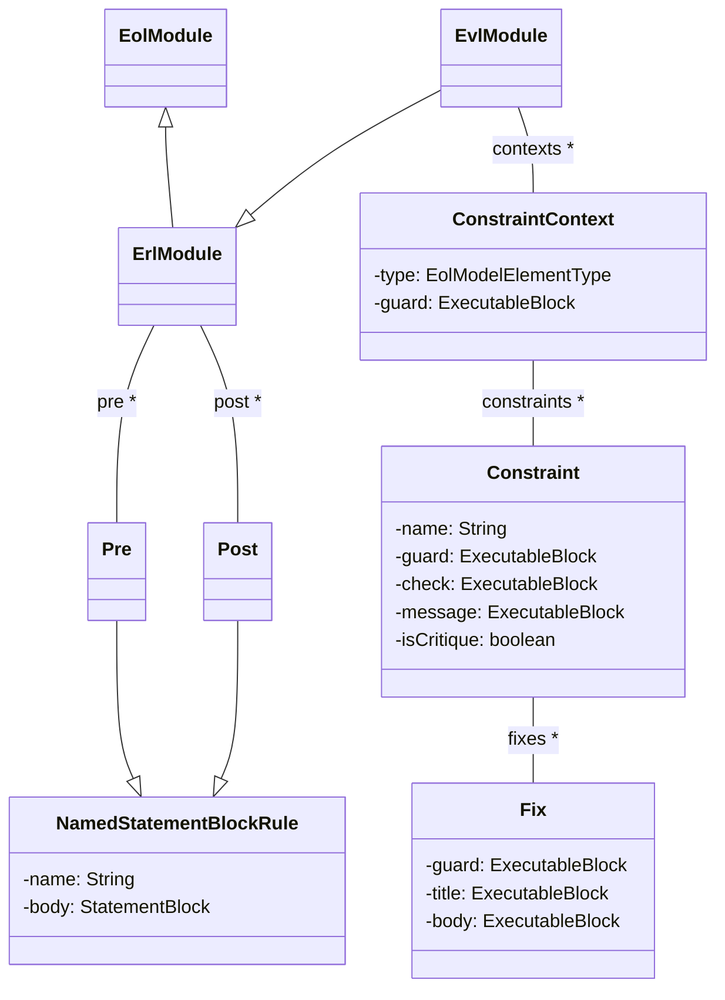
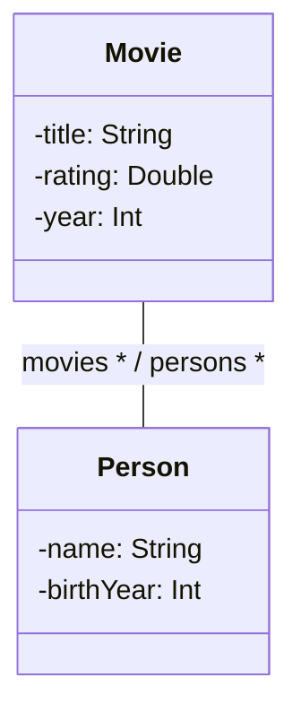

# The Epsilon Validation Language (EVL)

EVL contributes model validation capabilities to Epsilon. More specifically, EVL can be used to specify and evaluate constraints and critiques on models of arbitrary metamodels and modelling technologies, and to produce human-readable error messages and executable quick fixes.

!!! tip "Try EVL online"
    You can run and fiddle with EVL constraints that validate a project scheduling model in the [online Epsilon Playground](../../live/?evl).

## Abstract Syntax

In EVL, validation specifications are organized in modules (*EvlModule*). As illustrated in the figure below, *EvlModule* (indirectly) extends *EolModule* which means that it can contain user-defined operations and import other EOL library modules and EVL modules. Apart from operations, an EVL module also contains a set of constraints grouped by the context they apply to, and, by extending *ErlModule*, a number of *pre* and *post* blocks.

!!! info
    As with most languages in Epsilon, EVL uses [EOL](../eol) as its expression language. This page only documents the additional syntax and semantics that EVL provides on top of EOL.



<!---->

### Context

A context specifies the kind of instances on which the contained constraints will be evaluated. Each context can optionally define a guard which limits its applicability to a narrower subset of instances of its specified type. Thus, if the guard fails for a specific instance of the type, none of its contained constraints are evaluated.

### Constraint

As with OCL, each EVL constraint defines a *name* and a body (*check*). However, it can optionally also define a *guard* which further limits its applicability to a subset of the instances of the type defined by the embracing *context*. Each constraint can optionally define a *message* as an *ExecutableBlock* that should return a String providing a description of the reason(s) for which the constraint has failed on a particular element. A constraint can also optionally define a number of *fixes*. Finally, as displayed in the figure above, *constraint* is an abstract class that is used as a super-class for the specific types *Constraint* and *Critique*.

### Guard

Guards are used to limit the applicability of constraints. This can be achieved at two levels. At the *Context* level it limits the applicability of all constraints of the context and at the *Constraint* level it limits the applicability of a specific constraint.

### Fix

A fix defines a title using an *ExecutableBlock* instead of a static String to allow users to specify context-aware titles (e.g. *Rename class customer to Customer* instead of a generic *Convert first letter to upper-case*). Moreover, the *do* (body) part is a statement block where the fixing functionality can be defined using EOL. The developer is responsible for ensuring that the actions contained in the *fix* actually repair the identified inconsistency.

### Critique

*Critiques* are constraints that are used to capture non-critical issues that do not invalidate the model, but should nevertheless be addressed by the user to enhance the quality of the model.

### Pre and Post

An EVL module can define a number of named *pre* and a *post* blocks that contain EOL statements which are executed before and after evaluating the constraints respectively. These should not be confused with the pre-/post-condition annotations available for EOL user-defined operations.

## Concrete Syntax

The following listing demonstrates the concrete sytnax of the *context*, *constraint* and *fix* abstract syntax constructs discussed above.

```
(@lazy)?
context <name> {
    (guard (:expression)|({statementBlock}))?
    (constraint)* 
}

((@lazy)?
(constraint|critique) <name> {
    (guard (:expression)|({statementBlock}))?
    (check (:expression)|({statementBlock}))?
    (message (:expression)|({statementBlock}))? 
    (fix)*
}

fix {
    (guard (:expression)|({statementBlock}))?
    (title (:expression)|({statementBlock}))
    do {
        statementBlock
    } 
}
```

*Pre* and *post* blocks have a simple syntax that, as presented in the listing below, consists of the identifier (*pre* or *post*), an optional name and the set of statements to be executed enclosed in curly braces.

```
(pre|post) <name> {
    statement+
}
```

## Execution Semantics

Having discussed the abstract and concrete syntaxes of EVL, this section provides an informal discussion of the execution semantics of the language. The execution of an EVL module is separated into four phases:

### Phase 1

Before any constraint is evaluated, the *pre* blocks of the module are executed in the order in which they have been specified.

### Phase 2

For each non-lazy *context* with at least one non-lazy constraint, the instances of the meta-class it defines are collected. For each instance, the *guard* of the *context* is evaluated. If the *guard* is satisfied, then for each non-lazy constraint contained in the context the constraint's *guard* is also evaluated. If the *guard* of the constraint is satisfied, the *body* of the constraint is evaluated. In case the *body* evaluates to *false*, the *message* part of the rule is evaluated and the produced message is added along with the instance, the constraint and the available *fixes* to the *ValidationTrace*.

The execution order of an EVL module follows a top-down depth-first scheme that respects the order in which the *contexts* and *constraints* appear in the module. However, the execution order can change in case one of the *satisfies*, *satisfiesOne*, *satisfiesAll* built-in operations, discussed in detail in the sequel, are called.

### Phase 3

In this phase, the validation trace is examined for unsatisfied constraints and the user is presented with the message each one has produced. The user can then select one or more of the available *fixes* to be executed. Execution of *fixes* is performed in a transactional manner using the respective facilities provided by the model connectivity framework. This is to prevent runtime errors raised during the execution of a *fix* from compromising the validated model by leaving it in an inconsistent state.

### Phase 4

When the user has performed all the necessary *fixes* or chooses to end Phase 3 explicitly, the *post* section of the module is executed. There, the user can perform tasks such as serializing the validation trace or producing a summary of the validation process results.

## Capturing Dependencies between Constraints

It is often the case that constraints conceptually depend on each other. To allow users capture such dependencies, EVL provides the *satisfies(constraint : String) : Boolean*, *satisfiesAll(constraints : Sequence(String)) : Boolean* and *satisfiesOne(constraints : Sequence(String)) : Boolean* built-in operations. Using these operations, an constraint can specify in its *guard* other constraints which need to be satisfied for it to be meaningful to evaluate.

When one of these operations is invoked, if the required *constraints* (either lazy or non-lazy) have been evaluated for the instances on which the operation is invoked, the engine will return their cached results; otherwise it will evaluate them and return their results.

## Example

The following is an EVL program demonstrating some of the language features, which validates models confirming to the Movies metamodel shown below. Execution begins from the *pre* block, which simply computes the average number of actors per Movie and stores it into a global variable, which can be accessed at any point. The *ValidActors* constraint checks that for every instance of *Movie* which has more than the average number of actors, all of the actors have valid names. This is achieved through a dependency on the *HashValidName* invariant declared in the context of *Person* type. This constraint is marked as lazy, which means it is only executed when invoked by *satisfies*, so avoiding unnecessary or duplicate invocations. The *HasValidName* constraint makes use of a helper operation (*isPlain()*) on Strings. Once all Movie instances have been checked, the execution engine then proceeds to validate all *Person* instances, which consists of only one non-lazy constraint *ValidMovieYears*. This checks that all of the movies the actor has played in were released at least 3 years after the actor was born. Finally, the *post* block is executed, which in this case simply prints some basic information about the model.



```evl
pre {
  var numMovies = Movie.all.size();
  var numActors = Person.all.size();
  var apm = numActors / numMovies;
}

context Movie {
  
  constraint ValidActors {
    guard : self.persons.size() > apm    
    check : self.persons.forAll(p | p.satisfies("HasValidName"))
  }
}

context Person {
  
  @lazy
  constraint HasValidName {
    check : self.name.isPlain()
  } 
  
  constraint ValidMovieYears {
    check : self.movies.forAll(m |  m.year + 1 > self.birthYear)
  }
}

operation String isPlain() : Boolean {
  return self.matches("[A-Za-z\\s]+");
}

post {
  ("Actors per Movie="+apm).println();
  ("# Movies="+numMovies).println();
  ("# Actors="+numActors).println();
}
```

## Additional Resources

Additional resources about EVL are available [here](../articles/#epsilon-validation-language).
