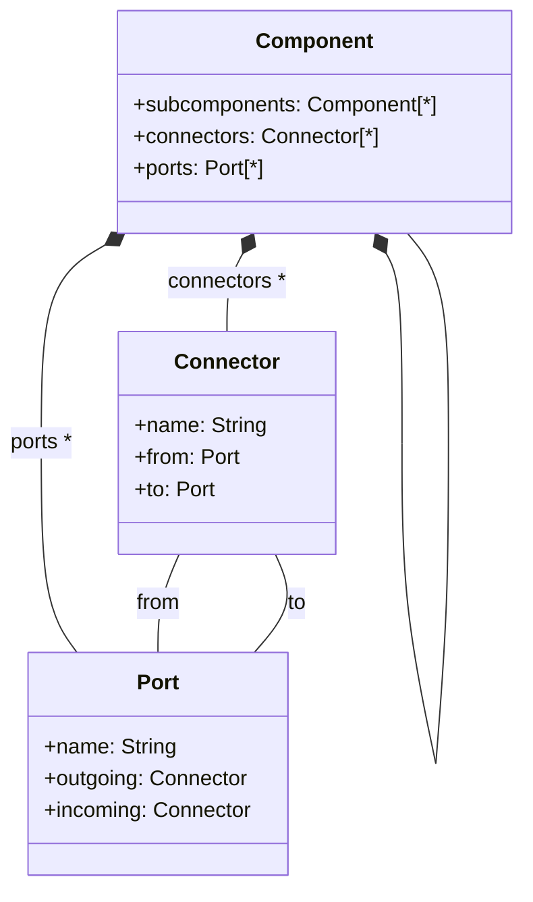
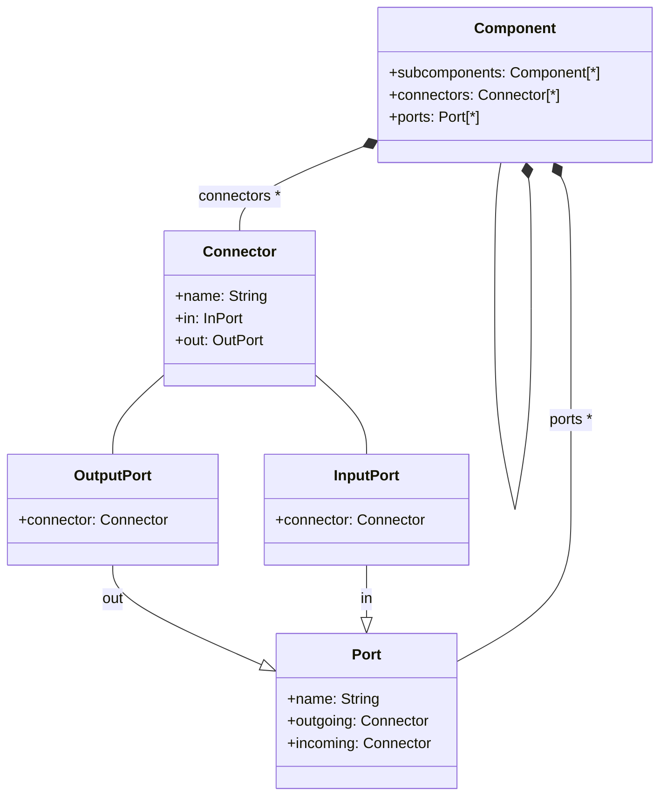
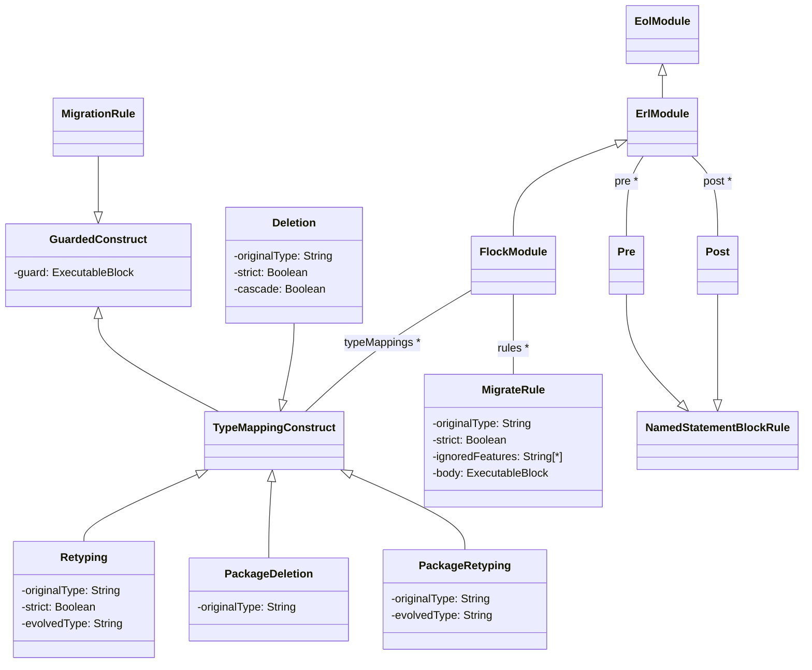

# Epsilon Flock for Model Migration

The aim of Epsilon Flock is to contribute *model migration* capabilities to Epsilon. Model migration is the process of updating models in response to metamodel changes. This section discusses the motivation for implementing Flock, introduces its syntax and execution semantics, and demonstrates the use of Flock with an example. Flock can be used to update models to a new version of their metamodel, or even to move from one modelling technology to another (e.g., from XML to EMF).

To illustrate the challenges of model migration, we use the example of metamodel evolution below. In the top figure, a `Component` comprises other `Component`s, `Connector`s and `Port`s. A `Connector` joins two `Port`s. `Connector`s are unidirectional, and hence define `to` and `from` references to `Port`. The original metamodel allows a `Connector` to start and end at the same `Port`, and the metamodel was evolved to prevent this, as shown in the bottom figure. `Port` was made abstract, and split into two subtypes, `InputPort` and `OutputPort`. The references between `Connector` and (the subtypes of) `Port` were renamed for consistency with the names of the subtypes.





Some models that conform to the original metamodel do not conform to the evolved metamodel. Specifically, models might not conform to the evolved metamodel because:

1.  They contain instances of `Port`, which is an abstract class in the evolved metamodel.

2.  They contain instances of `Connector` that specify values for the features `to` and `from`, which are not defined for the `Connector` type in the evolved metamodel.

3.  They contain instances of `Connector` that do not specify a value for the `in` and `out` features, which are mandatory for the `Connector` type in the evolved metamodel.

Model migration can be achieved with a general-purpose model-to-model transformation using a language such as ETL. However, this typically involves writing a large amount of repetitive and redundant code. Flock reduces the amount of repetitive and redundant code needed to specify model migration by automatically copying from the original to the migrated model all of the model elements that conform to the evolved metamodel as described below.



## Abstract Syntax

As illustrated in the figure above, Flock migration strategies are organised into individual modules (`FlockModule`). Flock modules inherit from EOL language constructs for specifying user-defined operations and for importing other (EOL and Flock) modules. Like the other rule-based of Epsilon, Flock modules may comprise any number of pre (post) blocks, which are executed before (after) all other constructs. Flock modules comprise any number of type mappings (`TypeMapping`) and rules (`Rule`). Type mappings operate on metamodel types (`Retyping` and `Deletion`) or on metamodel packages (`PackageRetyping` and `PackageDeletion`). Type mappings are applied to a type in the original metamodel (`originalType`) or to a package in the original metamodel (`originalPackage`) . Additionally, `Retyping`s apply to an evolved metamodel type (`evolvedType`) or package (`evolvedPackage`). Each rule has an original metamodel type (`originalType`), a `body` comprising a block of EOL statements, and zero or more `ignoredFeatures`. Type mappings and rules can optionally specify a `guard`, which is either an EOL statement or a block of EOL statements. Type mappings that operate on metamodel types and rules can be marked as `strict`.

## Concrete Syntax

The listing below demonstrates the concrete syntax of the Flock language constructs. All of the constructs begin with keyword(s) (`retype`, `retype package` `delete`, `delete package` or `migrate`), followed by the original metamodel type or package. Additionally, type mappings that operate on metamodel types and rules can be annotated with the `strict` modifier. The `delete` construct can be annotated with a `cascade` modifier. All constructs can have guards, which are specified using the `when` keyword.

Migrate rules can specify a list of features that conservative copy will ignore (`ignoring`), and a `body` containing a sequence of at least one EOL statement. Note that a migrate rule must have a list of ignored features, or a body, or both.

```
(@strict)?
retype <originalType> to <evolvedType>
(when (:<eolExpression>)|({<eolStatement>+}))? 

retype package <originalPackage> to <evolvedPackage>
(when (:<eolExpression>)|({<eolStatement>+}))? 

(@strict)?
(@cascade)?
delete <originalType>
(when (:<eolExpression>)|({<eolStatement>+}))?

delete package <originalPackage>
(when (:<eolExpression>)|({<eolStatement>+}))?

(@strict)?
migrate <originalType>
(ignoring <featureList>)?
(when (:<eolExpression>)|({<eolStatement>+}))? {
    <eolStatement>+
}
```

*Pre* and *post* blocks have a simple syntax that, as presented below, consists of the identifier (*pre* or *post*), an optional name and the set of statements to be executed enclosed in curly braces.

```
(pre|post) <name> {
    statement+
}
```

## Execution Semantics

The execution semantics of a Flock module are now described. Note that the Epsilon Model Connectivity (EMC) layer, which Flock uses to access and manipulate models supports a range of modelling technologies, and identifies types by name. Consequently, the term *type* is used to mean "the name of an element of a metamodel" in the following discussion. For example, `Component`, `Connector` and `InputPort` are three of the types defined in the evolved metamodel.

Execution of a Flock module occurs in six phases:

1.  Any pre blocks are executed.

2.  Type mapping constructs (retypings and deletions) are processed to identify the way in which original and evolved metamodel types are to be related.

3.  Migrate rules are inspected to build sets of ignored properties.

4.  The information determined in steps 2 and 3 is used as input a copying algorithm, which creates an (equivalent) element in the migrated model for each element of the original model, and copies values from original to equivalent model elements.

5.  Migrate rules are executed on each pair of original and (equivalent) migrated model elements.

6.  Any post blocks are executed.

In phases 2-5, language constructs are executed only when they are *applicable*. The *applicability* of the Flock language constructs (retyping, deletion or migrate rule) is determined from their type and guard. For a language construct `c` to be applicable to an original model element `o`, `o` must instantiate either the original type of `c` or one of the subtypes of the original type of `c`; and `o` must satisfy the guard of `c`. For language constructs that have been annotated as strict, type-checking is more restrictive: `o` must instantiate the original type of `c` (and not one its subtypes). In other words, the applicability of strict constructs is determined with EOL's `isTypeOf` operation and the applicability of non-strict constructs is determined with EOL's `isKindOf` operation. For language constructs that have been annotated with cascade, type-checking is less restrictive: `o` must be contained in another model element (either directly or indirectly) to which the construct is applicable. Similarly, for language constructs that operate on packages (i.e. package retyping and package deletions), type-checking is less restrictive: `o` must be contained in a package with the same name as the original package of `c`.


Phases 2-4 of execution implement a copying algorithm which has been termed conservative copy and is discussed thoroughly [elsewhere](https://link.springer.com/chapter/10.1007/978-3-642-16145-2_5). Essentially, conservative copy will do the following for each element of the original model, `o`:

1.  **Do nothing** when `o` instantiates a type that cannot be instantiated in the evolved metamodel (e.g., because the type of `o` is now abstract or no longer exists). Example: instances of `Port` in the original metamodel are not copied because `Port` has become abstract.

2.  **Fully copy** `o` to produce `m` in the migrated model when `o` instantiate a type that has not been at all affected by metamodel evolution. Example: instances of `Component` in the original metamodel are fully copied because neither `Component` nor any of its features have been changed.

3.  **Partially copy** `o` to produce `m` in the migrated model when `o` instantiates a type with one or more features that have been affected by metamodel evolution. Example: instances of `Connector` in the original metamodel are partially copied because the `from` and `to` features have been renamed. Note that in a partial copy only the features that have not been affected by metamodel evolution are copied (e.g., the `name`s of `Connector`s).

In phase 5, migrate rules are applied. These rules specify the problem-specific migration logic and might, for example, create migrated model elements for original model elements that were skipped or partially copied by the copying algorithm described above. The Flock engine makes available two variables (`original` and `migrated`) for use in the body of any migration rule. These variables are used to refer to the particular elements of the original and migrated models to which the rule is currently being applied. In addition, Flock defines an `equivalent()` operation that can be called on any original model element and returns the equivalent migrated model element (or `null`). The `equivalent()` operation is used to access elements of the migrated model that cannot be accessed via the `migrated` variable due to metamodel evolution. Flock rules often contain statements of the form: `original.x.equivalent()` where `x` is a feature that has been removed from the evolved metamodel.

Finally, we should consider the order in which Flock schedules language constructs: a construct that appears earlier (higher) in the source file has priority. This is important because only one type mapping (retypings and deletions) is applied per original model element, and because this implies that migrate rules are applied from top-to-bottom. This ordering is consistent with the other languages of the Epsilon platform.

Example
-------

Flock is now demonstrated using the example of model migration
introduced above. Recall that the metamodel evolution
 involves splitting the `Port` type to form the
`InputPort` and `OutputPort` types.
Below is a high-level design for
migrating models from the original to the evolved metamodel.

-   For every instance, p, of `Port` in the original model: 
    - If there exists in the original model a `Connector`, c, that specifies p as
    the value for its `from` feature:
        - Create a new instance, `i`, of `InputPort` in the migrated model. 
        - Set c as the `connector` of `i`. 
        - Add c to the `ports` reference of the `Component` that contains c.

    - If there exists in the original model a `Connector`, c, that specifies p as the value for its `to` feature: 
        - Create a new instance of `OutputPort` in the migrated model. 
        - Set c as the `connector` of i. 
        - Add c to the `ports` reference of the `Component` that contains c.

-   And nothing else changes.

The Flock migration strategy that implements this design is shown below. Three type mappings constructs (on lines 1-4) are used to control the way in which instances of `Port` are migrated. For example, line 3 specifies that instances of `Port` that are referenced via the `from` feature of a `Connector` are retyped, becoming `InputPort`s. Instances of `Connector` are migrated using the rule on lines 6-9, which specifies the way in which the `from` and `to` features have evolved to form the `in` and `out` features.

```mig
delete Port when: not (original.isInput() xor original.isOutput())

retype Port to InputPort  when: original.isInput()
retype Port to OutputPort when: original.isOutput()

migrate Connector {
    migrated.`in` = original.from.equivalent();
    migrated.out = original.`to`.equivalent();
}

operation Original!Port isInput() : Boolean {
    return Original!Connector.all.exists(c|c.from == self);
}

operation Original!Port isOutput() : Boolean {
    return Original!Connector.all.exists(c|c.`to` == self);
}
```

Note that metamodel elements that have not been affected by the metamodel evolution, such as `Component`s, are migrated automatically. Explicit copying code would be needed to achieve this with a general purpose model-to-model transformation language.

## Limitations and Scope

Although Flock has been shown to much more concise than general purpose model-to-model transformation languages for specifying model migration, Flock does not provide some of the features commonly available in general-purpose model-to-model transformation language. This section discusses the limitations of Flock and its intended scope with respect to other tools for model migration.

### Limitations

Firstly, Flock does not support rule inheritance, and re-use of migration logic is instead achieved by exploiting the inheritance hierarchy of the original metamodel. The form of re-use provided by Flock is less general than rule-inheritance, but has proved sufficient for existing use-cases.

Secondly, Flock does not provide language constructs for controlling the order in which rules are scheduled (other than the ordering of the rules in the program file). ATL, for example, includes constructs that allow users to specify that rules are scheduled explicitly (lazy rules) or in a memoised manner (unique rules). We anticipate that scheduling constructs might be necessary for larger migration strategies, but have not yet encountered situations in which they have been required.

Thirdly, Flock is tailored for applying migration to a single original and a single migrated model. Although further models can be accessed by a Flock migration strategy, they cannot be used as the source or target of the conservative copy algorithm. By contrast, some general-purpose model transformation languages can access and manipulate any number of models.

Fourthly, Flock can only operate on models loaded with [EMC drivers](../emc) that implement the [IReflectiveModel](https://github.com/eclipse/epsilon/blob/874e5c435742e94faed95b42d06d43b8efecf242/plugins/org.eclipse.epsilon.eol.engine/src/org/eclipse/epsilon/eol/models/IReflectiveModel.java) interface  (such as the [EMF driver](../emc/#eclipse-modeling-framework)), as its conservative copy algorithm needs additional information to what Epsilon's [IModel](../emc/#the-imodel-interface) interface provides. 

Finally, Flock has been tailored to the model migration problem. In other words, we believe that Flock is well-suited to specifying model transformations between two metamodels that are very similar. For metamodel evolution in which the original metamodel undergoes significant and large-scale revision, a general-purpose transformation might be more suitable than Flock for specifying model migration.

### Scope

Flock is typically used as a manual specification approach in which model migration strategies are written by hand. As such, we believe that Flock provides a flexible and concise way to specify migration, and is a foundation for further tools that seek to automate the metamodel evolution and model migration processes. There are approaches to model migration that encompass both the metamodel evolution and model migration processes, seeking to automatically derive model migration strategies (e.g., [Edapt](http://www.eclipse.org/edapt/). These approaches provide more automation but at the cost of flexibility: for example, you might be restricted to using a tool-specific editor to perform model migration, or to using only EMF.

A more thorough discussion of the design decisions and execution
semantics of Flock can be found in a [SoSyM journal article](https://dl.acm.org/doi/10.1007/s10270-012-0296-2). Flock has been compared with other model migration tools
and languages in a [MoDELS paper](https://link.springer.com/chapter/10.1007/978-3-642-16145-2_5).


## Additional Resources

- [Executing a Flock migration transformation from Java](https://github.com/eclipse/epsilon/tree/main/examples/org.eclipse.epsilon.examples.standalone/src/org/eclipse/epsilon/examples/standalone/flock/FlockStandaloneExample.java): Shows how to run Flock to migrate an EMF-based model from a headless Java application.
