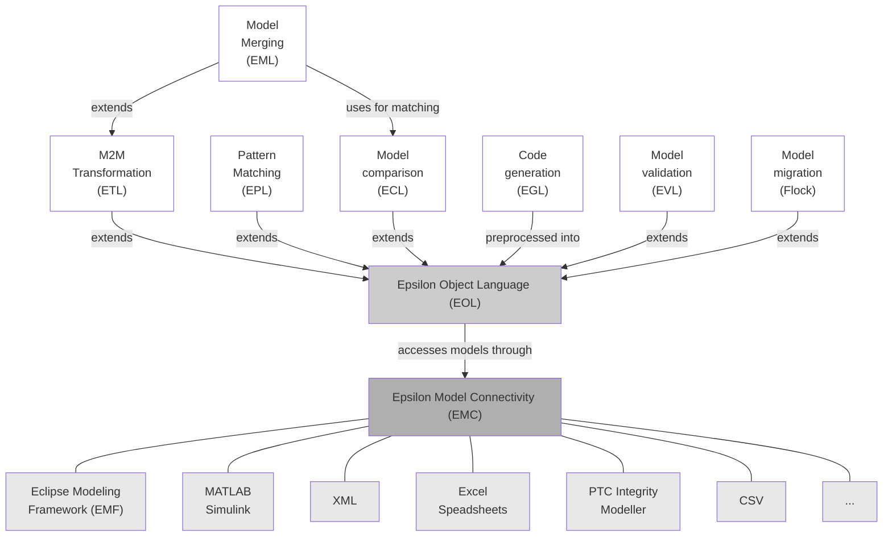

# Documentation

Epsilon is a family of languages and tools implemented in Java, for automating common model-based software engineering tasks.

## Languages

At the core of Epsilon is the [Epsilon Object Language (EOL)](eol), a scripting language that combines the imperative style of languages like Java/JavaScript with the powerful functional model querying capabilities of [OCL](). On top of EOL, Epsilon provides a number of interoperable task-specific languages for tasks such as code generation, model-to-model transformation and model validation. 

Epsilon languages are underpinnd by a [model connectivity layer](emc) that shields them from the specifics of individual modeling technologies and allows them to query and modify models that conform to different technologies in a uniform way (e.g. transform an EMF model into Simulink, cross-validate an XML document and a UML model).

### Task-Specific Languages

Epsilon provides the following task-specific languages, which use EOL as their core expression language. Each task-specific language provides constructs and syntax that are tailored to the specific task it targets:

-   [Epsilon Generation Language (EGL)](egl): A template-based model-to-text language for generating code, documentation and other textual artefacts from models. EGL supports content-destination decoupling, protected regions for mixing generated with hand-written code. EGL also provides a rule-based coordination language ([EGX](egx)), that allows specific EGL templates to be executed for a specific model element type, with the ability to guard rule execution and specify generation target location by type/element.
-   [Epsilon Transformation Language (ETL)](etl): A rule-based model-to-model transformation language that supports transforming many input to many output models, rule inheritance, lazy and greedy rules, and the ability to query and modify both input and output models.
-   [Epsilon Validation Language (EVL)](evl): A model validation language that supports both intra and inter-model consistency checking, constraint dependency management and specifying fixes that users can invoke to repair identified inconsistencies. EVL is integrated with EMF/GMF and as such, EVL constraints can be evaluated from within EMF/GMF editors and generate error markers for failed constraints.
-   [Epsilon Wizard Language (EWL)](ewl): A language tailored to interactive in-place model transformations on model elements selected by the user. EWL is integrated with EMF/GMF and as such, wizards can be executed from within EMF and GMF editors.
-   [Epsilon Comparison Language (ECL)](ecl): A rule-based language for discovering correspondences (matches) between elements of models of diverse metamodels.
-   [Epsilon Merging Language (EML)](eml): A rule-based language for merging models of diverse metamodels, after first identifying their correspondences with [ECL](ecl) (or otherwise).
-   [Epsilon Pattern Language (EPL)](epl): A pattern language for matching model elements based on element relations and characteristics.
-   [Epsilon Model Generation Language (EMG)](emg): A language for semi-automated model generation.
-   [Epsilon Flock](flock): A rule-based transformation language for updating models in response to metamodel changes.
-   [EUnit](eunit): EUnit is a unit testing framework specialized on testing model management tasks, such as model-to-model transformations, model-to-text transformations or model validation. It is based on Epsilon, but it can be used for model technologies external to Epsilon. Tests are written by combining an EOL script and an [ANT](workflow) buildfile.

## Tools

In addition to the languages above, Epsilon also provides several tools
and utilities for working with models.

### Graphical Modelling

- [Picto](picto): Picto is an Eclipse view for visualising models via model-to-text transformation to SVG/HTML. Compared to existing graphical modelling frameworks such as Sirius and GMF, the main appeal of Picto is that model visualisation takes place in an embedded browser and therefore you can leverage any HTML/SVG/JavaScript-based technology such as D3.js, mxGraph and JointJS. Picto also provides built-in support for the powerful Graphviz and PlantUML textual syntaxes (which are transformed to SVG via the respective tools). A distinguishing feature of Picto is does not require running multiple Eclipse instances as the metamodels, models and visualisation transformations can all reside in the same workspace. 
- [EuGENia](eugenia): EuGENia is a front-end for GMF. Its aim is to speed up the process of developing a GMF editor and lower the entrance barrier for new developers. To this end, EuGENia enables developers to generate a fully-functional GMF editor only by specifying a few high-level annotations in the Ecore metamodel.

### Textual Modelling

- [Flexmi](flexmi): Flexmi is a flexible, reflective textual syntax for creating models conforming to Ecore (EMF) metamodels. Flexmi is XML-based and offers features such as fuzzy matching of XML tags and attributes to Ecore class/feature names, support for embedding EOL expressions in models and for defining and instantiating model element templates.
- [Human Usable Textual Notation](hutn): An implementation of the OMG standard for representing models in a human understandable format. HUTN allows models to be written using a text editor in a C-like syntax.

### EMF Utilities

- [Exeed](exeed): Exeed is an enhanced version of the built-in EMF reflective tree-based editor that enables developers to customize the labels and icons of model elements simply by attaching a few simple annotations to the respective EClasses in the Ecore metamodel. Exeed also supports setting the values of references using drag-and-drop instead of using the combo boxes in the properties view.
- [ModeLink](modelink): ModeLink is an editor consisting of 2-3 side-by-side EMF tree-based editors, and is very convenient for establishing (weaving) links between different models using drag-and-drop.

### Workflow

- [Workflow](workflow): Epsilon provides a set of ANT tasks to enable developers assemble complex workflows that involve both MDE and non-MDE tasks.

