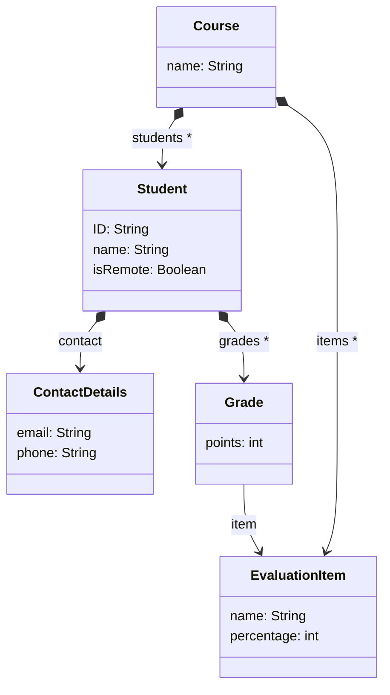

# Dataset Extraction (Pinset)

The Pinset language offers specific syntax constructs to **extract table-like datasets from models**. The main objective of Pinset is to facilitate the analysis of models data via conventional data mining and machine learning techniques, which impose a tabular input format. In addition, tables can be useful as an extra viewpoint when creating model visualisations.

## Model example

We use as running example a course model, which contains the enrolled students along with their grades. All models and Pinset scripts shown in this documentation can be found in an [example project](https://git.eclipse.org/c/epsilon/org.eclipse.epsilon.git/tree/examples/org.eclipse.epsilon.examples.pinset.grades) in the Epsilon repository.

All Pinset scripts query the following metamodel:



As for the data shown as a result of the Pinset scripts, we use the following [Flexmi](../flexmi) model, which conforms to the metamodel above:

```xml
<?nsuri grades?>
<course name="Model-Driven Engineering">
	<item name="Lab 1" perc="15"/>
	<item name="Lab 2" perc="15"/>
	<item name="Partial Test" perc="20"/>
	<item name="Final Exam" perc="50"/>

	<student id="S1" name="Alice">
		<contact email="alice@university.com" phone="+44 101"/>
		<grade item="Lab 1" points="60"/>
		<grade item="Lab 2" points="90"/>
		<grade item="Partial Test" points="80"/>
		<grade item="Final Exam" points="85"/>
	</student>
	<student id="S2" name="Bob" remote="true">
		<contact email="bob@university.com" phone="+44 654"/>
		<grade item="Lab 1" points="60"/>
		<grade item="Final Exam" points="100"/>
	</student>
	<student id="S3" name="Charlie" remote="true">
		<contact email="charlie@university.com" phone="+44 333"/>
		<grade item="Lab 1" points="50"/>
		<grade item="Lab 2" points="35"/>
		<grade item="Partial Test" points="20"/>
	</student>
	<student id="S4" name="Dana">
		<contact email="dana@university.com"/>
		<grade item="Lab 1" points="100"/>
		<grade item="Lab 2" points="90"/>
		<grade item="Partial Test" points="70"/>
		<grade item="Final Exam" points="95"/>
	</student>
</course>
```

## Overview

This first Pinset example defines a dataset from students data, containing some basic information such as name and student ID, contact details, the number of completed evaluation items, and the final grade for the course:

```pinset
dataset studentsSummary over s : Student {
	column id: s.ID
	column name: s.name
	column phone: s.contact.phone

	column items_completed: s.grades.size
	column final_grade : s.getFinalGrade()

	column course_outcome {
		if (final_grade < 50) {
			return "fail";
		}
		else if (final_grade < 70) {
			return "good";
		}
		else if (final_grade < 90) {
			return "notable";
		}
		else {
			return "excellent";
		}
	}
}

@cached
operation Student getFinalGrade() {
	return self.grades
			.collect(g | g.points * g.item.percentage)
			.sum() / 100;
}
```

From that Pinset script, the following dataset is generated:

id|name|phone|items_completed|final_grade|course_outcome
----|----|----|----|----|----
S1|Alice|+44 101|4|81|notable
S2|Bob|+44 654|2|59|good
S3|Charlie|+44 333|3|16|fail
S4|Dana||4|90|excellent

As the above example shows, Pinset offers a rule-based syntax to declare datasets.
These rules are specified as a set of column generators that capture data from instances of a type included in an input model.
That type is defined as a parameter, after the `over` keyword.
In the example, the chosen type is `Student`, which by default means that each Student instance of the input model will be used to populate a row of the output dataset.

Pinset offers different column generators.
This first example uses the `column` one, which is composed of the name of the column header and an EOL expression to calculate the cell value over the row element.

Other common EOL constructs are also available in Pinset scripts.
For instance, an EOL block can be used for those column calculations that might be better organised in an imperative set of statements, such as the `course_outcome` column that shows the final course result in a textual format as used in the Spanish education system.
In addition, external operations can be invoked in the column expressions, such as the `getFinalGrade()` operation used in the example.

As a last comment for the `column` generator, values of previously calculated columns of an element can be used in subsequent definitions. For instance, the `course_outcome` column uses the `finalGrade`

After this overview, next sections describe extra column generators, as well as on other functionalities offered by Pinset for an easier dataset extraction specification.

## Properties accessors

As a way to facilitate the definition of columns that simply hold element properties, Pinset offers some column generators to access these properties:

```pinset
dataset studentsContact over s : Student {
	properties [ID as StudentId, name]
	reference contact[email, phone]
}
```

The previous dataset rule results in:

StudentId|name|contact_email|contact_phone
--|--|--|--
S1|Alice|alice@university.com|+44 101
S2|Bob|bob@university.com|+44 654
S3|Charlie|charlie@university.com|+44 333
S4|Dana|dana@university.com|


Precisely, Pinset offers two property accessors: the `properties` generator can be used to generate columns for attributes of the selected type (e.g. `ID` and `name` in the example), while the `references` one allows getting attributes from single references (i.e. upper bound of 1) of the type, such as `contact`.

When using the `properties` accessor, the name of the attribute is used as column name, while for the `references` accessor a combination of the name of the reference with the name of the attribute is used (e.g. `contact_phone`). This default behaviour can be altered by using the `as` keyword.

These accessors also offer null safety. If any attributes or the traversed reference point to null, Pinset automatically inserts a blank value in the cell.

## Row filtering

By default, all elements of the selected type are processed into rows.
As this might sometimes not be desired, Pinset offers some ways to filter out rows from the resulting dataset:

```pinset
dataset remoteStudents over s : Student {
	guard: s.isRemote

	properties[ID, name]
}

dataset finalExamAssistants over s : Student
	from : Student.all.select(s |
			s.grades.exists(g | g.item.name == "Final Exam")) {

	properties[ID, name]
}
```

These dataset rules show the two ways that can be used to perform filtering in Pinset:

- The `remoteStudents` dataset uses a `guard` to limit the processed students to the remote ones (based in their boolean attribute). Any element not meeting the guard requirements is excluded from the dataset generation step.

- The `finalExamAssistants` dataset uses a `from` expression to only include those students that took the final exam of the course. A `from` expression must return a collection of elements of the selected type to be used for the dataset generation. Therefore, this expression can be used for row filtering, and for other things such as performance improvements (i.e. calculate a collection, and use it for multiple dataset generations).

If necessary, both filtering mechanisms can be used simultaneously. For instance, if we combine the `guard` and `from` expressions shown above, we would obtain a dataset with the remote students that took the final exam of the course.

## Multiple columns: grid

In some cases, we might want to generate a set of columns that are calculated using the same expression, just by changing the parameter(s) of such expression. In the course example, this happens when generating a table including the detailed grades of the students for all the evaluated items of the course, such as the following:

ID|name|Lab_1|Lab_2|Partial_Test|Final_Exam|final_grade
--|--|--|--|--|--|--
S1|Alice|60|90|80|85|81
S2|Bob|60|||100|59
S3|Charlie|50|35|20||16
S4|Dana|100|90|70|95|90

Defining this table with the `column` generator would quickly become very verbose and tedious, as we would need to use one expression for each evaluated item of the course. Also, using that strategy would match the Pinset script to the specific course, as the script would include the name of the grades that are being represented as columns. Any new item added to future editions of the course, or any new course we might want to suport, would require updating the Pinset script / creating a new one.

To prevent this, Pinset offers the `grid` generator, which allows the batch-definition of similar columns. A `grid` has three components:

- `keys`: determine the elements to use as seeds or parameters of each column.
- `header`: used to create the name or header of the column, based on the value of each individual `key`.
- `body`: used to calculate the value of each cell of the column. Generally, both the row element and the grid `key` intervene here.

This generator is used in the following dataset rule, which generates the grades table depicted above:

```pinset
dataset studentGrades over s : Student {
	properties[ID, name]

	grid {
		keys: EvaluationItem.all
		header: key.name
		body: s.grades.selectOne(g | g.item == key)?.points
	}

	column final_grade : s.getFinalGrade()
}
```

In that grid generator, the course evaluation items are used as `keys`, which means that each one of these items would be evaluated over the `header` and `body` expressions to generate a new column. The `header` of the columns uses the item name, and the `body` is calculated by looking for a grade of the student for the evaluation item. The body uses the `?.` [safe null navigation operator](../eol#safe-navigation-and-elvis-operator) in case the student does not have a grade for certain item.

## Typeless dataset rules

The `from` expression presented above to filter rows during the generation can be also used to define datasets where the row elements are not instances coming from an input model. This can be useful to perform data aggregations, or to generate synthetic tables starting from a custom collection of values.

The following dataset rule generates a basic table using a sequence of numbers as row elements and different column generators:

```pinset
dataset numbers over n from : 1.to(5) {
	column number : n
	column squared : n * n

	grid {
		keys: 2.to(5)
		header: "times_" + key
		body: n * key
	}
}
```

number|squared|times_2|times_3|times_4|times_5
--|--|--|--|--|--
1|1|2|3|4|5
2|4|4|6|8|10
3|9|6|9|12|15
4|16|8|12|16|20
5|25|10|15|20|25


## Nested column generators

When certain intermediate value has to be used in several column calculations, Pinset offers a nested, composite column generator. This generator is defined by a `from` expression that calculates a value, followed by a block containing column generators that can use that value:

```pinset
dataset gradesDetails over g : Grade {
	properties[points]
	reference item[name]
	from student : g.eContainer {
		column id : student.ID
		column final_grade : student.getFinalGrade()
		column grade_lowerthan_final : g.points < final_grade
	}
}
```

The rule above generates a dataset with one row per grade in the course. The rule includes a `from` expression, which obtains the student that obtained the grade through the containment reference. Then, it is used to obtain the student id and final grade, and an extra column that determines whether a grade contributed negatively to the final grade of the student, by checking if it has less points than the final grade.

The names of the nested column generators are prefixed with the name given to the object calculated by the `from` expression:

points|item_name|student_id|student_final_grade|student_grade_lowerthan_final
--|--|--|--|--
60|Lab 1|S1|81|true
90|Lab 2|S1|81|false
80|Partial Test|S1|81|true
85|Final Exam|S1|81|false
60|Lab 1|S2|59|false
100|Final Exam|S2|59|false
50|Lab 1|S3|16|false
35|Lab 2|S3|16|false
20|Partial Test|S3|16|false
100|Lab 1|S4|90|false
90|Lab 2|S4|90|false
70|Partial Test|S4|90|true
95|Final Exam|S4|90|false


## Column post-processing

Pinset offers some column post-processing operations that are frequently used to prepare a dataset for an analysis.
These operations are invoked by annotating the column generators.

```pinset
dataset studentGradesPostProcessed over s : Student {
	properties[ID]

	@fillNulls 0
	grid {
		keys: EvaluationItem.all
		header: key.name
		body: s.grades.selectOne(g | g.item == key)?.points
	}

	column final_grade : s.getFinalGrade()
	@normalize 100
	column final_grade_normalized : final_grade
}
```

ID|Lab_1|Lab_2|Partial_Test|Final_Exam|final_grade|final_grade_normalized
--|--|--|--|--|--|--
S1|60|90|80|85|81|0.81
S2|60|0|0|100|59|0.59
S3|50|35|20|0|16|0.16
S4|100|90|70|95|90|0.9

### Fill nulls

It is possible to `@fillNulls` with a custom value, or with a special and sometimes used value, such as the `mean` or the `mode` of the column values. The following dataset rule

By annotating the grid in the detailed grades example, we can fill with zeros those cells where a student did not took an evaluation item.

### Normalisation

We can `@normalize` data columns between the \[0,1\] interval (useful when applying distance-based algorithms with numeric columns in different scales). A value can be provided to the annotation to perform the normalisation. If no value is given, the maximum value encountered in the column is used instead.

The dataset rule above contains a column with the normalised final grade of the course.

## Picto Integration

Check out [this article](../articles/picto-tables) to learn how Pinset can be used to generate [Picto](../picto) table visualisations.
