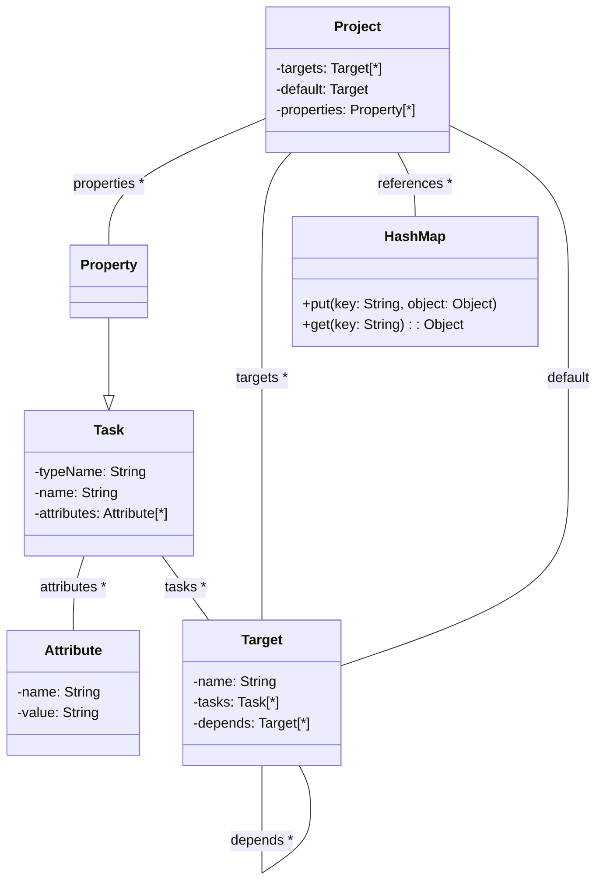
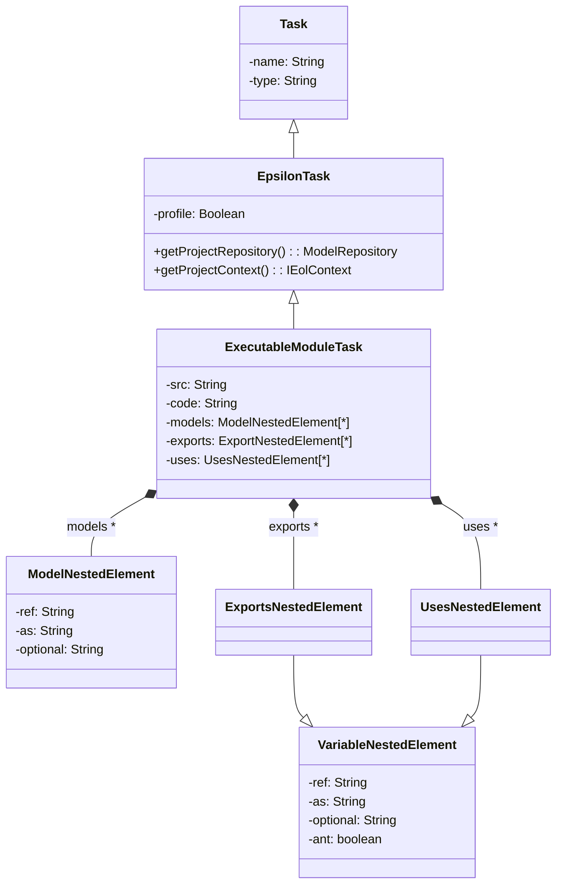
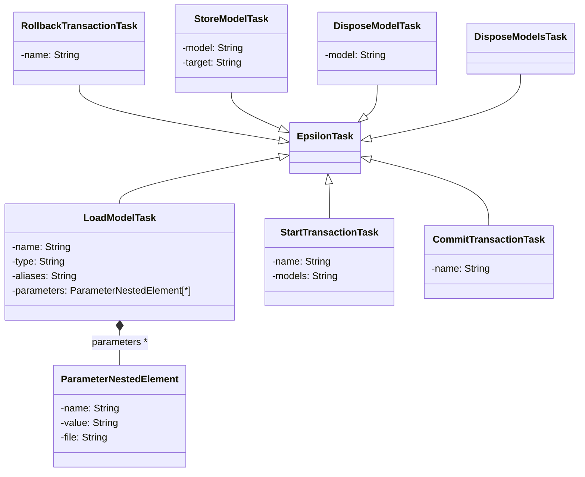
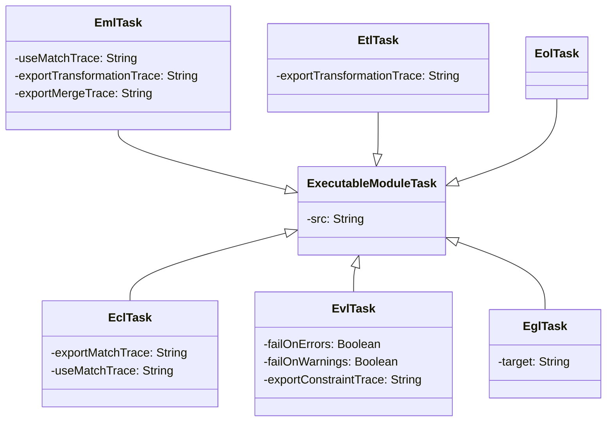

# Orchestration Workflow

In practice, model management activities are seldom carried out in isolation; instead, they are often combined together to form complex workflows. Therefore, in addition to task-specific languages for individual activities (model-to-text transformatino, model validation etc), Epsilon provides a set of Apache ANT tasks for assembling multi-step automated build processes.

!!! tip "Running Epsilon's ANT tasks"
    Epsilon's ANT tasks can run both [within Eclipse](https://www.vogella.com/tutorials/ApacheAnt/article.html) and [headless](../articles/running-epsilon-ant-tasks-from-command-line), and from [Maven](../articles/running-epsilon-ant-tasks-from-command-line/#maven) and [Gradle](../articles/running-epsilon-ant-tasks-from-command-line/#gradle) builds too. When running an ANT workflow that involves Epsilon tasks in Eclipse, please make sure you select the `Run in the same JRE as the workspace` option under the `JRE` tab of your launch configuration.

## Motivation

As a motivating example, a workflow that consists of both model management tasks (1-4, 6) and mainstream software development tasks (5, 7) is displayed below.

1.  Load a UML model
2.  Validate it
3.  Transform it into a Database Schema model
4.  Generate Java code from the UML model
5.  Compile the Java code
6.  Generate SQL statements from the Database model
7.  Run the SQL statements in a Database Management System (DBMS)

In the above workflow, if the validation step (2) fails, the entire process should be aborted and the identified errors should be reported to the user. This example demonstrates that to be of practical use, a task orchestration framework needs to be able to coordinate both model management and mainstream development tasks and provide mechanisms for establishing dependencies between different tasks.

This page discusses such a framework for orchestrating modular model management tasks implemented using languages of the Epsilon platform. As the problem of task coordination is common in software development, many technical solutions have been already proposed and are widely used by software practitioners. In this context, designing a new general-purpose workflow management solution was deemed inappropriate. Therefore, the task orchestration solution discussed here has been designed as an extension to the robust and widely used [ANT](https://ant.apache.org) framework. A brief overview of ANT as well as a discussion on the choice to design the orchestration workflow of Epsilon atop it is provided below.

The ANT Tool
------------

ANT, named so because it is *a little thing that can be used to build big things*, is a robust and widely-used framework for composing automated workflows from small reusable activities. The most important advantages of ANT, compared to traditional build tools such as *gnumake*, is that it is platform independent and easily extensible. Platform independence is achieved by building atop Java, and extensibility is realized through a lightweight binding mechanism that enables developers to contribute custom tasks using well defined interfaces and extension points.

This section provides a brief discussion of the structure and concrete syntax of ANT workflows, as well as the extensibility mechanisms that ANT provides to enable users contribute custom tasks.

### Structure

In ANT, each workflow is captured as a `project`. A simplified illustration of the structure of an ANT project is displayed in the figure below. Each ANT project consists of a number of `targets`. The one specified as the `default` is executed automatically when the project is executed. Each `target` contains a number of `tasks` and `depends` on other targets that must be executed before it. An ANT task is responsible for a distinct activity and can either succeed or fail. Exemplar activities implemented by ANT tasks include file system management, compiler invocation, version management and remote artefact deployment.



### Concrete Syntax

In terms of concrete syntax, ANT provides an XML-based syntax. In the listing below, an exemplar ANT project that compiles a set of Java files is illustrated. The project contains one target (`main`) which is also set to be the `default` target. The `main` target contains one `javac` task that specifies attributes such as `srcdir`, `destdir` and `classpath`, which define that the Java compiler will compile a set of Java files contained into the `src` directory into classes that should be placed in the `build` directory using `dependencies.jar` as an external library.

```xml
<project default="main">
    <target name="main"/>
      <javac srcdir="${src}"
             destdir="${build}"
             classpath="dependencies.jar"
             debug="on"
             source="1.4"/>
    </target>
</project>
```

### Extending ANT

Binding between the XML tags that describe the tasks and the actual implementations of the tasks is achieved through a light-weight mechanism at two levels. First, the tag (in the example above, `javac`) is resolved to a Java class that extends the `org.apache.ant.Task` abstract class (in the case of `javac`, the class is `org.apache.tools.ant.taskdefs.Javac`) via a configuration file. Then, the attributes of the tasks (e.g. `srcdir`) are set using the reflective features that Java provides. Finally, the `execute()` method of the task is invoked to perform the actual job.

ANT also supports more advanced features including nested XML elements and `filesets`, however providing a complete discussion is beyond the scope of this page.

## Integration Challenges 

A simple approach to extending ANT with support for model management tasks would be to implement one standalone task for each language in Epsilon. However, such an approach demonstrates a number of integration and performance shortcomings which are discussed below.

Since models are typically serialized in the file system, before a task is executed, the models it needs to access/modify must be parsed and loaded in memory. In the absence of a more elaborate framework, each model management task would have to take responsibility for loading and storing the models it operates on. Also, in most workflows, more than one task operates on the same models sequentially, and needlessly loading/storing the same models many times in the context of the same workflow is an expensive operation both time and memory-wise, particularly as the size of models increases.

Another weakness of this primitive approach is limited inter-task communication. In the absence of a communication framework that allows model management tasks to exchange information with each other, it is often the case that many tasks end up performing the same (potentially expensive) queries on models. By contrast, an inter-task communication framework would enable time and resource intensive calculations to be performed once and their results to be communicated to all interested subsequent tasks.

Having discussed ANT, Epsilon and the challenges their integration poses, the following sections presents the design of a solution that enables developers to invoke model management tasks in the context of ANT workflows. The solution consists of a core framework that addresses the challenges discussed above, a set of specific tasks, each of which implements a distinct model management activity, and a set of tasks that enable developers to initiate and manage transactions on models using the respective facilities provided by Epsilon's [model connectivity layer](../emc).

## Framework Design and Core Tasks

The role of the core framework, illustrated below, is to provide model loading and storing facilities as well as runtime communication facilities to the individual model management tasks that build atop it. This section provides a detailed discussion of the components it consists of.





### The EpsilonTask task

An ANT task can access the project in which it is contained by invoking the `Task.getProject()` method. To facilitate sharing of arbitrary information between tasks, ANT projects provide two convenience methods, namely `addReference(String key, Object ref)` and `getReference(String key) : Object`. The former is used to add key-value pairs, which are then accessible using the latter from other tasks of the project.

To avoid loading models multiple times and to enable on-the-fly management of models from different Epsilon modules without needing to store and re-load the models after each task, a reference to a project-wide model repository has been added to the current ANT project using the `addReference` method discussed above. In this way, all the subclasses of the abstract `EpsilonTask` can invoke the `getProjectRepository()` method to access the project model repository.

Also, to support a variable sharing mechanism that enables inter-task communication, the same technique has been employed; a shared context, accessible by all Epsilon tasks via the `getProjectContext()` method, has been added. Through this mechanism, model management tasks can export variables to the project context (e.g. traces or lists containing results of expensive queries) which other tasks can then reuse.

`EpsilonTask` also specifies a `profile` attribute that defines if the execution of the task must be profiled using the [profiling features](../articles/profiling/) provided by Epsilon. Profiling is a particularly important aspect of workflow execution, especially where model management languages are involved. The main reason is that model management languages tend to provide convenient features which can however be computationally expensive (such as the `allInstances()` EOL built-in feature that returns all the instances of a specific metaclass in the model) and when used more often than really needed, can significantly degrade the overall performance.

The workflow leverages the model-transaction services provided by the model connectivity framework of Epsilon by providing three tasks for managing transactions in the context of workflows.

### Model Loading Tasks

The `LoadModelTask (epsilon.loadModel)` loads a model from an arbitrary location (e.g. file-system, database) and adds it to the project repository so that subsequent Epsilon tasks can query or modify it. Since Epsilon supports many modelling technologies (e.g. EMF, MDR, XML), the `LoadModelTask` defines only three generic attributes. The `name` attribute specifies the name of the model in the project repository. The `type` attribute specifies the modelling technology with which the model is captured and is used to resolve the technology-specific model loading functionality. Finally, the `aliases` attribute defines a comma-separated list of alternative names by which the model can be accessed in the model repository.

The rest of the information needed to load a model is implementation-specific and is therefore provided through `parameter` nested elements, each one defining a pair of `name`-`value` attributes. As an example, a task for loading an EMF model that has a file-based ECore metamodel is displayed below.

```xml
<epsilon.loadModel name="Tree1" type="EMF">
    <parameter name="modelFile" value="TreeInstance.ecore"/>
    <parameter name="metamodelFile" path="Tree.ecore"/>
    <parameter name="isMetamodelFileBased" value="true"/>
    <parameter name="readOnLoad" value="true"/>
</epsilon.loadModel>
```

`LoadEmfModelTask` is a specialised version of `LoadModelTask` only for EMF models. While the `type` attribute is no longer available, the task still supports the `name` and `aliases` attributes. In addition, some of the values which had to be provided through `parameter` nested elements can now be set using regular attributes, such as `modelFile`, `modelUri`, `metamodelFile` (which implicitly indicates that the metamodel is file-based), `metamodelUri`, `reuseUnmodifiedMetamodelFile` (which can be set to "false" to avoid reusing file-based metamodels that have not been modified since the last time they were loaded), `read` (equivalent to `readOnLoad`) and `store` (equivalent to `storeOnDisposal`). The listing below shows the equivalent fragment required to produce the same result as in the listing above.

```xml
<epsilon.emf.loadModel name="Tree1"
  modelFile="TreeInstance.ecore"
  metamodelFile="Tree.ecore" />
```

### Model Storing Task

The `StoreModelTask (epsilon.storeModel)` is used to store a model residing in the project repository. The `StoreModelTask` defines three attributes:

-   `model` (required): name of the model to be stored.

-   `targetUri` (optional): URI where the model will be stored (e.g. "file:/path/to/destination").

-   `target` (optional): file path where the model will be stored (e.g. "file.xmi").

`targetUri` takes precedence over `target`. If neither is defined, then the model is stored in the location from which it was originally loaded.

### Model Disposal Tasks

When a model is no longer required by tasks of the workflow, it can be disposed using the `epsilon.disposeModel` task. The task provides the `model` attribute that defines the name of the model to be disposed. Also, the attribute-less `epsilon.disposeModels` task is provided that disposes all the models in the project model repository. This task is typically invoked when the model management part of the workflow has finished.

### The StartTransaction Task

The `epsilon.startTransaction` task defines a `name` attribute that identifies the transaction. It also optionally defines a comma-separated list of model names (`models`) that the transaction will manage. If the `models` attribute is not specified, the transaction involves all the models contained in the common project model repository.

### The CommitTransaction and RollbackTransaction Tasks

The `epsilon.commitTransaction` and `epsilon.rollbackTransaction` tasks define a `name` attribute through which the transaction to be committed/rolled-back is located in the project's active transactions. If several active transactions with the same name exist the more recent one is selected.

The example below demonstrates an exemplar usage of the `epsilon.startTransaction` and `epsilon.rollbackTransaction` tasks. In this example, two empty models Tree1 and Tree2 are loaded in lines 1,2. Then, the EOL task of line 4 queries the models and prints the number of instances of the `Tree` metaclass in each one of them (which is 0 for both). Then, in line 13, a transaction named T1 is started on model Tree1. The EOL task of line 15, creates a new instance of Tree in both Tree1 and Tree2 and prints the number of instances of Tree in the two models (which is 1 for both models). Then, in line 26, the T1 transaction is rolled-back and any changes done in its context to model Tree1 (but not Tree2) are undone. Therefore, the EOL task of line 28, which prints the number of instances of Tree in both models, prints 0 for Tree1 but 1 for Tree2.

```xml
<epsilon.loadModel name="Tree1" type="EMF">...</epsilon.loadModel>
<epsilon.loadModel name="Tree2" type="EMF">...</epsilon.loadModel>

<epsilon.eol>
    <![CDATA[
    Tree1!Tree.allInstances.size().println(); // prints 0 
    Tree2!Tree.allInstances.size().println(); // prints 0
    ]]>
    <model ref="Tree1"/>
    <model ref="Tree2"/>
</epsilon.eol>

<epsilon.startTransaction name="T1" models="Tree1"/>

<epsilon.eol> 
    <![CDATA[
    var t1 : new Tree1!Tree; 
    Tree1!Tree.allInstances.size().println(); // prints 1
    var t2 : new Tree2!Tree;
    Tree2!Tree.allInstances.size().println(); // prints 1
    ]]>
    <model ref="Tree1"/>
    <model ref="Tree2"/>
</epsilon.eol>

<epsilon.rollbackTransaction name="T1"/>

<epsilon.eol>
    <![CDATA[
    Tree1!Tree.allInstances.size().println(); // prints 0 
    Tree2!Tree.allInstances.size().println(); // prints 1 
    ]]>
    <model ref="Tree1"/>
    <model ref="Tree2"/>
</epsilon.eol>
```



### The Abstract Executable Module Task

This task is the base of all the model management tasks presented in the following section. Its aim is to encapsulate the commonalities of Epsilon tasks in order to reduce duplication among them. As already discussed, in Epsilon, specifications of model management tasks are organized in executable modules. While modules can be stored anywhere, in the case of the workflow it is assumed that they are either stored as separate files in the file-system or they are provided inline within the worfklow. Thus, this abstract task defines an `src` attribute that specifies the path of the source file in which the Epsilon module is stored, but also supports inline specification of the source of the module. The two alternatives are demonstrated in the listings below.

```xml
<project default="main">
    <target name="main">
        <epsilon.eol src="HelloWorld.eol"/>
    </target>
</project>
```

```xml
<project default="main">
    <target name="main">
        <epsilon.eol>
            <![CDATA[
                "Hello world".println();
            ]]>
        </epsilon.eol>
    </target>
</project>
```

Optionally, users can enable debugging for the module to be run by setting the `debug` attribute to `true`. An example is shown below. If the module reaches a breakpoint, users will be able to run the code step by step and inspect the stack trace and its variables.

```xml
<project default="main">
    <target name="main">
            <epsilon.eol src="HelloWorld.eol" debug="true"/>
        </target>
</project>
```

The task also defines the following nested elements:

#### 0..n model nested elements

Through the `model` nested elements, each task can define which of the models, loaded in the project repository it needs to access. Each `model` element defines three attributes. The `ref` attribute specifies the name of the model that the task needs to access, the `as` attribute defines the name by which the model will be accessible in the context of the task, and the `aliases` defines a comma-delimited sequence of aliases for the model in the context of the task.

#### 0..n parameter nested elements

The `parameter` nested elements enable users to communicate String parameters to tasks. Each `parameter` element defines a `name` and a `value` attribute. Before executing the module, each `parameter` element is transformed into a String variable with the respective name and value which is then made accessible to the module.

#### 0..n exports nested elements

To facilitate low-level integration between different Epsilon tasks, each task can export a number of variables to the project context, so that subsequent tasks can access them later. Each `export` nested element defines the three attributes. The `ref` attribute specifies the name of the variable to be exported, the `as` string attribute defines the name by which the variable is stored in the project context and the `optional` boolean attribute specifies whether the variable is mandatory. If `optional` is set to `false` and the module does not specify such a variable, an ANT `BuildException` is raised. If the `ant` attribute is set to true, the variable is exported as an ANT variable, as shown below.

```xml
<project default="main">
  <target name="main">
    <epsilon.eol>
      var x = 1;
      <exports ref="x" ant="true"/>
    </epsilon.eol>
    <echo>${x}</echo> <!-- Prints  1 -->
  </target> 
</project>
```

#### 0..n uses nested elements

The `uses` nested elements enable tasks to import variables exported by previous Epsilon tasks. Each use element supports three attributes. The `ref` attribute specifies the name of the variable to be used. If there is no variable with this name in the project context, the ANT project properties are queried. This enables Epsilon modules to access ANT parameters (e.g. provided using command-line arguments). The `as` attribute specifies the name by which the variable is accessible in the context of the task. Finally, the `optional` boolean parameter specifies if the variable must exist in the project context.

To better illustrate the runtime communication mechanism, a minimal example is provided below. In  the first listing, `Exporter.eol` defines a String variable named `x` and assigns a value to it. The workflow below specifies that after executing `Exporter.eol`, it must export a variable named `x` with the new name `y` to the project context. Finally, it defines that before executing `User.eol`, it must query the project context for a variable named `y` and in case this is available, add the variable to the module's context and then execute it. Thus, the result of executing the workflow is `Some String` printed in the output console.

```eol
// Exporter.eol
var x : String = "Some string";
```

```eol
// User.eol
z.println();
```

```xml
<epsilon.eol src="Exporter.eol">
    <exports ref="x" as="y"/>
</epsilon.eol>

<epsilon.eol src="User.eol">
    <uses ref="y" as="z"/>
</epsilon.eol>
```

## Model Management Tasks

Having discussed the core framework, this section presents the model management tasks that have been implemented atop it, using languages of the Epsilon platform.

### Generic Model Management Task

The `epsilon.eol` task executes an EOL module, defined using the `src` attribute on the models that are specified using the `model` nested elements.

### Model Validation Task

The `epsilon.evl` task executes an EVL module, defined using the `src` attribute on the models that are specified using the `model` nested elements. In addition to the attributes defined by the ExecutableModuleTask, this task also provides the following attributes:

-   `failOnErrors` : Errors are the results of unsatisfied constraints. Setting the value of this attribute to `true` (default is `false`) causes a `BuildException` to be raised if one or more errors are identified during the validation process.

-   `failOnWarnings` : Similarly to errors, warnings are the results of unsatisfied critiques. Setting the value of this attribute to `true` (default is also `false`) causes a `BuildException` to be raised if one or more warnings are identified during the validation process.

-   `exportConstraintTrace` : This attribute enables developers to export the internal constraint trace constructed during model validation to the project context so that it can be later accessed by other tasks - which could for example attempt to automatically repair the identified inconsistencies.

-   `exportAsModel` : Setting the value of this attribute causes the task to export the results of the validation as a new in-memory [Java model](https://download.eclipse.org/epsilon/interim-javadoc/org/eclipse/epsilon/eol/models/java/JavaModel.html) with the specified name in the project repository. The exported model is essentially a wrapper for all the [unsatisfied constraints](https://download.eclipse.org/epsilon/interim-javadoc/org/eclipse/epsilon/evl/execute/UnsatisfiedConstraint.html) identified by EVL.

### Model-to-Model Transformation Task

The `epsilon.etl` task executes an ETL module, defined using the `src` attribute to transform between the models that are specified using the `model` nested elements. In addition to the attributes defined by the ExecutableModuleTask, this task also provides the `exportTransformationTrace` attribute that enables the developer to export the internal transformation trace to the project context. In this way this trace can be reused by subsequent tasks; for example another task can serialize it in the form of a separate traceability model.

### Model Comparison Task

The `epsilon.ecl` task executes an ECL module, defined using the `src` attribute to establish matches between elements of the models that are specified using the `model` nested elements. In addition to the attributes defined by `ExecutableModuleTask`, this task also provides the `exportMatchTrace` attribute that enables users to export the [match-trace](https://download.eclipse.org/epsilon/interim-javadoc/org/eclipse/epsilon/ecl/trace/MatchTrace.html) calculated during the comparison as a named variable to the project context so that subsequent tasks can reuse it. For example, as discussed in the sequel, an EML model merging task can use it as a means of identifying correspondences on which to perform merging. In another example, the match-trace can be stored by a subsequent EOL task in the form of an stand-alone weaving model.

### Model Merging Task

The `epsilon.eml` task executes an EML module, defined using the `src` attribute on the models that are specified using the `model` nested elements. In addition to the attributes defined by the ExecutableModuleTask, this task also provides the following attributes:

-   `useMatchTrace` : To merge a set of models, an EML module needs an established match-trace between elements of the models. The `useMatchTrace` attribute enables the EML task to use a match-trace exported by a preceding ECL task (using its `exportMatchTrace` attribute).

-   `exportMergeTrace, exportTransformationTrace` : Similarly to ETL, through these attributes an EML task can export the internal traces calculated during merging for subsequent tasks to use.

### Model-to-Text Transformation Task

To support model to text transformations, `EglTask (epsilon.egl)` task is provided that executes an Epsilon Generation Language (EGL) module. In addition to the attributes defined by `ExecutableModuleTask`, `EglTask` also defines the following attributes:

-   `target` : Defines a file in which all of the generated text will be stored.

-   `templateFactoryType` : Defines the Java class that will be instantiated to provide a `TemplateFactory` for the EGL program. The specified class must be on the classpath and must subtype `EglTemplateFactory`.

`EglTask` may nest any number of `formatter` elements. The `formatter` nested element has the following attributes:

-   `implementation` (required) : Defines the Java class that will be instantiated to provide a `Formatter` for the EGL program. The specified class must be on the classpath and must subtype `Formatter`.

### Model Migration Task

To support model migration, `FlockTask (epsilon.flock)` is provided for executing an Epsilon [Flock](../flock) module. In addition to the attributes defined by `ExecutableModuleTask`, `FlockTask` also defines the following mandatory attributes:

-   `originalModel` : Specifies which of the currently loaded models should be used as the source of the model migration.

-   `migratedModel` : Specifies which of the currently loaded models should be used as the target of the model migration.

### Pattern Matching Task

The `epsilon.epl` task executes an EPL module, defined using the `src` attribute to perform pattern matching on the models that are specified using the `model` nested elements. In addition to the attributes defined by the ExecutableModuleTask, this task also provides the following attributes.

-   `repeatWhileMatches`: A boolean specifying whether the pattern matching process should continue to execute for as long as matches are found.

-   `maxLoops`: An integer specifying the maximum number of pattern matching iterations.

-   `exportAs`: The name under which the computed pattern match model should be made available to other Epsilon tasks of the workflow.

### Java Class Static Method Execution Task

The `epsilon.java.executeStaticMethod` task executes a parameter-less static method, defined using the `method` attribute, of a Java class, defined using the `javaClass` attribute. This task can be useful for setting up the infrastructure of Xtext-based languages.

### For Task

The `epsilon.for` task iterates over the files in a [fileset](https://ant.apache.org/manual/Types/fileset.html) and executes its nested tasks. An example that uses `epsilon.for` to run an EOL program on XML files contained in a folder called `loop` is show below. 

```xml
{{{ example("org.eclipse.epsilon.examples.workflow.for/build.xml", false) }}}
```

The complete source code for this example is in [Epsilon's Git repo](https://git.eclipse.org/c/epsilon/org.eclipse.epsilon.git/tree/examples/org.eclipse.epsilon.examples.workflow.for).

## Additional Resources

Additional resources about the Epsilon ANT tasks are available [here](../articles/#workflow-ant-tasks).
