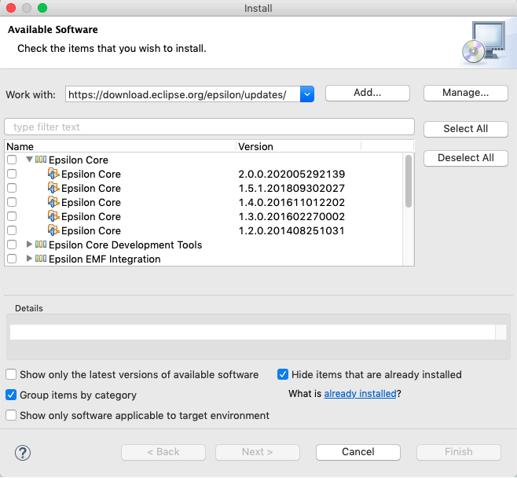

# Epsilon 1.x

<style>
	img {
		box-shadow: 0 4px 8px 0 rgba(0, 0, 0, 0.2), 0 6px 20px 0 rgba(0, 0, 0, 0.19);
	}
</style>
## Distributions

Ready-to-use Eclipse distributions containing a stable 1.x version of Epsilon and all its mandatory and optional  dependencies. You will only need a [Java Runtime Environment](https://adoptopenjdk.net/). 

| Version | Location                                                     |
| ------- | ------------------------------------------------------------ |
| 1.5     | <https://archive.eclipse.org/epsilon/1.5/distributions/> (Once you have downloaded the 1.5 distribution, please update Epsilon from the update site below to version 1.5.1, which contains a fix for a regression that affects the properties view of Exeed.) |
| 1.4     | <https://archive.eclipse.org/epsilon/1.4/distributions/>       |
| 1.3     | <https://archive.eclipse.org/epsilon/1.3/distributions/>       |
| 1.2     | <https://archive.eclipse.org/epsilon/1.2/distributions/>       |
| 1.1_SR1 | <https://archive.eclipse.org/epsilon/1.1_SR1/distributions/>   |
| 1.1     | <https://archive.eclipse.org/epsilon/1.1/distributions/>       |
| 1.0     | <https://archive.eclipse.org/epsilon/1.0/distributions/>       |

## Prerequisites

The development tools of Epsilon come as a set of Eclipse plugins and therefore, unless you download one of the ready-made distributions above, to install Epsilon you need to download and install a  [Java Runtime Environment](https://adoptopenjdk.net/) and Eclipse first. The [Eclipse Modeling Tools](https://www.eclipse.org/downloads/packages/) distribution contains most of the necessary prerequisites for Epsilon 1.x. See [this page](../all-versions) to find out which modeling tools distribution matches the version of Epsilon you wish to install.

## Update Site

You can use the following update sites through the `Help` --> `Install new software` menu in Eclipse to install (parts of) Epsilon. Please untick the `Show only the latest versions of available software` check box, as shown below, to reveal older versions of Epsilon.

| Site | Location |
| - | - |
| Stable | `http://download.eclipse.org/epsilon/updates/`|



### Dependencies

| Dependency  | Update Site                                                  | Notes                                                        |
| ----------- | ------------------------------------------------------------ | ------------------------------------------------------------ |
| Emfatic     | `http://download.eclipse.org/emfatic/update/`                 | None.                                                        |
| GMF Tooling | `http://download.eclipse.org/modeling/gmp/gmf-tooling/updates/releases/` | Install Graphical Modelling Framework (GMF) Tooling SDK. Required for Eugenia. |
| QVTo        | `http://download.eclipse.org/mmt/qvto/updates/releases/latest/` | Versions of QVTo >= 3.9.1 should all work with with GMF Tooling  |

### Archived Update Sites

Below are also links to compressed versions of the Epsilon update sites for long-term archival and to support users who are behind corporate firewalls.

| Site | Zip Archive |
| - | - |
| 1.5 | <https://www.eclipse.org/downloads/download.php?file=/epsilon/updates/1.5/epsilon-1.5-site.zip> |
| 1.4 | <https://www.eclipse.org/downloads/download.php?file=/epsilon/updates/1.4/epsilon-1.4-site.zip> |
| 1.3 | <https://www.eclipse.org/downloads/download.php?file=/epsilon/updates/1.3/epsilon-1.3-site.zip> |
| 1.2 | <https://www.eclipse.org/downloads/download.php?file=/epsilon/updates/1.2/epsilon-1.2-site.zip> |

## Source Code

The source code of 1.x versions of Epsilon can be obtained by checking out the respective tag listed under <https://github.com/eclipse-epsilon/epsilon/tags> (e.g. `https://github.com/eclipse-epsilon/epsilon/releases/tag/1.4` for 1.4)

## Maven

Older versions of Epsilon JARs are available from [Maven Central](https://mvnrepository.com/artifact/org.eclipse.epsilon). Note that prior to 2.0, the structure was different (less modular). For instance, to use the `epsilon-core` JAR from your `pom.xml`:

```xml
<dependencies>
  ...
  <dependency>
    <groupId>org.eclipse.epsilon</groupId>
    <artifactId>epsilon-core</artifactId>
    <version>1.5.1</version>
  </dependency>
  ...
</dependencies>
```
