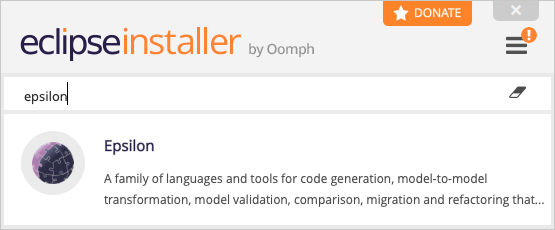

# Download

The simplest way to get a copy of Eclipse with Epsilon 2.1 and all its dependencies installed, is to download the [Eclipse Installer](https://wiki.eclipse.org/Eclipse_Installer) and select Epsilon. Note that you will need a [Java Runtime Environment](https://adoptopenjdk.net/) installed on your system.



| OS | Eclipse Installer |
| - | - |
| Windows | <http://www.eclipse.org/downloads/download.php?file=/oomph/products/eclipse-inst-win64.exe> |
| Mac | <http://www.eclipse.org/downloads/download.php?file=/oomph/products/eclipse-inst-mac64.dmg> |
| Linux | <http://www.eclipse.org/downloads/download.php?file=/oomph/products/eclipse-inst-linux64.tar.gz> |

!!! tip
	 If you don't see Epsilon in the list, click on the three vertical bars on the top right, then Product Catalogs and check "Eclipse.org Applications". Epsilon should be near the bottom of the list (you can also use the search bar). If the Product Catalogs option is missing, switch to Advanced Mode and look for Epsilon under "Eclipse.org Applications" (if this category is missing, click on the small yellow folder icon in the top right corner and select it). Keep pressing Next (you don't need to change anything) and then Finish. Accept the licenses when prompted.

!!! warning
	Please do not select the Epsilon project on the second page of the installer in Advanced Mode. This is for Epsilon developers only and may cause issues during installation of the Epsilon product.

## Update Sites

Alternatively, you can use the following update sites through the `Help->Install new software` menu in Eclipse to install (parts of) Epsilon.

| Site | Location |
| - | - |
| Stable | `http://download.eclipse.org/epsilon/updates/`|
| Interim | `http://download.eclipse.org/epsilon/interim/`|

!!! info
    The interim update site is rebuilt automatically with every push to the main branch of the Epsilon repo. Bugs fixed in the interim version (compared to the latest stable version) are listed [here](https://bugs.eclipse.org/bugs/buglist.cgi?bug_status=RESOLVED&list_id=17694438&product=epsilon&query_format=advanced)

### Archived Update Sites

Below are also links to compressed versions of the Epsilon update sites for long-term archival and to support users who are behind corporate firewalls.

| Site | Zip Archive |
| - | - |
| Stable | <https://www.eclipse.org/downloads/download.php?file=/epsilon/updates/2.1/epsilon-2.1-site.zip> |
| Interim | <https://www.eclipse.org/downloads/download.php?file=/epsilon/interim/epsilon-interim-site.zip> |

## Eclipse Marketplace

If you prefer to install Epsilon through the Eclipse Marketplace, you can drag and drop <a style="position:relative;top:8px" href="https://marketplace.eclipse.org/marketplace-client-intro?mpc_install=400" title="install"></a> into a running instance of Eclipse.

## Source Code <a href="https://ci.eclipse.org/epsilon/job/interim-kubernetes/job/master/lastBuild/"></a>

The source code of Epsilon is in the following Git repository. 

| Type | Location |
| - | - |
| Users | `git://git.eclipse.org/gitroot/epsilon/org.eclipse.epsilon.git`|
| Committers | `ssh://user_id@git.eclipse.org:29418/epsilon/org.eclipse.epsilon.git`|
| Release tag | `https://git.eclipse.org/c/epsilon/org.eclipse.epsilon.git/tag/?id=2.1`|

Additional projects which are experimental or have dependencies which are incompatible with the Eclipse Public License are available in [Epsilon Labs](https://github.com/epsilonlabs). 

## Maven

Epsilon JARs are available from [Maven Central](https://mvnrepository.com/artifact/org.eclipse.epsilon). For
instance, to use the `epsilon-core` JAR from your `pom.xml`:

```xml
<dependencies>
  ...
	<dependency>
	    <groupId>org.eclipse.epsilon</groupId>
	    <artifactId>org.eclipse.epsilon.eol.engine</artifactId>
	    <version>2.1.0</version>
	</dependency>
  ...
</dependencies>

```

## Older versions

Previous stable versions of Epsilon are available [here](all-versions).