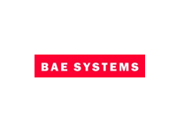

# Industry

 Below is a list of known industrial users of Epsilon (based on bug reports, forum messages, blog posts, tweets and published articles). If you'd like to report additional uses of Epsilon in industry or you've spotted any outdated content, please [let us know](../../forum).

## Sources

BAE Systems 
	[[1](http://link.springer.com/chapter/10.1007%2F978-3-642-13595-8_7)],
Bosch 
	[[1](https://youtu.be/T7-ExsSzSWw?t=1481)],
NASA 
	[[1](https://github.com/nasa/CertWare/blob/f63ff91edaaf2b0718b51a34cda0136f3cdbb085/net.certware.state.gui/model/StateAnalysis.emf),
	[2](https://bugs.eclipse.org/bugs/show_bug.cgi?id=258871),
	[3](https://bugs.eclipse.org/bugs/show_bug.cgi?id=259923),
	[4](https://bugs.eclipse.org/bugs/show_bug.cgi?id=256473)], 
THALES 
	[[1](https://bugs.eclipse.org/bugs/show_bug.cgi?id=415037),
	[2](https://bugs.eclipse.org/bugs/show_bug.cgi?id=414675),
	[3](https://bugs.eclipse.org/bugs/show_bug.cgi?id=414766)],
Siemens 
	[[1](https://bugs.eclipse.org/bugs/show_bug.cgi?id=333740),
	[2](http://yusun.io/papers/iceme-2011.pdf)],
Rolls-Royce 
	[[1](https://bugs.eclipse.org/bugs/show_bug.cgi?id=385900),
	[2](https://bugs.eclipse.org/bugs/show_bug.cgi?id=386240),
	[3](https://bugs.eclipse.org/bugs/show_bug.cgi?id=381984),
	[4](https://bugs.eclipse.org/bugs/show_bug.cgi?id=383547),
	[5](https://bugs.eclipse.org/bugs/show_bug.cgi?id=390339)],
IBM 
	[[1](https://bugs.eclipse.org/bugs/show_bug.cgi?id=264709),
	[2](https://bugs.eclipse.org/bugs/show_bug.cgi?id=268085),
	[3](https://bugs.eclipse.org/bugs/show_bug.cgi?id=265609),
	[4](https://bugs.eclipse.org/bugs/show_bug.cgi?id=265285),
	[5](https://bugs.eclipse.org/bugs/show_bug.cgi?id=265145)],
Oracle
	[[1](https://bugs.eclipse.org/bugs/show_bug.cgi?id=567747)],
Blackbelt 
	[[1](https://github.com/BlackBeltTechnology/emf-genmodel-generator),
	[2](https://github.com/BlackBeltTechnology/epsilon-runtime)],
Raytheon 
	[[1](http://codegeneration.net/cg2014/sessions/index.php?session=13),
	[2](https://twitter.com/guwac/status/321983342683758592)],
Atos
	[[1](https://bugs.eclipse.org/bugs/show_bug.cgi?id=331497)],
Ergon
	[[1](https://bugs.eclipse.org/bugs/show_bug.cgi?id=407183)],
Talend
	[[1](https://bugs.eclipse.org/bugs/show_bug.cgi?id=325010)],
Corpus
	[[1](https://bugs.eclipse.org/bugs/show_bug.cgi?id=287756)],
develop group
	[[1](http://www.develop-group.de/downloads/fv_projekt/devgroup_ecmfa2012.pdf)],
DevBoost
	[[1](https://github.com/DevBoost/Reuseware/blob/master/Experimental/org.reuseware.comogen.ui.eclipse.dslbuilder/META-INF/MANIFEST.MF)],
Academa 
	[[1](https://bugs.eclipse.org/bugs/show_bug.cgi?id=270570),
	[2](https://bugs.eclipse.org/bugs/show_bug.cgi?id=271329),
	[3](https://bugs.eclipse.org/bugs/show_bug.cgi?id=270572),
	[4](https://bugs.eclipse.org/bugs/show_bug.cgi?id=211210)],
Intelliment
	[[1](https://twitter.com/jozemi/status/128550322560958464)],
Maiborn Wolff
	[[1](https://bugs.eclipse.org/bugs/show_bug.cgi?id=441410#c12),
	[2](https://bugs.eclipse.org/bugs/show_bug.cgi?id=441979)]
