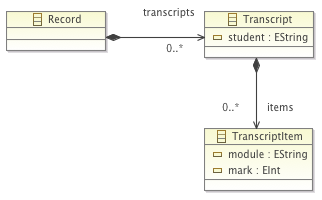

# MDE Exercises

This article provides a number of exercises you can use to test your knowledge on MDE, EMF and Epsilon.

## Exercise 1: Metamodelling with Ecore

Write Ecore metamodels (using Emfatic or the graphical Ecore editor) for the following scenarios, and create instances of these metamodels using the [reflective EMF tree editor](../reflective-emf-tutorial):

1.  All school rooms have a buzzer triggered by a central clock to signal the end of the school day.
2.  Political parties, such as the Labour Party, the Conservative party, and the Liberal Democrat party, have both voters and supporters.
3.  An undirected graph consists of a set of vertices and a set of edges. Edges connect pairs of vertices.
4.  A football league has a set of teams, where each team has a manager and a set of players. A player is a forward, defender, or goalkeeper. The manager cannot be a player.
5.  A student is awarded a prize. Each prize is donated by at least one sponsor, e.g., IBM. A prize may be jointly awarded. Each student
    must write a letter thanking the sponsors of their prize

## Exercise 2: Constructing models programmatically using EOL

In the previous exercise, you created sample models conforming to your metamodels using the reflective EMF tree editor. In this exercise, you should create the same models, but this time programmatically using [EOL](../../eol).

## Exercise 3: Introducing EOL operations

The Office Management System (OMS) is used to manage the rooms available to a company. It keeps track of who is assigned to occupy a room, along with their position in the company. It facilitates providing newly hired employees with offices, and assists employees who are to move from one office to another. Employees have positions, an office (offices are never shared), and know when they started work at the company and when they ended their employment. The OMS keeps track of all employees and rooms. Rooms are either occupied or unoccupied.\ With the OMS, it is possible to:

1.  hire a new employee and assign them to a room
2.  fire an employee and remove them from their office
3.  move an employee from one room to another, unoccupied room
4.  calculate the set of rooms that are unoccupied (useful for planning)

With this scenario in mind you need to do the following:

-   Write an Ecore metamodel for the system above
-   Write the body of the following EOL operations that implement 1-4
    above
    1.  operation Employee hire() { \... }
    2.  operation Employee fire() { \... }
    3.  operation Employee move(to:Room) { \... }
    4.  operation Company getFreeRooms() : Sequence(Room) { \... }

## Exercise 4: Model validation with EVL

-   Construct the Ecore metamodel above and create a sample model that conforms to it using the reflective EMF tree editor.
-   Write the following EVL constraints and evaluate them on your sample model
    1.  In the context of class Student, write a constraint stating that a student takes up to 6 modules
    2.  In the context of class Grade, write a constraint stating that the mark must always be non-negative.
    3.  In the context of Module, write a constraint stating that every student must have a unique name.
    4.  In the context of Student, write a constraint that states that the grades for the modules taken by a student must be identical to the grades that the student knows about directly

## Exercise 5: Model transformation with ETL
 Write an ETL transformation that transforms models conforming to the metamodel of Exercise 4 to models conforming to the metamodel below.

## Exercise 6: Text generation with EGL

Write an EGL transformation that reads a model conforming to the metamodel of exercise 4 and produces a text file containing the names of all students and the total marks each student has obtained so far.

## Exercise 7: Multiple file generation with EGL

Write an EGL transformation that reads a model conforming to the metamodel of exercise 5 and generates one file per transcript. Each output file should be named after the student with a .txt suffix (e.g. John Doe.txt) and it should contain a list of all the modules and marks of the student.

## Exercise 8: Using ANT to implement an ETL-EGL workflow

Use the ANT tasks provided by Epsilon to create an ANT workflow that invokes the ETL transformation of Exercise 5 and then passes the produced model to the EGL transformation of Exercise 7, which in turn generates a set of transcript files.

## Exercise 9: Constructing graphical editors

Create GMF editors for the metamodels you have written in the exercises above using EuGENia.