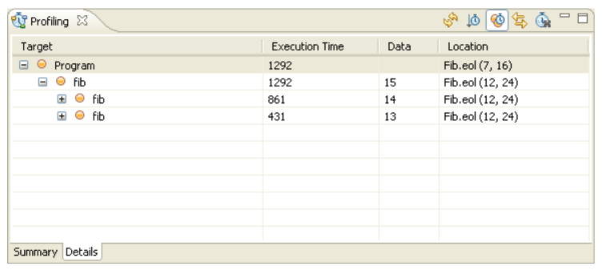

# Profiling Epsilon Programs 

The purpose of this article is to provide an overview and a usage example of the Epsilon profiling tools. Profiling is particularly useful in order to obtain metrics for theperformance of Epsilon code, and to identify blocks of code that are either executed more often than anticipated or take too much time to execute.

## Adding profiling statements to your Epsilon code

Code-level support for profiling in Epsilon has been implemented in the form of a tool called `ProfilerTool` (`org.eclipse.epsilon.eol.tools.ProfilerTool`). To add support for profiling in your Epsilon program you must instantiate the tool and call its `start()` and `stop()` methods. The following EOL example contains an operation `fib()` that calculates the Fibonacci number of a given integer, and a call to the `fib()` operation with an initial value of 15.

```eol
15.fib();
operation Integer fib() : Integer {
  var fib : Integer;
  if (self = 1 or self = 0){ 
    fib = 1;
  } else {
    fib = (self-1).fib()+(self-2).fib();
  }
  return fib;
}
```

Our aim in this example is to enrich the program with profiling statements so that we canget to know how many times the `fib()` operation is executed and how much time each calltakes to execute. To achieve this we modify our program as follows:

```eol
var profiler : new Native('org.eclipse.epsilon.eol.tools.ProfilerTool');
profiler.start('Program');
15.fib();
profiler.stop();

operation Integer fib() : Integer {
  profiler.start('fib',self);
  var fib : Integer;
  if (self = 1 or self = 0){ 
    fib = 1;
  } else {
    fib = (self-1).fib()+(self-2).fib();
  }
  profiler.stop();
  return fib;
}
```

We add an instantiation statement that creates a new instance of the `ProfilerTool` in Line 1. Then we define two profiling targets. The first one is called "Program" and measures the performance of line 3 and the second one is called "fib" and measures the performance of the body of the `fib()` operation. Note that the first call to the `start()` method has only one argument (the mandatory `targetName : String` argument) while the second one has an additional argument. This extra (optional) argument (`data : Any`) enables users to capture context-specific information where multiple calls to the specific `start()` method are anticipated. In our example, we store the value of the integer on which the operation is executed (`self`). Here we should note that since profiling has been implemented in the context of EOL, the same technique can be used to profile code in all task-specific languages of Epsilon (ETL, ECL, EML etc).

## Inspecting Profiling Information

Once we've executed the program, we can inspect the profiling information gathered, by activating the "Profiling" Eclipse view. Upon activation the view will look like this:


To populate the view with the information gathered during profiling, we click the "Refresh view" button in the toolbar of the view. This makes the view look like this:


From this summary view we see that the Program target has been executed 1 time and has taken 1292 ms to execute. Similarly, the fib target has been executed 1973 times with a total time of 1292 ms and an average of 0.6548. By clicking on the respective column headers of the summary table we can sort the targets by name, \# times executed, total execution time etc.

To obtain a more detailed view on the profiling data, we can switch to the "Details" tab located at the bottom of the view.



Unlike the table-oriented "Summary" view, the "Details" view contains a tree-table combination that visualizes each target instance and displays its execution time, the context specific data, as well as the location of the profiling statement in the source code. By default, the children of each target are ordered by execution order. However, by checking the "Sort children by execution time" button on the view toolbar we can sort the children by execution time as well. Also, double-clicking a particular target should bring up the respective editor and highlight the line in which the call to the `start()` method of the ProfilerTool exists.

## Execution Time Measuring Modes

The Epsilon profiling tools support two different modes for measuring the time each target has consumed to execute. In the individual mode, each target is assigned only the time it has taken to execute itself. In the aggregated mode, the execution time of a target is that of the target itself plus the execution times of its children (recursively). To change between the two modes, we can check/uncheck the "Show aggregated execution times" button on the toolbar.

## Enabling Profiling in Epsilon Run Configurations

You can turn profiling on through the "Profiling" tab of the run configuration of your Epsilon program.

## Enabling Profiling in Epsilon ANT tasks

In addition to profiling specific code blocks, we can use the Epsilon profiling tools to profile entire model management operations invoked as ANT tasks by setting the optional profile attribute to true. In the following example, we have created an ANT build-file that invokes the Fib.eol EOL program we demonstrated above.

```xml
<project default="main">
  <target name="main">
    <epsilon.eol src="Fib.eol" profile="true"/>
  </target>
</project>
```

Executing the ANT build-file and refreshing the following Profiling view makes it look like this:


We can see that a new target named after the filename of the executed EOL program has been created along with the targets created using the in-line calls to the `start()` method of the `ProfilerTool`.

## Notes on Using the Profiling Tools

The underlying profiler is loosely coupled with Epsilon. This means that it records profiling information when asked to, and which is never cleared automatically. To clear the profile, you must click the "Reset profiler" button in the Profiling view. To enable real-time preview of the profiling data as they are being recorded, we have added an "Auto Refresh" button to the view. However, this should be used with caution as real-time rendering of the results may lead to (significantly) increased execution times due to the time consumed to actually query the profiler and display the data in the widgets. With regard to the impact of the profiling code on the produced metrics we have tried to minimize it by using an elaborated stopwatch mechanism. Initial tests have shown that each `start()` -- `stop()` pair introduces a 0-10ms overhead of the measured time; however this is only indicative and may vary according to the execution platform.
