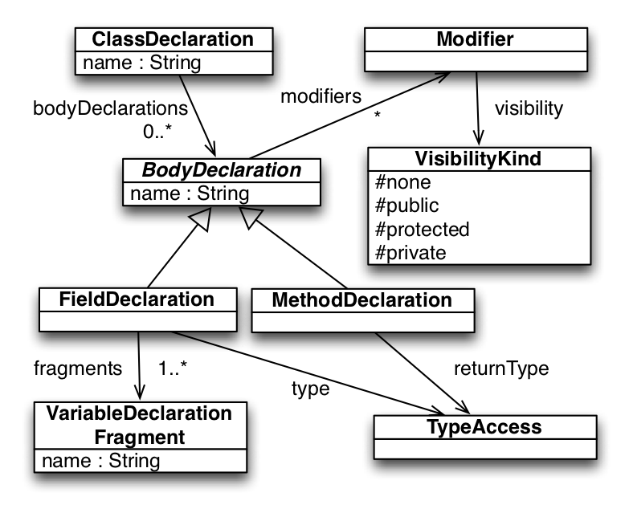

# The Epsilon Pattern Language (EPL)

The aim of EPL is to contribute *pattern matching* capabilities to Epsilon. This chapter discusses the abstract and concrete syntax of EPL as well as its execution semantics. To aid understanding, the discussion of the syntax and the semantics of the language revolves around an exemplar pattern which is developed incrementally throughout the chapter. The exemplar pattern is matched against models extracted from Java source code using tooling provided by the MoDisco project. MoDisco is an Eclipse project that provides a fine-grained Ecore-based metamodel of the Java language as well as tooling for extracting models that conform to this Java metamodel from Java source code. A simplified view of the relevant part of the MoDisco Java metamodel used in this running example is presented below.

The aim of the pattern developed here (which we will call *PublicField*) is to identify quartets of `<ClassDeclaration, FieldDeclaration, MethodDeclaration, MethodDeclaration>`, each representing a field of a Java class for which appropriately named accessor/getter (getX/isX) and mutator/setter (setX) methods are defined by the class.



## Syntax

The syntax of EPL is an extension of the syntax of the [EOL language](../eol), which is the core language of Epsilon. As such, any references to *expression* and *statement block* in this chapter, refer to EOL expressions and blocks of EOL statements respectively. It is also worth noting that EOL expressions and statements can produce side-effects on models, and therefore, it is the responsibility of the developer to decide which expressions used in the context of EPL patterns should be side-effect free and which not.

As illustrated in the figure below, EPL patterns are organised in *modules*. Each module contains a number of named *patterns* and optionally, *pre* and *post* statement blocks that are executed before and after the pattern matching process, and helper EOL operations. EPL modules can import other EPL and EOL modules to facilitate reuse and modularity.


In its simplest form a *pattern* consists of a number of named and typed *roles* and a *match* condition. For example, in lines 2-3, the *PublicField* pattern below, defines four roles (*class*, *field*, *setter* and *getter*). The *match* condition of the pattern specifies that for a quartet to be a valid match, the field, setter and getter must all belong to the class (lines 5-7, and that the setter and getter methods must be appropriately named[^1].

```epl
pattern PublicField
    class : ClassDeclaration, field : FieldDeclaration, 
    setter : MethodDeclaration, getter : MethodDeclaration {
    
    match : class.bodyDeclarations.includes(field) 
        class.bodyDeclarations.includes(setter) and
        class.bodyDeclarations.includes(getter) and 
        setter.name = "set" + field.getName() and
        (getter.name = "get" + field.getName() or
        getter.name = "is" + field.getName()) 
}

@cached
operation FieldDeclaration getName() {
    return self.fragments.at(0).name.firstToUpperCase();
}
```

The implementation of the PublicField pattern above is fully functional but not particularly efficient as the *match* condition needs to be evaluated `#ClassDefinition * #FieldDeclaration * #MethodDeclaration^2` times. To enable pattern developers to reduce the search space, each *role* in an EPL pattern can specify a *domain* which is an EOL expression that returns a collection of model elements from which the role will draw values.

There are two types of domains in EPL: static domains which are computed once for all applications of the pattern, and which **are not** dependent on the bindings of other roles of the pattern (denoted using the *in* keyword in terms of the concrete syntax), and dynamic domains which are recomputed every time the candidate values of the role are iterated, and which **are** dependent on the bindings of other roles (denoted using the *from* keyword). Beyond a domain, each role can also specify a *guard* expression that further prunes unnecessary evaluations of the match condition. Using dynamic domains and guards, the *PublicField* pattern can be expressed in a more efficient way, as illustrated below. To further illustrate the difference between dynamic and static domains, changing *from* to *in* in line 4 would trigger a runtime exception as the domain would become static and therefore not able to access bindings of other roles (i.e. *class*).

```epl
pattern PublicField
    class : ClassDeclaration,
    field : FieldDeclaration
        from: class.bodyDeclarations, @*\label{dynamicdomain}*@
    setter : MethodDeclaration
        from: class.bodyDeclarations
        guard: setter.name = "set" + field.getName(),
    getter : MethodDeclaration
        from: class.bodyDeclarations 
        guard : (getter.name = "get" + field.getName() or
                 getter.name = "is" + field.getName()) { }
```

The implementation above is significantly more efficient than the
previous implementation but can still be improved by further reducing
the number of name comparisons of candidate *setter* and *getter*
methods. To achieve this we can employ memoisation: we create a hash map
of method names and methods once before pattern matching (line 2), and use it to identify candidate setters and
getters (lines 9 and 12-13).

```epl
pre {
    var methodMap = MethodDeclaration.all.mapBy(m|m.name);
}
pattern PublicField
    class : ClassDeclaration,
    field : FieldDeclaration
        from: class.bodyDeclarations,
    setter : MethodDeclaration
        from: getMethods("set" + field.getName()) 
        guard: setter.abstractTypeDeclaration = class,
    getter : MethodDeclaration
        from: getMethods("get" + field.getName())
                .includingAll(getMethods("is" + field.getName())),
        guard: getter.abstractTypeDeclaration = class {
}

operation getMethods(name : String) : Sequence(MethodDeclaration) {
    var methods = methodMap.get(name);
    if (methods.isDefined()) return methods;
    else return new Sequence;
}
```

The sections below discuss the remainder of the syntax of EPL.

### Negative Roles

Pattern roles can be negated using the *no* keyword. For instance, by adding the *no* keyword before the setter role in line 8 of the listing above, the pattern will match fields that have getters but no setters (i.e. read-only fields).

### Optional and Active Roles

Pattern roles can be designated as optional using the *optional* EOL expression. For example, adding `optional: true` to the setter role would also match all fields that only have a getter. By adding `optional: true` to the setter role and `optional: setter.isDefined()` to the getter role, the pattern would match fields that have at least a setter or a getter. Roles can be completely deactivated depending on the bindings of other roles through the *active* construct. For example, if the pattern developer prefers to specify separate roles for *getX* and *isX* getters, with a preference over getX getters, the pattern can be formulated as illustrated in the listing below so that if a *getX* getter is found, no attempt is even made to match an *isX* getter.

```epl
pattern PublicField
    class : ClassDeclaration,
    field : FieldDeclaration ...,
    setter : MethodDeclaration ...,
    getGetter : MethodDeclaration ...,
    isGetter: MethodDeclaration
        ...
        active: getGetter.isUndefined() {
}
```

### Role Cardinality

The cardinality of a role (lower and upper bound) can be defined in
square brackets following the type of the role. Roles that have a
cardinality with an upper bound $>$ 1 are bound to the subset of
elements from the domain of the role which also satisfy the guard, if
the size of that subset is within the bounds of the role's cardinality.
The listing below demonstrates the *ClassAndPrivateFields*
pattern that detects instances of classes and all their private fields.
If the cardinality of the field role in line 3 was \[1..3\] instead of \[\*\], the
pattern would only detect classes that own 1 to 3 private fields.

```epl
pattern ClassAndPrivateFields
    class : ClassDeclaration,
    field : FieldDeclaration[*]
        from: class.bodyDeclarations
        guard: field.getVisibility() = VisibilityKind#private {
    
    onmatch { 
        var message : String;
        message = class.name + " matches";
        message.println();
    }
    
    do { 
        // More actions here
    }
    
    nomatch : (class.name + " does not match").println()

}
operation FieldDeclaration getVisibility() {
    if (self.modifier.isDefined()) {
        return self.modifier.visibility; }
    else { return null; }
}
```

Execution Semantics
-------------------

When an EPL module is executed, all of its *pre* statement blocks are first executed in order to define and initialise any global variables needed (e.g. the *methodMap* variable in the listing above or to print diagnostic messages to the user. Subsequently, patterns are executed in the order in which they appear. For each pattern, all combinations that conform to the type and constraints of the roles of the pattern are iterated, and the validity of each combination is evaluated in the *match* statement block of the pattern. In the absence of a *match* block, every combination that satisfies the constraints of the roles of the pattern is accepted as a valid instance of the pattern.

Immediately after every successful match, the optional *onmatch* statement block of the pattern is invoked (see lines 7-11 of the listing above) and after every unsuccessful matching attempt, for combinations which however satisfy the constraints specified by the roles of the pattern, the optional *nomatch* statement block of the pattern (line 17) is executed . When matching of all patterns is complete, the *do* part (line 13) of each successful match is executed. In the *do* part, developers can modify the involved models (e.g to perform in-place transformation), without the risk of concurrent list modification errors (which can occur if elements are created/deleted during pattern matching). After pattern matching has been completed, the *post* statement blocks of the module are executed in order to perform any necessary finalisation actions.

An EPL module can be executed in a one-off or iterative mode. In the one-off mode, patterns are only evaluated once, while in the iterative mode, the process is repeated until no more matches have been found or until the maximum number of iterations (specified by the developer) has been reached. The iterative mode is particularly suitable for patterns that perform reduction of the models they are evaluated against.

Pattern Matching Output
-----------------------

The output of the execution of an EPL module on a set of models is a collection of matches encapsulated in a *PatternMatchModel*, as illustrated in the figure below. As *PatternMatchModel* implements the *IModel* [EMC](../emc) interface, its instances can be accessed from other programs expressed in languages of the Epsilon family.


A *PatternMatchModel* introduces one model element type for each pattern and one type for each field of each pattern (the name of these types are derived by concatenating the name of the pattern with a camel-case version of the name of the field). Instances of the prior are the matches of the pattern while instances of the latter are elements that have been matched in this particular role. For example, after executing the EPL module above, the produced *PatternMatchModel* contains 5 types: *PublicField*, instances of which are all the identified matches of the *PublicField* pattern, *PublicFieldClass*, instances of which are all the classes in the input model which have been matched to the *class* role in instances of the *PublicField* pattern, and similarly *PublicFieldField*, *PublicFieldSetter* and *PublicFieldGetter*.

Interoperability with Other Model Management Tasks
--------------------------------------------------

As a *PatternMatchModel* is an instance of *IModel*, after its computation it can be manipulated by other Epsilon programs. For example, the listing below demonstrates running the EPL module and passing its output to the EVL constraints that follow and, if validation is successful, to an ETL transformation where it is used to guide the generation of a UML model.

In lines 4-7, the Java model is loaded and is assigned the name `Java`. Then, in line 9, the Java model is passed on to `publicfield.epl` for pattern matching. The result of pattern matching, which is an instance of the `PatternMatchModel` class (and therefore also an instance of `IModel`) is exported to the global context under the name `Patterns`. Then, in line 13, both the `Patterns` and the `Java` models are passed on to the EVL model validation task which performs validation of the identified pattern matches.

```xml
<project default="main">
    <target name="main">
    
        <epsilon.emf.loadModel name="Java"
            modelfile="org.eclipse.epsilon.eol.engine_java.xmi" 
            metamodeluri="...MoDisco/Java/0.2.incubation/java"
            read="true" store="false"/>
        
        <epsilon.epl src="publicfield.epl" exportAs="Patterns">
            <model ref="Java"/>
        </epsilon.epl> 
        
        <epsilon.evl src="constraints.evl"> 
            <model ref="Patterns"/>
            <model ref="Java"/>
        </epsilon.evl> 

        <epsilon.etl src="java2uml.etl"> 
            <model ref="Patterns"/>
            <model ref="Java"/>
        </epsilon.etl>
    </target>
</project>
```

Line 1 below defines a set of constraints that will be applied to instances of the *PublicField* type from the *Patterns* model. As discussed above, these are all matched instances of the *PublicField* pattern. Line 4, specifies the condition that needs to be satisfied by instances of the pattern. Notice the *self.getter* and *self.field* expressions which return the *MethodDeclaration* and *FieldDeclaration* bound to the instance of the pattern. Then, line 5 defines the message that should be produced for instances of *PublicField* that do not satisfy this constraint.

```evl
context Patterns!PublicField {
    guard: self.field.type.isDefined()
    constraint GetterAndFieldSameType { 
        check : self.getter.returnType.type = self.field.type.type
        message : "The getter of " + self.class.name + "."
            + self.field.fragments.at(0).name +
            " does not have the same type as the field itself"
    }
}
```

If validation is successful, both the *Java* and the *Patterns* model are passed on to an ETL transformation that transforms the *Java* model to a UML model, a fragment of which is presented below. The transformation encodes `<field, setter, getter>` triplets in the *Java* model as public properties in the UML model. As such, in line 6 of the transformation, the *Patterns* model is used to check whether field *s* has been matched under the *PublicField* pattern, and if so, the next line ignores the field's declared visibility and sets the visibility of the respective UML property to *public*.

```etl
rule FieldDeclaration2Property
    transform s: Java!FieldDeclaration
    to t: Uml!Property {
    
    t.name = s.getName();
    if (s.instanceOf(Patterns!PublicFieldField)) {
        t.visibility = Uml!VisibilityKind#public;
    }
    else {
        t.visibility = s.toUmlVisibility();
    }
    ...
}
```

As Epsilon provides ANT tasks for all its languages, the same technique can be used to pass the result of pattern matching on to model-to-text transformations, as well as model comparison and model merging programs.

[^1]: To maintain the running example simple and concise, the pattern does not check aspects such as matching/compatible parameter/return types in the field, setter and getter but the reader should easily be able to envision how this would be supported through additional clauses in the match condition.