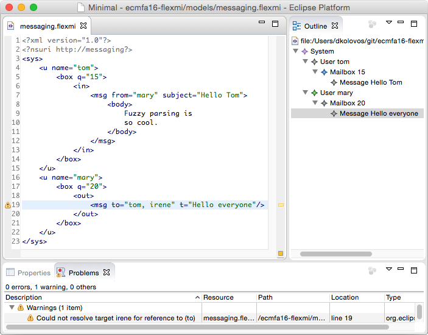

# Flexmi

Flexmi is a **permissive and reflective textual syntax for creating models conforming to Ecore metamodels**. Flexmi is XML-based and offers features such as fuzzy matching of XML tags and attributes to Ecore class/feature names, support for embedding EOL expressions in models and for defining and instantiating model element templates. For example, the following XML document (`messaging.flexmi`):

```xml
<?xml version="1.0"?>
<?nsuri http://messaging?>
<sys>
  <u name="tom">
    <box q="15">
      <out>
        <msg from="mary" subject="Hello Tom">
          <body> 
            Fuzzy parsing is
            so cool.
          </body>
        </msg>
      </out>
    </box>
  </u>
  <u name="mary">
    <box q="20">
      <out>
        <msg to="tom, mary" t="Hello everyone"/>
      </out>
    </box>
  </u>
</sys>
```

is a valid instance of the Ecore metamodel (in Emfatic) below:

```emf
@namespace(uri="http://messaging", prefix="")
package messaging;

class System {
  val User[*] users;
}

class User {
  id attr String name;
  val Mailbox mailbox;
}

class Mailbox {
  attr int quota;
  val Message[*] incoming;
  val Message[*] outgoing;
}

class Message {
  attr String subject;
  attr String body;
  ref User from;
  ref User[*] to;
}
```

## Getting started

-   Create a text file named `messaging.emf` in your workspace and place
    the Emfatic content above in it.
-   Convert it into Ecore and register the produced Ecore metamodel
    (`messaging.ecore`) as shown
    [here](../reflective-emf-tutorial).
-   Create a new text file named `messaging.flexmi` and place the XML
    content above in it.
-   The result should look like the screenshot below.



## Use in Epsilon and Java

Flexmi offers and registers an implementation of [EMF's Resource interface](http://download.eclipse.org/modeling/emf/emf/javadoc/2.4.3/org/eclipse/emf/ecore/resource/Resource.html) (`FlexmiResource`), and can be used like any other EMF resource implementation. For example, you can add `.flexmi` models as regular EMF models to the run configuration of your Epsilon program. An example of using Flexmi from Java follows.

```java
ResourceSet resourceSet = new ResourceSetImpl();
resourceSet.getResourceFactoryRegistry().
  getExtensionToFactoryMap().put("flexmi", 
    new FlexmiResourceFactory());
Resource resource = resourceSet.createResource
  (URI.createFileURI("/../messaging.flexmi"));
resource.load(null);
```

## Limitations

Flexmi resources can't be saved programmatically (i.e. trying to call `resource.save(...)` will do nothing).
