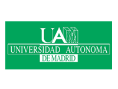

# Education

Below is a list of institutions that use one or more components of Epsilon (e.g. EGL, Eugenia) as part of their modelling/MDE courses. If you'd like to report additional uses of Epsilon in taught courses or you've spotted any outdated content, please [let us know](../../forum).

## Sources

University of York 
	[[1](http://www.cs.york.ac.uk/postgraduate/modules/mode.html)],
University of Texas 
	[[1](http://www.cs.utexas.edu/~jbarbosa/CS392F/)],
University of Oslo 
	[[1](http://www.uio.no/studier/emner/matnat/ifi/INF5120/v13/obligs/oblig-2-description-2013-ajb.pdf)],
Universidad Autonoma de Madrid 
	[[1](http://astreo.ii.uam.es/~jlara/doctorado.2011/4_Generacion_codigo.pdf)],
University of Kassel 
	[[1](http://seblog.cs.uni-kassel.de/wp-content/uploads/2009/11/SE2_Uebung4.pdf)],
University of Marburg 
	[[1](http://www.mathematik.uni-marburg.de/~arendt/fopra12/slides/Neue%20FoPras%20Arendt.pptx)],
Technische Universiteit Eindhoven 
	[[1](http://www.win.tue.nl/~mvdbrand/courses/GLT/1314/exercises/assignment4and5.pdf)],
Universitea Babes-Bolyai 
	[[1](http://www.cs.ubbcluj.ro/~ilazar/ssm/)],
Universidad de los Andes 
	[[1](http://sistemas.uniandes.edu.co/~isis4712/dokuwiki/doku.php?id=tut_eugenia)],
Budapest University of Technology and Economics 
	[[1](https://inf.mit.bme.hu/sites/default/files/materials/category/kateg%C3%B3ria/oktat%C3%A1s/v%C3%A1laszthat%C3%B3-t%C3%A1rgyak/eclipse-alap%C3%BA-fejleszt%C3%A9s-%C3%A9s-integr%C3%A1ci%C3%B3/13/gmf.pdf)],
Technical University of Dresden 
	[[1](http://st-teach.inf.tu-dresden.de/wiki/images/The_Eclipse_Modeling_Framework_(EMF)_-_Christoph_Seidl_(commented).pdf)],
University of Southern Denmark 
	[[1](http://websrv0a.sdu.dk/ups/SSE02/slides/lecture-10.pdf)],
Norwegian University of Science and Technology 
	[[1](https://files.itslearning.com/data/ntnu/open/co37331/1759069.pdf)],
University of Cadiz 
	[[1](http://ocw.uca.es/pluginfile.php/2491/mod_resource/content/0/T5%20-%20Desarrollo%20del%20formato%20de%20representaci%C3%B3n.pdf)],
McMaster University 
	[[1](http://www.cas.mcmaster.ca/~maibaum/Toms_Mac_Site/CAS756.html)],
University of Edinburgh 
	[[1](http://www.inf.ed.ac.uk/teaching/courses/sdm/labs/mdd.html)]